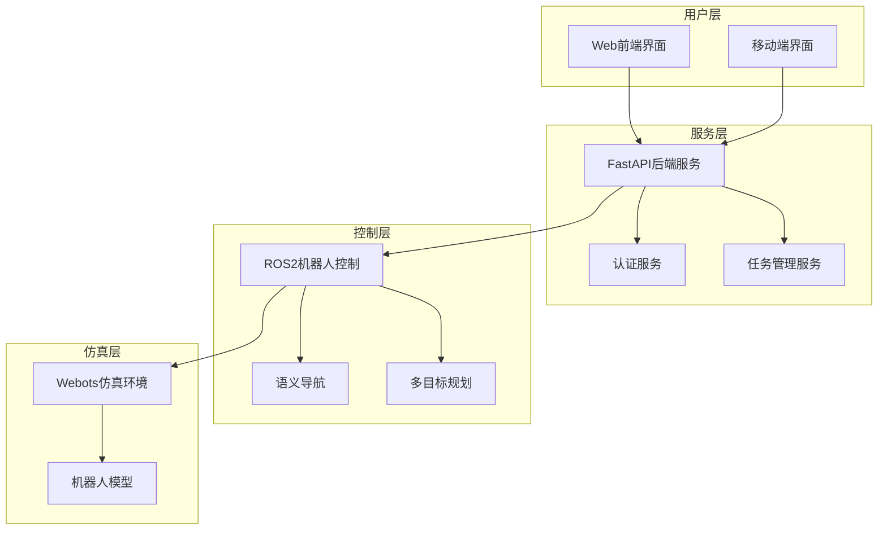

# 智能机器人配送系统 - 项目文档

## 文档总览

本目录包含智能机器人配送系统的完整项目文档，涵盖需求分析、系统设计、架构规划、测试计划、用户手册、开发指南等各个方面。

## 文档结构

### 核心文档

| 文档名称 | 文件路径 | 描述 | 状态 |
|---------|---------|------|------|
| 需求规格说明书 | [SRS.md](./SRS.md) | 系统功能需求和非功能需求详细规格 | ✅ 完成 |
| 软件设计说明书 | [SDS.md](./SDS.md) | 详细设计规格和技术实现方案 | ✅ 完成 |
| 系统架构文档 | [ARCHITECTURE.md](./ARCHITECTURE.md) | 系统架构设计和技术决策记录 | ✅ 完成 |
| 测试计划文档 | [TEST_PLAN.md](./TEST_PLAN.md) | 测试策略、测试用例和质量保证 | ✅ 完成 |
| 用户操作手册 | [USER_MANUAL.md](./USER_MANUAL.md) | 系统使用指南和操作说明 | ✅ 完成 |
| 开发者指南 | [DEVELOPER_GUIDE.md](./DEVELOPER_GUIDE.md) | 开发环境搭建和技术实现指南 | ✅ 完成 |

### 图表和附录

| 类型 | 路径 | 描述 |
|------|------|------|
| 架构图表 | [diagrams/](./diagrams/) | 系统架构图、流程图、部署图等 |
| 术语表 | [appendix/glossary.md](./appendix/glossary.md) | 项目术语定义和解释 |
| 参考文献 | [appendix/reference.md](./appendix/reference.md) | 技术参考资料和标准 |

## 🎯 项目概述

智能机器人配送系统是一套基于Webots仿真的室内自动化配送解决方案，采用现代化的技术栈实现：

- **前端**: Vue.js 3 + TypeScript + Element Plus
- **后端**: FastAPI + Python 3.8+
- **机器人控制**: ROS2 Humble + Navigation2
- **仿真环境**: Webots 2023b
- **数据存储**: JSON文件系统

## 🏗️ 系统架构



## 🔧 核心功能

### 用户功能
- **包裹寄送**: 创建配送任务，支持语音输入目标位置
- **包裹接收**: 查询和接收待取包裹，多级安全认证
- **机器人呼叫**: 呼叫机器人到指定位置，支持优先级设置
- **任务监控**: 实时查看任务队列和执行状态

### 技术特性
- **语义导航**: 基于自然语言的位置描述和导航
- **多级安全**: L1/L2/L3三级认证体系
- **智能调度**: 多目标路径优化和任务优先级管理
- **实时通信**: WebSocket实时状态更新
- **模块化设计**: 微服务架构，易于扩展和维护


## 🚀 快速导航

### 开发人员
1. 首先阅读 [DEVELOPER_GUIDE.md](./DEVELOPER_GUIDE.md) 了解开发环境搭建
2. 参考 [ARCHITECTURE.md](./ARCHITECTURE.md) 理解系统架构
3. 查看 [SDS.md](./SDS.md) 了解详细设计

### 测试人员
1. 阅读 [TEST_PLAN.md](./TEST_PLAN.md) 了解测试策略
2. 参考 [SRS.md](./SRS.md) 理解功能需求
3. 使用 [USER_MANUAL.md](./USER_MANUAL.md) 进行功能验证

### 产品经理/用户
1. 查看 [SRS.md](./SRS.md) 了解系统功能
2. 阅读 [USER_MANUAL.md](./USER_MANUAL.md) 学习系统使用
3. 参考 [appendix/glossary.md](./appendix/glossary.md) 理解专业术语

### 系统管理员
1. 阅读 [DEVELOPER_GUIDE.md](./DEVELOPER_GUIDE.md) 中的部署章节
2. 参考 [ARCHITECTURE.md](./ARCHITECTURE.md) 了解部署架构
3. 查看 [diagrams/deployment_architecture.md](./diagrams/deployment_architecture.md) 了解部署细节

## 📖 各文档详细说明

### SRS.md - 软件需求规格说明书
**目标读者**: 项目经理、产品经理、架构师、开发团队
**主要内容**:
- 项目背景和目标
- 功能性需求详细描述
- 非功能性需求（性能、安全、可靠性等）
- 用户角色和用例分析
- 系统约束条件
- 接受标准

### SDS.md - 软件设计说明书
**目标读者**: 架构师、开发人员、技术负责人
**主要内容**:
- 系统总体设计
- 模块详细设计
- 数据结构设计
- 接口设计规范
- 算法设计说明
- 异常处理机制

### ARCHITECTURE.md - 系统架构文档
**目标读者**: 架构师、技术负责人、开发团队
**主要内容**:
- 架构原则和设计理念
- 系统分层架构
- 组件交互关系
- 部署架构方案
- 技术选型决策
- 架构演进规划

### TEST_PLAN.md - 测试计划
**目标读者**: 测试团队、QA工程师、开发人员
**主要内容**:
- 测试策略和方法
- 测试用例设计
- 性能测试方案
- 安全测试计划
- 自动化测试实施
- 测试环境搭建

### USER_MANUAL.md - 用户手册
**目标读者**: 最终用户、运维人员、客户支持
**主要内容**:
- 系统功能介绍
- 操作步骤说明
- 常见问题解答
- 故障排除指南
- 最佳使用实践
- 安全注意事项

### DEVELOPER_GUIDE.md - 开发者指南
**目标读者**: 开发人员、新团队成员
**主要内容**:
- 开发环境搭建
- 代码结构说明
- 编码规范要求
- 调试和测试方法
- 部署流程说明
- 扩展开发指南

## 🔍 技术规格概要

### 系统核心特性
- **多层架构**: 前端展示层、API服务层、业务逻辑层、数据访问层
- **微服务设计**: 松耦合、高内聚的服务组件
- **实时通信**: WebSocket支持实时状态推送
- **智能导航**: 基于ROS2的路径规划和避障
- **多模态交互**: Web界面 + 语音交互双重支持
- **安全机制**: 三级权限控制 + JWT认证

### 技术栈总览
```
前端层:    Vue.js 3 + TypeScript + Element Plus
API层:     FastAPI + Python + Pydantic
通信层:    ROS2 + WebSocket + RESTful API
仿真层:    Webots + Gazebo + Nav2
数据层:    SQLite + Redis + 文件存储
部署层:    Docker + Nginx + 监控系统
```

