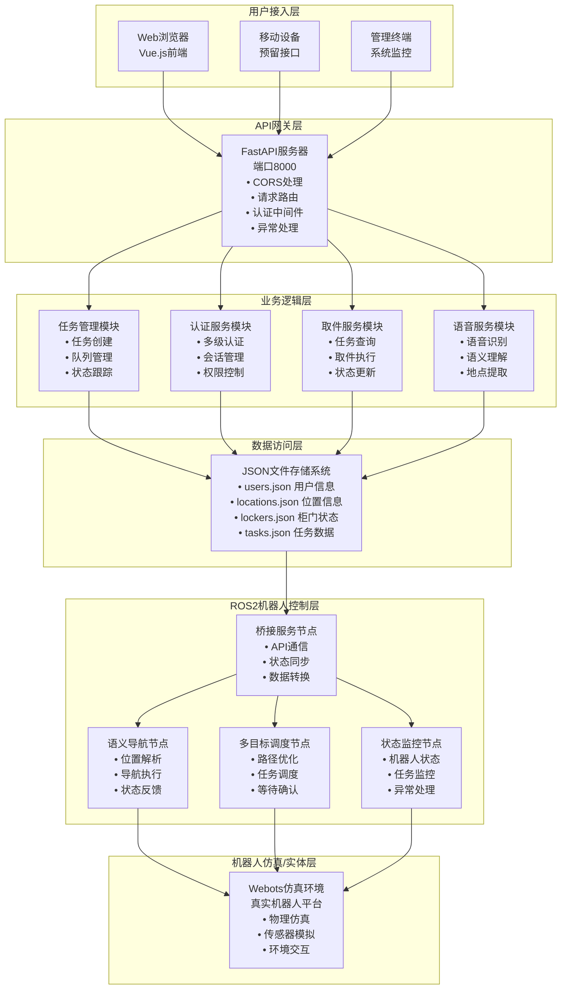
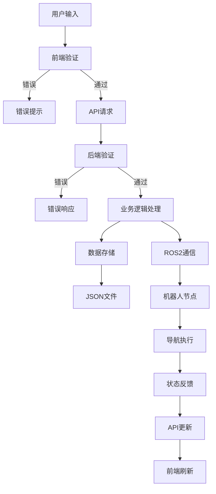
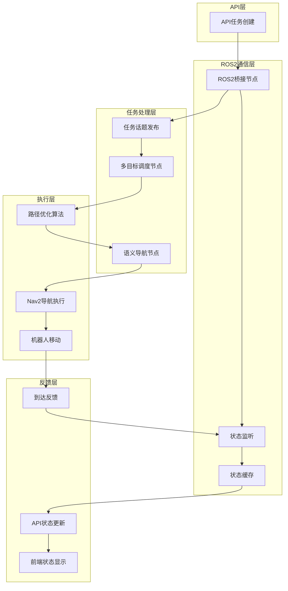

# 软件设计说明书（SDS）
## 智能机器人配送系统

**版本**: 1.0  
**日期**: 2025年6月22日  
**项目**: 基于Webots的智能室内配送机器人系统

---

## 1. 概述

### 1.1 编写目的

本文档详细描述了智能机器人配送系统的软件设计方案，包括系统架构、模块设计、数据结构、接口设计等技术细节。本文档的主要目的是：

- 为开发团队提供详细的技术实现指导
- 为系统集成和测试提供设计依据
- 为后续系统维护和扩展提供技术参考
- 确保系统设计的一致性和可追溯性

### 1.2 阅读对象

- **软件开发工程师**: 系统实现的主要参与者
- **系统架构师**: 架构设计和技术决策制定者
- **测试工程师**: 系统测试和验证执行者
- **项目经理**: 项目进度控制和资源协调者
- **技术支持人员**: 系统部署和维护执行者

### 1.3 参考资料

- 《软件需求规格说明书（SRS）》v1.0
- 《ROS2 Humble官方文档》
- 《Webots用户手册》R2023b版本
- 《FastAPI官方文档》v0.104+
- 《Vue.js 3.x官方指南》
- 《Nav2导航框架文档》

---

## 2. 软件架构设计

### 2.1 总体结构图



### 2.2 技术选型说明

#### 2.2.1 前端技术栈
- **Vue.js 3.x**: 选择原因
  - 组合式API提供更好的代码组织
  - TypeScript支持增强代码可维护性
  - 丰富的生态系统和社区支持
  - 渐进式框架易于团队学习

- **Element Plus**: UI组件库选择原因
  - 组件丰富且设计一致
  - Vue 3原生支持
  - 国际化支持完善
  - 文档详细易于使用

- **Vite**: 构建工具选择原因
  - 开发环境启动速度快
  - 热模块替换（HMR）响应迅速
  - 插件生态完善
  - TypeScript开箱即用

#### 2.2.2 后端技术栈
- **FastAPI**: Web框架选择原因
  - 自动生成OpenAPI文档
  - 类型检查和数据验证
  - 异步支持性能优异
  - Python生态系统兼容性好

- **Pydantic**: 数据验证选择原因
  - 基于Python类型提示
  - 自动JSON序列化/反序列化
  - 详细的错误信息
  - 与FastAPI深度集成

- **JSON文件存储**: 数据存储选择原因
  - 轻量级无需额外数据库安装
  - 数据结构直观易于调试
  - 支持版本控制
  - 适合原型开发和小规模部署

#### 2.2.3 机器人控制技术栈
- **ROS2 Humble**: 机器人操作系统选择原因
  - 长期支持版本（LTS）
  - 分布式架构支持多节点
  - 丰富的导航功能包
  - 工业级稳定性

- **Nav2**: 导航框架选择原因
  - ROS2官方导航解决方案
  - 模块化设计易于定制
  - 支持多种规划算法
  - 活跃的社区维护

- **Webots**: 仿真平台选择原因
  - 物理仿真精度高
  - 支持ROS2集成
  - 丰富的机器人模型库
  - 跨平台支持

---

## 3. 模块设计

### 3.1 前端模块设计

#### 3.1.1 用户界面模块
```typescript
// 组件结构设计
interface ComponentStructure {
  views: {
    HomeView: "主页视图，包含功能导航和系统状态";
    SendPackage: "寄件界面，支持多级认证和表单填写";
    ReceivePackage: "收件界面，任务查询和取件操作";
    CallRobot: "呼叫机器人界面，位置选择和优先级设置";
    TaskQueue: "任务队列管理，状态监控和操作控制";
    ApiTest: "API测试界面，开发调试专用";
  };
  
  components: {
    AuthModal: "认证模态框，支持L1/L2/L3三级认证";
    TaskCard: "任务卡片组件，显示任务详情和操作按钮";
    LocationSelector: "位置选择器，支持语音和手动选择";
    LockerStatus: "柜门状态显示，实时更新开关状态";
    StatusIndicator: "状态指示器，系统和机器人状态显示";
  };
  
  stores: {
    authStore: "认证状态管理，用户信息和权限控制";
    taskStore: "任务状态管理，队列数据和操作记录";
    systemStore: "系统状态管理，连接状态和配置信息";
  };
}
```

**主要设计特点**:
- 响应式设计适配不同屏幕尺寸
- 组件化开发提高代码复用性
- 状态管理集中化便于数据同步
- 实时更新机制确保界面数据新鲜度

#### 3.1.2 API通信模块
```typescript
// API客户端设计
class ApiClient {
  private baseURL: string = 'http://localhost:8000';
  private axiosInstance: AxiosInstance;
  
  constructor() {
    this.axiosInstance = axios.create({
      baseURL: this.baseURL,
      timeout: 10000,
      headers: {
        'Content-Type': 'application/json',
      },
    });
    
    this.setupInterceptors();
  }
  
  // 请求拦截器：添加认证token
  private setupRequestInterceptor(): void {
    this.axiosInstance.interceptors.request.use(
      (config) => {
        const token = getAuthToken();
        if (token) {
          config.headers.Authorization = `Bearer ${token}`;
        }
        return config;
      },
      (error) => Promise.reject(error)
    );
  }
  
  // 响应拦截器：处理通用错误
  private setupResponseInterceptor(): void {
    this.axiosInstance.interceptors.response.use(
      (response) => response.data,
      (error) => {
        this.handleApiError(error);
        return Promise.reject(error);
      }
    );
  }
}
```

### 3.2 后端模块设计

#### 3.2.1 任务管理模块

**模块职责**:
- 任务的创建、执行、完成、取消操作
- 任务队列的管理和优先级排序
- 任务状态的实时跟踪和更新
- 与ROS2系统的任务同步

**核心类设计**:
```python
from enum import Enum
from typing import List, Optional
from pydantic import BaseModel
from datetime import datetime

class TaskType(str, Enum):
    DELIVERY = "delivery"      # 配送任务
    PICKUP = "pickup"         # 取件任务  
    CALL_ROBOT = "call_robot" # 呼叫机器人

class TaskStatus(str, Enum):
    PENDING = "pending"       # 等待执行
    EXECUTING = "executing"   # 执行中
    COMPLETED = "completed"   # 已完成
    FAILED = "failed"         # 执行失败
    CANCELLED = "cancelled"   # 已取消

class TaskPriority(int, Enum):
    URGENT = 1               # 紧急
    HIGH = 2                 # 高优先级
    NORMAL = 3               # 普通
    LOW = 4                  # 低优先级

class Task(BaseModel):
    task_id: str
    task_type: TaskType
    status: TaskStatus
    priority: TaskPriority
    
    # 位置信息
    source_location: Optional[str] = None
    target_location: str
    
    # 用户信息
    sender_id: Optional[str] = None
    receiver_id: Optional[str] = None
    
    # 时间信息
    created_at: datetime
    updated_at: datetime
    estimated_start: Optional[datetime] = None
    estimated_completion: Optional[datetime] = None
    actual_completion: Optional[datetime] = None
    
    # 任务数据
    task_data: dict = {}
    
    class Config:
        use_enum_values = True

class TaskManager:
    def __init__(self):
        self.tasks: List[Task] = []
        self.current_task: Optional[Task] = None
        self.task_storage = TaskStorage()
    
    async def create_task(self, task_data: dict) -> Task:
        """创建新任务"""
        task = Task(
            task_id=self.generate_task_id(),
            **task_data,
            created_at=datetime.now(),
            updated_at=datetime.now(),
            status=TaskStatus.PENDING
        )
        
        self.tasks.append(task)
        await self.task_storage.save_task(task)
        await self.schedule_tasks()
        
        return task
    
    async def schedule_tasks(self) -> None:
        """任务调度算法"""
        # 按优先级和创建时间排序
        pending_tasks = [t for t in self.tasks if t.status == TaskStatus.PENDING]
        pending_tasks.sort(key=lambda x: (x.priority.value, x.created_at))
        
        # 如果当前没有执行中的任务，启动下一个任务
        if not self.current_task and pending_tasks:
            next_task = pending_tasks[0]
            await self.execute_task(next_task)
    
    async def execute_task(self, task: Task) -> None:
        """执行任务"""
        task.status = TaskStatus.EXECUTING
        task.updated_at = datetime.now()
        self.current_task = task
        
        # 向ROS2系统发送任务指令
        await self.send_robot_command(task)
        
        await self.task_storage.update_task(task)
```

#### 3.2.2 认证服务模块

**模块职责**:
- 用户身份验证和权限管理
- 会话管理和token生成
- 多级安全认证流程控制
- 认证缓存和过期处理

**核心类设计**:
```python
from enum import Enum
from typing import Dict, Optional
import hashlib
import jwt
from datetime import datetime, timedelta

class AuthLevel(str, Enum):
    L1 = "L1"  # 基础认证：仅用户ID
    L2 = "L2"  # 中级认证：用户ID + PIN码
    L3 = "L3"  # 高级认证：用户ID + PIN码 + 生物特征

class AuthResult(BaseModel):
    success: bool
    auth_level: Optional[AuthLevel] = None
    user_info: Optional[dict] = None
    token: Optional[str] = None
    expires_at: Optional[datetime] = None
    error_message: Optional[str] = None

class AuthService:
    def __init__(self):
        self.user_storage = UserStorage()
        self.auth_cache: Dict[str, dict] = {}
        self.jwt_secret = "your-secret-key"  # 实际部署时使用环境变量
        
    async def verify_auth(self, user_id: str, auth_level: AuthLevel, 
                         auth_data: dict) -> AuthResult:
        """验证用户认证"""
        user = await self.user_storage.get_user(user_id)
        if not user:
            return AuthResult(
                success=False, 
                error_message="用户不存在"
            )
        
        # 检查用户权限等级
        if not self.check_auth_level_permission(user, auth_level):
            return AuthResult(
                success=False,
                error_message="用户权限不足"
            )
        
        # 执行相应级别的认证
        if auth_level == AuthLevel.L1:
            return await self.verify_l1_auth(user)
        elif auth_level == AuthLevel.L2:
            return await self.verify_l2_auth(user, auth_data.get("pin"))
        elif auth_level == AuthLevel.L3:
            return await self.verify_l3_auth(user, auth_data.get("pin"), 
                                           auth_data.get("biometric"))
    
    async def verify_l1_auth(self, user: dict) -> AuthResult:
        """L1级别认证：仅验证用户ID"""
        token = self.generate_token(user, AuthLevel.L1)
        return AuthResult(
            success=True,
            auth_level=AuthLevel.L1,
            user_info=user,
            token=token,
            expires_at=datetime.now() + timedelta(minutes=30)
        )
    
    async def verify_l2_auth(self, user: dict, pin: str) -> AuthResult:
        """L2级别认证：验证用户ID + PIN码"""
        if not pin or not self.verify_pin(user.get("l2_auth"), pin):
            return AuthResult(
                success=False,
                error_message="PIN码验证失败"
            )
        
        token = self.generate_token(user, AuthLevel.L2)
        return AuthResult(
            success=True,
            auth_level=AuthLevel.L2,
            user_info=user,
            token=token,
            expires_at=datetime.now() + timedelta(minutes=30)
        )
    
    def verify_pin(self, stored_pin: str, input_pin: str) -> bool:
        """PIN码验证"""
        return stored_pin == input_pin  # 实际应用中应使用哈希比较
    
    def generate_token(self, user: dict, auth_level: AuthLevel) -> str:
        """生成JWT token"""
        payload = {
            "user_id": user["user_id"],
            "auth_level": auth_level.value,
            "exp": datetime.utcnow() + timedelta(minutes=30),
            "iat": datetime.utcnow()
        }
        return jwt.encode(payload, self.jwt_secret, algorithm="HS256")
```

#### 3.2.3 ROS2桥接服务模块

**模块职责**:
- API请求到ROS2消息的转换
- ROS2状态到API响应的转换
- 机器人状态实时监控
- 异常情况处理和恢复

**核心类设计**:
```python
import rclpy
from rclpy.node import Node
from std_msgs.msg import String
from geometry_msgs.msg import PoseStamped
import json
import asyncio
from concurrent.futures import ThreadPoolExecutor

class ROS2Bridge(Node):
    def __init__(self):
        super().__init__('api_ros2_bridge')
        
        # 发布者
        self.nav_command_pub = self.create_publisher(String, '/nav_command', 10)
        self.multi_nav_pub = self.create_publisher(String, '/multi_nav_command', 10)
        self.next_pub = self.create_publisher(String, '/next', 10)
        
        # 订阅者
        self.task_status_sub = self.create_subscription(
            String, '/task_status', self.task_status_callback, 10)
        self.robot_status_sub = self.create_subscription(
            String, '/robot_status', self.robot_status_callback, 10)
        
        # 状态缓存
        self.robot_status = {}
        self.task_status = {}
        
        # 回调队列
        self.status_callbacks = []
    
    async def send_navigation_command(self, location: str) -> bool:
        """发送导航指令"""
        try:
            msg = String()
            msg.data = location
            self.nav_command_pub.publish(msg)
            self.get_logger().info(f'发送导航指令: {location}')
            return True
        except Exception as e:
            self.get_logger().error(f'发送导航指令失败: {e}')
            return False
    
    async def send_multi_navigation_command(self, locations: list) -> bool:
        """发送多目标导航指令"""
        try:
            msg = String()
            msg.data = json.dumps(locations)
            self.multi_nav_pub.publish(msg)
            self.get_logger().info(f'发送多目标导航指令: {locations}')
            return True
        except Exception as e:
            self.get_logger().error(f'发送多目标导航指令失败: {e}')
            return False
    
    def task_status_callback(self, msg):
        """任务状态回调"""
        try:
            status_data = json.loads(msg.data)
            self.task_status.update(status_data)
            
            # 通知所有注册的回调函数
            for callback in self.status_callbacks:
                callback(status_data)
                
        except Exception as e:
            self.get_logger().error(f'处理任务状态消息失败: {e}')
    
    def robot_status_callback(self, msg):
        """机器人状态回调"""
        try:
            status_data = json.loads(msg.data)
            self.robot_status.update(status_data)
        except Exception as e:
            self.get_logger().error(f'处理机器人状态消息失败: {e}')
```

### 3.3 ROS2节点模块设计

#### 3.3.1 语义导航节点

**节点职责**:
- 接收语义位置指令（房间名称）
- 将语义位置转换为坐标位置
- 执行单点导航任务
- 反馈导航状态

**实现设计**:
```python
class SemanticNavigator(Node):
    def __init__(self):
        super().__init__('semantic_navigator')
        
        # 加载语义地图
        self.semantic_map = self.load_semantic_map()
        
        # 订阅语义导航指令
        self.subscription = self.create_subscription(
            String, '/nav_command', self.nav_command_callback, 10)
        
        # 导航动作客户端
        self._action_client = ActionClient(self, NavigateToPose, 'navigate_to_pose')
        
        # 状态发布者
        self.status_pub = self.create_publisher(String, '/nav_status', 10)
    
    def load_semantic_map(self) -> dict:
        """加载语义地图配置"""
        try:
            map_file = os.path.join(
                get_package_share_directory('auto_explorer'),
                'map', 'map.json'
            )
            with open(map_file, 'r', encoding='utf-8') as f:
                return json.load(f)
        except Exception as e:
            self.get_logger().error(f'加载语义地图失败: {e}')
            return {}
    
    def nav_command_callback(self, msg):
        """处理语义导航指令"""
        room_name = msg.data.strip()
        
        if room_name not in self.semantic_map:
            self.get_logger().warn(f"未知房间: {room_name}")
            self.publish_status("failed", f"未知房间: {room_name}")
            return
        
        # 获取目标位置
        target_pose = self.create_pose_from_semantic(room_name)
        
        # 执行导航
        self.navigate_to_pose(target_pose, room_name)
    
    def create_pose_from_semantic(self, room_name: str) -> PoseStamped:
        """从语义地图创建位置消息"""
        pose_data = self.semantic_map[room_name]['pose']
        
        pose_msg = PoseStamped()
        pose_msg.header.frame_id = 'map'
        pose_msg.header.stamp = self.get_clock().now().to_msg()
        
        # 设置位置
        pose_msg.pose.position.x = pose_data['position']['x']
        pose_msg.pose.position.y = pose_data['position']['y']
        pose_msg.pose.position.z = pose_data['position']['z']
        
        # 设置方向
        pose_msg.pose.orientation.x = pose_data['orientation']['x']
        pose_msg.pose.orientation.y = pose_data['orientation']['y']
        pose_msg.pose.orientation.z = pose_data['orientation']['z']
        pose_msg.pose.orientation.w = pose_data['orientation']['w']
        
        return pose_msg
```

#### 3.3.2 多目标调度节点

**节点职责**:
- 接收多目标导航指令
- 计算最优访问顺序
- 管理导航任务队列
- 处理等待确认机制

**路径优化算法**:
```python
def calculate_optimal_order(self, locations: List[str], 
                          current_pos: tuple) -> List[str]:
    """计算最优访问顺序 - 贪心算法实现"""
    if not locations:
        return []
    
    # 获取所有位置的坐标
    coordinates = {}
    for loc in locations:
        if loc in self.semantic_map:
            pos = self.semantic_map[loc]['pose']['position']
            coordinates[loc] = (pos['x'], pos['y'])
        else:
            self.get_logger().warn(f"位置 {loc} 不在地图中")
            return locations  # 返回原顺序
    
    # 贪心算法：从当前位置开始，每次选择最近的未访问位置
    unvisited = set(locations)
    current = current_pos
    optimal_order = []
    
    while unvisited:
        # 找到距离当前位置最近的点
        nearest_loc = min(unvisited, 
                         key=lambda loc: self.calculate_distance(current, coordinates[loc]))
        
        optimal_order.append(nearest_loc)
        unvisited.remove(nearest_loc)
        current = coordinates[nearest_loc]
    
    return optimal_order

def calculate_distance(self, pos1: tuple, pos2: tuple) -> float:
    """计算两点之间的欧几里得距离"""
    return math.sqrt((pos1[0] - pos2[0])**2 + (pos1[1] - pos2[1])**2)
```

---

## 4. 数据设计

### 4.1 数据结构设计

#### 4.1.1 用户数据结构
```json
{
  "user_id": "EMP7064",
  "name": "王勇",
  "role": "财务处",
  "auth_level": "L3",
  "office_location": "A座财务部",
  "l2_auth": "546121",
  "l3_auth": "FACE_EMP7064_4944",
  "created_at": "2025-01-15T09:00:00Z",
  "last_login": "2025-06-22T14:30:00Z",
  "permissions": ["send_package", "receive_package", "call_robot"],
  "contact_info": {
    "email": "wang.yong@company.com",
    "phone": "13812345678",
    "extension": "8001"
  }
}
```

#### 4.1.2 任务数据结构
```json
{
  "task_id": "TSK20250622001",
  "task_type": "delivery",
  "status": "pending",
  "priority": 2,
  "source_location": "前台",
  "target_location": "经理室",
  "sender_id": "EMP4958",
  "receiver_id": "EMP7001",
  "created_at": "2025-06-22T15:30:00Z",
  "updated_at": "2025-06-22T15:30:00Z",
  "estimated_start": "2025-06-22T15:35:00Z",
  "estimated_completion": "2025-06-22T15:45:00Z",
  "actual_completion": null,
  "task_data": {
    "locker_id": "LCK001",
    "package_info": {
      "description": "重要文件",
      "security_level": "L2",
      "special_instructions": "请小心处理"
    },
    "route_data": {
      "waypoints": ["前台", "走廊A", "经理室"],
      "estimated_distance": 25.6,
      "estimated_time": 180
    }
  },
  "execution_log": [
    {
      "timestamp": "2025-06-22T15:30:00Z",
      "event": "task_created",
      "details": "任务创建成功"
    }
  ]
}
```

#### 4.1.3 位置数据结构
```json
{
  "location_id": "LOC101",
  "label": "经理室",
  "coordinates": {
    "x": 0.72,
    "y": -19.52,
    "z": 0.0
  },
  "orientation": {
    "x": 0.0,
    "y": 0.0,
    "z": 0.707,
    "w": 0.707
  },
  "accessibility": {
    "wheelchair_accessible": true,
    "requires_authorization": ["L2", "L3"],
    "available_hours": {
      "monday": "09:00-18:00",
      "tuesday": "09:00-18:00",
      "wednesday": "09:00-18:00",
      "thursday": "09:00-18:00",
      "friday": "09:00-18:00",
      "saturday": "closed",
      "sunday": "closed"
    }
  },
  "metadata": {
    "description": "总经理办公室",
    "floor": 2,
    "building": "A座",
    "room_number": "A201",
    "capacity": 1,
    "equipment": ["电脑", "会议桌", "投影仪"]
  }
}
```

### 4.2 数据流图

#### 4.2.1 用户操作数据流



#### 4.2.2 机器人控制数据流



---

## 5. 接口设计

### 5.1 前后端交互接口

#### 5.1.1 任务管理接口
```typescript
// TypeScript接口定义
interface TaskCreateRequest {
  task_type: 'delivery' | 'pickup' | 'call_robot';
  source_location?: string;
  target_location: string;
  priority: 1 | 2 | 3 | 4;
  sender_id?: string;
  receiver_id?: string;
  task_data: {
    package_info?: {
      description: string;
      security_level: 'L1' | 'L2' | 'L3';
      special_instructions?: string;
    };
    locker_preference?: string[];
    estimated_weight?: number;
  };
}

interface TaskCreateResponse {
  success: boolean;
  task_id?: string;
  locker_id?: string;
  estimated_completion?: string;
  queue_position?: number;
  error_message?: string;
}

interface TaskStatusResponse {
  task_id: string;
  status: 'pending' | 'executing' | 'completed' | 'failed' | 'cancelled';
  progress: number; // 0-100
  current_location?: string;
  estimated_arrival?: string;
  message?: string;
}
```

#### 5.1.2 认证接口
```typescript
interface AuthRequest {
  user_id: string;
  auth_level: 'L1' | 'L2' | 'L3';
  auth_data: {
    pin?: string;
    biometric?: string;
  };
}

interface AuthResponse {
  success: boolean;
  auth_level?: 'L1' | 'L2' | 'L3';
  user_info?: {
    user_id: string;
    name: string;
    role: string;
    office_location: string;
    permissions: string[];
  };
  token?: string;
  expires_at?: string;
  error_message?: string;
}
```

### 5.2 ROS2通信接口

#### 5.2.1 话题接口定义
```yaml
# /nav_command - 语义导航指令
topic_name: /nav_command
message_type: std_msgs/String
direction: publish
description: 发送目标房间名称进行导航
example_data: "经理室"

# /multi_nav_command - 多目标导航指令  
topic_name: /multi_nav_command
message_type: std_msgs/String
direction: publish
description: 发送JSON格式的目标点列表
example_data: '["小会议室", "经理室", "财务处"]'

# /next - 导航确认信号
topic_name: /next
message_type: std_msgs/String
direction: publish
description: 确认继续下一个导航目标
example_data: "continue"

# /task_status - 任务状态反馈
topic_name: /task_status  
message_type: std_msgs/String
direction: subscribe
description: 接收机器人任务执行状态
example_data: '{"task_id": "TSK001", "status": "executing", "progress": 50}'

# /robot_pose - 机器人位置
topic_name: /robot_pose
message_type: geometry_msgs/PoseStamped  
direction: subscribe
description: 机器人当前位置信息
```

#### 5.2.2 服务接口定义
```yaml
# /robot/get_status - 获取机器人状态
service_name: /robot/get_status
service_type: std_srvs/Empty
description: 查询机器人当前状态
response_fields:
  - battery_level: float
  - current_location: string
  - is_busy: bool
  - last_task_id: string

# /robot/emergency_stop - 紧急停止
service_name: /robot/emergency_stop
service_type: std_srvs/Trigger
description: 紧急停止机器人所有动作
response_fields:
  - success: bool
  - message: string
```

### 5.3 数据库接口设计

#### 5.3.1 数据访问层接口
```python
from abc import ABC, abstractmethod
from typing import List, Optional, Dict, Any

class DataStorageInterface(ABC):
    """数据存储接口定义"""
    
    @abstractmethod
    async def create(self, collection: str, data: Dict[str, Any]) -> str:
        """创建新记录"""
        pass
    
    @abstractmethod  
    async def read(self, collection: str, id: str) -> Optional[Dict[str, Any]]:
        """读取指定记录"""
        pass
    
    @abstractmethod
    async def update(self, collection: str, id: str, data: Dict[str, Any]) -> bool:
        """更新指定记录"""
        pass
    
    @abstractmethod
    async def delete(self, collection: str, id: str) -> bool:
        """删除指定记录"""
        pass
    
    @abstractmethod
    async def query(self, collection: str, filters: Dict[str, Any]) -> List[Dict[str, Any]]:
        """条件查询记录"""
        pass

class JSONFileStorage(DataStorageInterface):
    """JSON文件存储实现"""
    
    def __init__(self, storage_path: str = "./storage"):
        self.storage_path = Path(storage_path)
        self.storage_path.mkdir(exist_ok=True)
        self._file_locks = {}
    
    async def create(self, collection: str, data: Dict[str, Any]) -> str:
        """创建新记录到JSON文件"""
        file_path = self.storage_path / f"{collection}.json"
        
        async with self._get_file_lock(collection):
            # 读取现有数据
            existing_data = await self._read_json_file(file_path)
            
            # 生成新ID
            record_id = self._generate_id(collection)
            data['id'] = record_id
            data['created_at'] = datetime.now().isoformat()
            
            # 添加新记录
            existing_data.append(data)
            
            # 写回文件
            await self._write_json_file(file_path, existing_data)
            
            return record_id
```

---

## 6. 异常处理和容错设计

### 6.1 异常分类

#### 6.1.1 系统级异常
- **网络连接异常**: API请求超时、ROS2通信中断
- **硬件故障**: 机器人传感器故障、柜门控制失效
- **资源不足**: 内存不足、存储空间不足、CPU过载

#### 6.1.2 业务级异常
- **认证失败**: token过期、权限不足、用户不存在
- **任务异常**: 目标位置不可达、任务冲突、优先级错误
- **数据异常**: 数据格式错误、必填字段缺失、数据一致性问题

### 6.2 容错机制设计

#### 6.2.1 API层容错
```python
from functools import wraps
import asyncio
from typing import Callable, Any

def retry_on_failure(max_retries: int = 3, delay: float = 1.0):
    """API调用重试装饰器"""
    def decorator(func: Callable) -> Callable:
        @wraps(func)
        async def wrapper(*args, **kwargs) -> Any:
            last_exception = None
            
            for attempt in range(max_retries + 1):
                try:
                    return await func(*args, **kwargs)
                except Exception as e:
                    last_exception = e
                    if attempt < max_retries:
                        await asyncio.sleep(delay * (2 ** attempt))  # 指数退避
                        continue
                    break
            
            # 所有重试失败，抛出最后一个异常
            raise last_exception
        return wrapper
    return decorator

class APIExceptionHandler:
    """API异常处理器"""
    
    @staticmethod
    async def handle_validation_error(error: ValidationError) -> dict:
        """处理数据验证错误"""
        return {
            "error_type": "validation_error",
            "message": "请求数据格式错误",
            "details": error.errors(),
            "status_code": 422
        }
    
    @staticmethod  
    async def handle_authentication_error(error: AuthenticationError) -> dict:
        """处理认证错误"""
        return {
            "error_type": "authentication_error", 
            "message": "身份认证失败",
            "details": str(error),
            "status_code": 401
        }
    
    @staticmethod
    async def handle_business_error(error: BusinessLogicError) -> dict:
        """处理业务逻辑错误"""
        return {
            "error_type": "business_error",
            "message": error.message,
            "error_code": error.code,
            "status_code": 400
        }
```

#### 6.2.2 ROS2节点容错
```python
class FaultTolerantNode(Node):
    """容错ROS2节点基类"""
    
    def __init__(self, node_name: str):
        super().__init__(node_name)
        self.is_healthy = True
        self.error_count = 0
        self.max_errors = 5
        
        # 健康检查定时器
        self.health_timer = self.create_timer(5.0, self.health_check)
        
        # 错误恢复定时器
        self.recovery_timer = None
    
    def handle_error(self, error: Exception, context: str = ""):
        """统一错误处理"""
        self.error_count += 1
        self.get_logger().error(f"节点错误 [{context}]: {error}")
        
        if self.error_count >= self.max_errors:
            self.enter_fault_mode()
    
    def enter_fault_mode(self):
        """进入故障模式"""
        self.is_healthy = False
        self.get_logger().warn("节点进入故障模式，尝试自动恢复")
        
        # 停止正常操作
        self.stop_normal_operations()
        
        # 启动恢复定时器
        if self.recovery_timer is None:
            self.recovery_timer = self.create_timer(10.0, self.attempt_recovery)
    
    def attempt_recovery(self):
        """尝试自动恢复"""
        try:
            # 执行恢复操作
            self.perform_recovery_actions()
            
            # 重置错误计数
            self.error_count = 0
            self.is_healthy = True
            
            # 停止恢复定时器
            if self.recovery_timer:
                self.recovery_timer.cancel()
                self.recovery_timer = None
            
            self.get_logger().info("节点恢复成功")
            
        except Exception as e:
            self.get_logger().error(f"自动恢复失败: {e}")
```

### 6.3 数据一致性保证

#### 6.3.1 事务处理机制
```python
import asyncio
from contextlib import asynccontextmanager
from typing import List, Callable

class TransactionManager:
    """事务管理器"""
    
    def __init__(self):
        self.active_transactions = {}
        self.rollback_handlers = {}
    
    @asynccontextmanager
    async def transaction(self, transaction_id: str):
        """事务上下文管理器"""
        try:
            # 开始事务
            self.active_transactions[transaction_id] = []
            self.rollback_handlers[transaction_id] = []
            
            yield self
            
            # 提交事务
            await self.commit(transaction_id)
            
        except Exception as e:
            # 回滚事务
            await self.rollback(transaction_id)
            raise e
        finally:
            # 清理事务
            self.cleanup_transaction(transaction_id)
    
    async def add_operation(self, transaction_id: str, operation: Callable, 
                          rollback: Callable):
        """添加事务操作"""
        if transaction_id in self.active_transactions:
            self.active_transactions[transaction_id].append(operation)
            self.rollback_handlers[transaction_id].append(rollback)
    
    async def commit(self, transaction_id: str):
        """提交事务"""
        operations = self.active_transactions.get(transaction_id, [])
        for operation in operations:
            await operation()
    
    async def rollback(self, transaction_id: str):
        """回滚事务"""
        rollback_ops = self.rollback_handlers.get(transaction_id, [])
        # 反向执行回滚操作
        for rollback_op in reversed(rollback_ops):
            try:
                await rollback_op()
            except Exception as e:
                self.get_logger().error(f"回滚操作失败: {e}")
```

---

**本文档版本**: 1.0  
**最后更新**: 2025年6月22日  
**审核状态**: 待审核  
**批准人**: 待定
