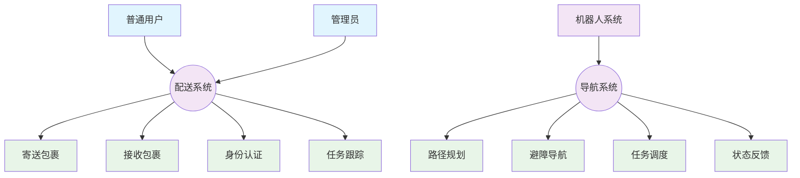

# 软件需求规格说明书（SRS）
## 安全配送机器人系统

**版本**: 1.0  
**日期**: 2025年6月22日  
**项目**: 安全配送机器人系统

---

## 1. 引言

### 1.1 项目背景

随着智能化办公环境的发展，室内物流配送的需求日益增长。传统的人工配送方式效率低下、成本高昂，且在特定环境下存在安全隐患。本项目旨在开发一套完整的安全配送机器人系统，通过机器人自主导航技术和多级安全认证机制，实现室内环境下的自动化安全物品配送服务。

系统主要服务于办公楼、医院、酒店等室内环境，能够自动处理包裹寄送、接收、配送等全流程任务，通过L1/L2/L3三级安全认证体系确保配送安全，大幅提升配送效率并降低人力成本。

### 1.2 项目目标

- **自动化配送**: 实现完全自主的室内配送服务，包括路径规划、避障导航、任务调度
- **多级安全认证**: 支持L1、L2、L3三级安全等级的身份认证体系，确保配送安全
- **智能任务调度**: 基于优先级和路径优化的多任务并发处理能力
- **用户友好界面**: 提供直观易用的Web界面和语音交互功能
- **系统集成**: 与ROS2生态系统深度集成，支持多机器人协同工作
- **可扩展架构**: 模块化设计支持功能扩展和设备接入
- **安全机制**: 实现数据加密、权限控制、操作审计等安全保障措施

### 1.3 项目范围

本系统涵盖以下核心功能模块：
- 前端用户交互系统（Web界面）
- 后端API服务系统（任务管理、安全认证服务）
- ROS2机器人控制系统（导航、调度）
- 仿真测试环境（Webots集成）
- 语音识别与智能交互
- 安全认证与权限管理
- 数据存储与管理

## 2. 定义

### 2.1 术语定义

- **ROS2 (Robot Operating System 2)**: 机器人操作系统第二代，提供分布式计算框架
- **Webots**: 专业机器人仿真平台，支持多种机器人模型和环境仿真
- **Nav2**: ROS2导航框架，提供路径规划、定位、避障等导航功能
- **FastAPI**: 现代高性能Python Web框架，用于构建API服务
- **Vue.js**: 渐进式JavaScript框架，用于构建用户界面
- **SLAM**: 同时定位与地图构建技术
- **语义导航**: 基于语义标签的导航方式，使用房间名称而非坐标

### 2.2 缩写定义

- **API**: Application Programming Interface（应用程序编程接口）
- **CORS**: Cross-Origin Resource Sharing（跨域资源共享）
- **JWT**: JSON Web Token（JSON网络令牌）
- **LIDAR**: Light Detection and Ranging（激光雷达）
- **MQTT**: Message Queuing Telemetry Transport（消息队列遥测传输）
- **REST**: Representational State Transfer（表述性状态转移）
- **TF**: Transform Framework（坐标变换框架）

## 3. 文档约定

### 3.1 ROS2术语统一

- **节点（Node）**: ROS2系统中的基本计算单元
- **话题（Topic）**: 节点间异步通信机制
- **服务（Service）**: 节点间同步通信机制
- **动作（Action）**: 长时间运行任务的通信机制
- **参数（Parameter）**: 节点配置数据

### 3.2 安全等级定义

- **L1**: 基础安全级别，仅需用户ID验证
- **L2**: 中等安全级别，需要用户ID和PIN码验证
- **L3**: 高等安全级别，需要用户ID、PIN码和生物特征验证

## 4. 总体描述

### 4.1 产品概述

安全配送机器人系统是一个集成了Web前端、后端API服务、ROS2机器人控制和多级安全认证的完整解决方案。系统通过Webots仿真环境验证功能，实现了L1/L2/L3三级安全等级的认证体系，预留了真实机器人部署接口。

**主要应用场景**:
- 办公楼内部敏感文件、包裹安全配送
- 医院药品、检验样本安全传递
- 酒店客房服务物品配送
- 工厂车间重要零部件运输

**系统核心特性**:
- 支持多目标点连续导航
- 智能路径优化算法
- 实时任务状态监控
- 多级安全权限控制（L1/L2/L3认证体系）
- 语音指令交互
- 柜门自动化管理
- 安全等级匹配机制

### 4.2 用户特征

#### 4.2.1 普通用户
- **角色描述**: 需要寄送或接收包裹的办公人员
- **技能要求**: 基本的Web界面操作能力
- **使用频率**: 每日1-5次
- **主要需求**: 简单易用的寄件/收件界面

#### 4.2.2 管理员
- **角色描述**: 系统管理和维护人员
- **技能要求**: 具备基本的IT操作技能
- **使用频率**: 每日多次
- **主要需求**: 任务监控、系统配置、故障处理

#### 4.2.3 开发人员
- **角色描述**: 系统开发和集成人员
- **技能要求**: 熟悉ROS2、Python、JavaScript等技术
- **使用频率**: 持续使用
- **主要需求**: API接口、系统扩展、调试工具

### 4.3 假设与依赖

#### 4.3.1 技术假设
- ROS2 Humble版本作为机器人控制基础
- Webots仿真环境可用且稳定运行
- Linux操作系统环境支持
- 网络连接稳定可靠

#### 4.3.2 硬件依赖
- 机器人平台支持差分驱动
- 激光雷达提供环境感知
- 存储柜具备电子锁控制
- 计算设备满足实时性要求

#### 4.3.3 软件依赖
- Python 3.8+运行环境
- Node.js 16+前端开发环境
- SQLite数据库支持
- 现代Web浏览器兼容性

## 5. 功能性需求

### 5.1 用例图



### 5.2 功能清单

#### 5.2.1 用户交互功能

**UC-001: 包裹寄送**
- 前置条件: 用户已通过相应安全等级认证
- 输入: 收件人信息、目标位置、包裹安全等级
- 处理: 验证权限、分配柜门、创建配送任务
- 输出: 柜门编号、任务编号、预计完成时间

**UC-002: 包裹接收**
- 前置条件: 存在待接收包裹
- 输入: 用户身份信息、取件用途
- 处理: 验证身份、查询可取包裹、执行取件操作
- 输出: 取件确认、包裹信息、柜门开启

**UC-003: 机器人呼叫**
- 前置条件: 系统正常运行
- 输入: 目标位置、任务优先级
- 处理: 创建呼叫任务、加入任务队列
- 输出: 任务确认、预计到达时间

#### 5.2.2 系统管理功能

**UC-004: 任务队列管理**
- 前置条件: 管理员已登录
- 输入: 任务操作指令（启动/取消/修改优先级）
- 处理: 验证权限、更新任务状态、通知相关组件
- 输出: 任务状态更新、操作结果确认

**UC-005: 系统状态监控**
- 前置条件: 系统组件正常运行
- 输入: 状态查询请求
- 处理: 收集各组件状态信息、生成综合报告
- 输出: 系统状态仪表板、异常告警信息

#### 5.2.3 机器人控制功能

**UC-006: 语义导航**
- 前置条件: 机器人已完成定位和地图加载
- 输入: 目标房间名称
- 处理: 语义位置解析、路径规划、执行导航
- 输出: 导航状态反馈、到达确认

**UC-007: 多目标导航**
- 前置条件: 机器人处于可用状态
- 输入: 目标点序列、路径优化选项
- 处理: 计算最优访问顺序、执行连续导航
- 输出: 每个目标点的到达状态、总体任务完成状态

### 5.3 详细功能说明

#### 5.3.1 身份认证系统

**功能描述**: 实现多级安全认证机制，确保只有授权用户才能进行相应级别的操作。

**输入规格**:
- 用户ID: 字符串，格式为EMP+4位数字
- L2认证码: 6位数字PIN码
- L3认证数据: 生物特征标识字符串

**处理逻辑**:
1. 验证用户ID是否存在于用户数据库
2. 根据请求的安全等级执行相应认证流程
3. L1: 仅验证用户ID
4. L2: 验证用户ID和PIN码
5. L3: 验证用户ID、PIN码和生物特征
6. 生成认证会话token，设置过期时间

**输出规格**:
- 认证结果: 成功/失败状态码
- 用户信息: 姓名、角色、权限等级
- 会话token: 用于后续API调用验证
- 错误信息: 失败原因的详细描述

#### 5.3.2 任务调度系统

**功能描述**: 管理和调度机器人配送任务，支持优先级排序和智能路径优化。

**输入规格**:
- 任务类型: 寄送/接收/呼叫
- 起始位置: 坐标或语义位置
- 目标位置: 坐标或语义位置
- 优先级: 1-5级（1为最高优先级）
- 时间约束: 期望完成时间

**处理逻辑**:
1. 接收任务请求并验证合法性
2. 根据优先级和时间约束加入任务队列
3. 计算最优执行顺序，考虑路径距离和时间成本
4. 为每个任务分配唯一标识符
5. 向ROS2导航系统发送导航指令
6. 监控任务执行状态并更新数据库

**输出规格**:
- 任务ID: 唯一任务标识符
- 队列位置: 当前任务在队列中的位置
- 预计开始时间: 基于当前队列状态的时间估算
- 预计完成时间: 包含导航和操作时间的总估算
- 状态更新: 任务执行过程中的实时状态变化

## 6. 非功能性需求

### 6.1 性能要求

#### 6.1.1 响应时间要求
- **API响应时间**: 95%的API请求在500ms内响应
- **导航规划时间**: 单点导航路径规划在2秒内完成
- **多点优化时间**: 5个目标点的路径优化在5秒内完成
- **用户界面响应**: 界面操作响应时间不超过200ms

#### 6.1.2 并发处理能力
- **用户并发**: 支持同时50个用户在线操作
- **任务并发**: 支持同时处理20个待执行任务
- **API并发**: 支持每秒100次API调用峰值

#### 6.1.3 实时性要求
- **机器人控制**: 导航指令执行延迟不超过100ms
- **状态同步**: 任务状态更新在1秒内同步到所有客户端
- **异常响应**: 系统异常检测和响应时间不超过3秒

### 6.2 可靠性要求

#### 6.2.1 系统可用性
- **系统可用性**: 99.5%的时间内系统正常运行
- **故障恢复**: 系统重启后在30秒内恢复服务
- **数据完整性**: 确保任务数据不丢失，支持事务回滚

#### 6.2.2 容错机制
- **网络中断**: 机器人失去网络连接时能够安全停止并保持状态
- **节点故障**: 单个ROS2节点故障不影响其他模块正常运行
- **数据备份**: 关键数据自动备份，备份间隔不超过1小时

### 6.3 安全性要求

#### 6.3.1 身份认证安全
- **密码策略**: PIN码采用6位数字，不允许连续或重复数字
- **会话管理**: 用户会话超时时间为30分钟，支持自动续期
- **权限控制**: 严格按照三级权限体系控制功能访问

#### 6.3.2 数据安全
- **传输加密**: 所有API通信采用HTTPS加密传输
- **存储安全**: 敏感数据（认证信息）采用单向哈希存储
- **访问日志**: 记录所有用户操作和系统访问日志

#### 6.3.3 物理安全
- **机器人安全**: 机器人具备紧急停止功能，遇到异常情况自动停止
- **柜门安全**: 存储柜具备故障安全机制，断电时柜门保持锁定状态

### 6.4 可扩展性要求

#### 6.4.1 功能扩展
- **模块化设计**: 支持新功能模块的热插拔式添加
- **API接口**: 提供标准化API接口支持第三方系统集成
- **多机器人**: 架构支持扩展到多台机器人协同工作

#### 6.4.2 性能扩展
- **水平扩展**: 支持通过增加服务器节点提升处理能力
- **负载均衡**: 支持API服务的负载均衡部署
- **存储扩展**: 支持数据存储容量的动态扩展

### 6.5 可维护性要求

#### 6.5.1 代码质量
- **代码规范**: 严格遵循Python PEP8和JavaScript ES6+规范
- **注释覆盖**: 关键代码注释覆盖率不低于80%
- **测试覆盖**: 单元测试覆盖率不低于70%

#### 6.5.2 系统监控
- **日志记录**: 详细记录系统运行日志，支持按级别过滤
- **性能监控**: 实时监控系统性能指标，支持告警通知
- **版本管理**: 支持系统版本的平滑升级和回滚

## 7. 外部接口需求

### 7.1 硬件接口需求

#### 7.1.1 机器人硬件接口
- **传感器接口**:
  - 激光雷达: 支持360度扫描，扫描频率10Hz，测距范围0.1-20m
  - 摄像头: 分辨率1280x720，帧率30fps，支持RGB和深度数据
  - IMU传感器: 9轴惯性测量单元，输出频率100Hz
  - 编码器: 轮式编码器，分辨率1024脉冲/转

- **执行器接口**:
  - 驱动电机: 差分驱动，支持速度和位置闭环控制
  - 机械臂: 6自由度机械臂，负载1kg，重复定位精度±0.5mm
  - 夹爪: 气动或电动夹爪，开合范围0-100mm

#### 7.1.2 存储设备接口
- **智能柜门**:
  - 电子锁: 支持远程开启/关闭，状态反馈
  - 传感器: 柜门开闭状态检测，物品存在检测
  - 通信接口: RS485或以太网通信协议

### 7.2 软件接口需求

#### 7.2.1 ROS2接口规格

**话题接口**:
```
/nav_command (std_msgs/String)
- 功能: 接收语义导航指令
- 数据格式: 房间名称字符串
- 发布频率: 按需发布

/multi_nav_command (std_msgs/String)
- 功能: 接收多目标导航指令
- 数据格式: JSON格式的目标点数组
- 发布频率: 按需发布

/next (std_msgs/String)
- 功能: 导航确认信号
- 数据格式: "start"或"continue"
- 发布频率: 按需发布

/task_status (custom_msgs/TaskStatus)
- 功能: 任务状态广播
- 数据格式: 任务ID、状态、进度、时间戳
- 发布频率: 状态变化时发布
```

**服务接口**:
```
/robot/set_goal (geometry_msgs/PoseStamped)
- 功能: 设置导航目标点
- 请求: 目标位置和姿态
- 响应: 成功/失败状态

/robot/get_status (std_srvs/Empty)
- 功能: 获取机器人状态
- 请求: 空
- 响应: 位置、电量、任务状态
```

#### 7.2.2 REST API接口规格

**任务管理API**:
```
POST /api/tasks/create
- 功能: 创建新任务
- 请求体: 任务类型、起止位置、优先级、认证信息
- 响应: 任务ID、状态、预计时间

GET /api/tasks/queue/status
- 功能: 获取任务队列状态
- 参数: 无
- 响应: 队列任务列表、执行状态

POST /api/tasks/cancel/{task_id}
- 功能: 取消指定任务
- 参数: task_id（路径参数）
- 响应: 取消结果、更新后的队列状态
```

**认证API**:
```
POST /api/auth/verify
- 功能: 用户身份认证
- 请求体: 用户ID、认证等级、认证数据
- 响应: 认证结果、用户信息、会话token

GET /api/auth/cache_status
- 功能: 获取认证缓存状态
- 参数: 无
- 响应: 当前认证用户列表、会话有效期
```

### 7.3 通信协议需求

#### 7.3.1 HTTP通信协议
- **协议版本**: HTTP/1.1，支持HTTP/2
- **数据格式**: JSON格式数据交换
- **认证方式**: Bearer Token认证
- **错误处理**: 标准HTTP状态码+自定义错误信息

#### 7.3.2 WebSocket通信协议
- **连接建立**: 基于HTTP Upgrade机制
- **数据格式**: JSON消息格式
- **心跳机制**: 30秒间隔心跳包
- **重连机制**: 连接断开时自动重连，最大重试次数5次

#### 7.3.3 ROS2通信协议
- **DDS中间件**: Fast-DDS作为底层通信中间件
- **序列化格式**: CDR（Common Data Representation）
- **QoS策略**: 
  - 可靠性: RELIABLE用于关键数据，BEST_EFFORT用于高频数据
  - 持久性: TRANSIENT_LOCAL用于状态数据
  - 历史记录: KEEP_LAST保留最新10条消息

---

## 8. 系统约束

### 8.1 技术约束
- 必须基于ROS2 Humble版本开发
- 前端必须支持Chrome 90+、Firefox 88+、Safari 14+
- 服务器必须运行在Linux环境下
- 实时性要求限制了可选择的编程语言和框架

### 8.2 业务约束
- 系统必须符合办公环境安全规范
- 配送任务必须有明确的优先级和时间限制
- 用户认证必须满足信息安全等级保护要求

### 8.3 环境约束
- 机器人运行环境必须有WiFi覆盖
- 室内环境必须满足激光雷达定位要求
- 系统部署环境必须有充足的计算资源

---

**本文档版本**: 1.0  
**最后更新**: 2025年6月22日  
**审核状态**: 待审核  
**批准人**: 待定
