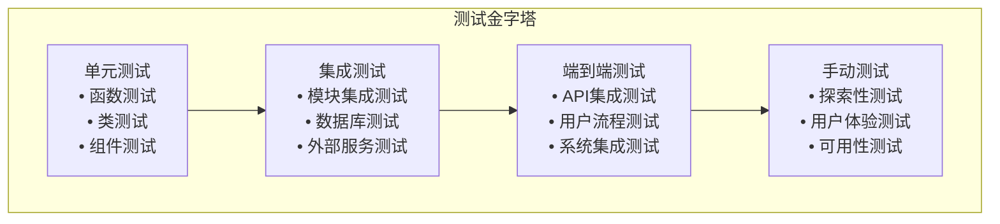

# 测试计划文档（Test Plan）
## 智能机器人配送系统

**版本**: 1.0  
**日期**: 2025年6月22日  
**项目**: 基于Webots的智能室内配送机器人系统

---

## 1. 测试概述

### 1.1 测试目标

本测试计划旨在确保智能机器人配送系统在功能性、性能、可靠性、安全性等方面满足设计要求。通过系统化的测试活动，验证系统的质量和稳定性，确保用户能够安全、高效地使用系统。

#### 1.1.1 主要测试目标
- **功能验证**: 确保所有功能模块按照需求规格正常工作
- **性能验证**: 验证系统在负载条件下的性能表现
- **可靠性验证**: 确保系统在各种异常情况下的稳定性
- **安全性验证**: 验证系统的安全防护机制
- **用户体验验证**: 确保用户界面友好且易于使用
- **集成验证**: 验证各模块之间的协作正常

#### 1.1.2 测试范围
- 前端用户界面（Vue.js应用）
- 后端API服务（FastAPI应用）
- ROS2机器人控制系统
- 数据存储和管理
- 系统集成和端到端流程
- 性能和负载测试
- 安全性测试

### 1.2 测试策略

#### 1.2.1 测试分层策略



**测试分层说明**：

| 测试层级 | 占比 | 执行频率 | 主要目的 |
|---------|------|---------|---------|
| 单元测试 | 70% | 每次构建 | 快速反馈，高覆盖率 |
| 集成测试 | 20% | 每日构建 | 模块间协作验证 |
| 端到端测试 | 8% | 发布前 | 用户场景验证 |
| 手动测试 | 2% | 发布前 | 探索性验证 |

### 1.3 测试环境

#### 1.3.1 测试环境配置
```yaml
# 测试环境配置
test_environments:
  development:
    description: "开发环境，用于开发阶段的快速测试"
    configuration:
      frontend_url: "http://localhost:5173"
      backend_url: "http://localhost:8000"
      database: "test_data.json"
      ros2_domain: 1
      
  staging:
    description: "预发布环境，用于集成测试和用户验收测试"
    configuration:
      frontend_url: "http://staging.example.com"
      backend_url: "http://api-staging.example.com"
      database: "staging_data.json"
      ros2_domain: 2
      
  production_simulation:
    description: "生产仿真环境，用于性能和压力测试"
    configuration:
      frontend_url: "http://prod-sim.example.com"
      backend_url: "http://api-prod-sim.example.com"
      database: "production_sim_data.json"
      ros2_domain: 3
```

#### 1.3.2 测试数据准备
```json
{
  "test_users": [
    {
      "user_id": "TEST001",
      "name": "测试用户1",
      "auth_level": "L1",
      "role": "普通用户"
    },
    {
      "user_id": "TEST002",
      "name": "测试用户2",
      "auth_level": "L2",
      "role": "管理员",
      "l2_auth": "123456"
    },
    {
      "user_id": "TEST003",
      "name": "测试用户3",
      "auth_level": "L3",
      "role": "系统管理员",
      "l2_auth": "654321",
      "l3_auth": "FACE_TEST003_BIOMETRIC"
    }
  ],
  "test_locations": [
    {
      "location_id": "LOC_TEST_001",
      "label": "测试位置1",
      "coordinates": {"x": 1.0, "y": 2.0}
    },
    {
      "location_id": "LOC_TEST_002", 
      "label": "测试位置2",
      "coordinates": {"x": 3.0, "y": 4.0}
    }
  ],
  "test_tasks": [
    {
      "task_type": "delivery",
      "priority": 2,
      "source_location": "测试位置1",
      "target_location": "测试位置2"
    }
  ]
}
```

---

## 2. 测试用例设计

### 2.1 功能测试用例

#### 2.1.1 用户认证功能测试

**TC-AUTH-001: L1级别认证测试**
```yaml
test_case_id: TC-AUTH-001
test_name: "L1级别用户认证"
test_objective: "验证L1级别用户认证流程"
test_priority: "High"
test_type: "Functional"
test_file: "tests/auth_api_test.py::TestAuthAPI::test_l1_auth_success"

preconditions:
  - 系统已启动
  - 测试用户EMP9875已存在于系统中

test_steps:
  1. 
    action: "发送POST请求到/api/auth/verify"
    data: |
      {
        "user_id": "EMP9875",
        "requested_level": "L1", 
        "provided": {}
      }
    expected_result: "返回认证成功响应"

test_data:
  valid_user_id: "EMP9875"
  auth_level: "L1"

expected_results:
  - HTTP状态码: 200
  - verified: true
  - verified_level: "L1"
  - methods包含"ID"

pass_criteria:
  - 所有断言验证通过
  - 返回数据格式正确
  - 认证级别匹配
```

**TC-AUTH-002: L2级别认证测试**
```yaml
test_case_id: TC-AUTH-002
test_name: "L2级别用户认证"
test_objective: "验证L2级别用户认证流程"
test_priority: "High"
test_type: "Functional"
test_file: "tests/auth_api_test.py::TestAuthAPI::test_l2_auth_success"

preconditions:
  - 系统已启动
  - L2级别测试用户EMP4958已存在

test_steps:
  1. 
    action: "发送POST请求到/api/auth/verify"
    data: |
      {
        "user_id": "EMP4958",
        "requested_level": "L2",
        "provided": {
          "l2_auth": "495481"
        }
      }
    expected_result: "L2认证成功"

test_data:
  user_id: "EMP4958"
  auth_level: "L2"
  l2_auth: "495481"

expected_results:
  - HTTP状态码: 200
  - verified: true
  - verified_level: "L2"
  - methods包含"ID"和"L2"
```

**TC-AUTH-003: L3级别认证测试**
```yaml
test_case_id: TC-AUTH-003
test_name: "L3级别用户认证"
test_objective: "验证L3级别用户认证流程"
test_priority: "High"
test_type: "Functional"
test_file: "tests/auth_api_test.py::TestAuthAPI::test_l3_auth_success"

preconditions:
  - 系统已启动
  - L3级别测试用户EMP7064已存在

test_steps:
  1. 
    action: "发送POST请求到/api/auth/verify"
    data: |
      {
        "user_id": "EMP7064",
        "requested_level": "L3",
        "provided": {
          "l2_auth": "546121",
          "l3_auth": "FACE_EMP7064_4944"
        }
      }
    expected_result: "L3认证成功"

test_data:
  user_id: "EMP7064"
  auth_level: "L3"
  l2_auth: "546121"
  l3_auth: "FACE_EMP7064_4944"

expected_results:
  - HTTP状态码: 200
  - verified: true
  - verified_level: "L3"
  - methods包含"ID"、"L2"和"L3"
```

**TC-AUTH-004: 认证失败测试**
```yaml
test_case_id: TC-AUTH-004
test_name: "认证失败处理"
test_objective: "验证认证失败时的错误处理"
test_priority: "Medium"
test_type: "Negative"
test_file: "tests/auth_api_test.py::TestAuthAPI::test_auth_user_not_found"

test_steps:
  1. 
    action: "输入不存在的用户ID: INVALID_USER"
    data: |
      {
        "user_id": "INVALID_USER",
        "requested_level": "L1",
        "provided": {}
      }
    expected_result: "返回401错误，显示用户不存在"

expected_results:
  - HTTP状态码: 401
  - detail包含"Authentication failed"
  - 适当的错误消息
```

#### 2.1.2 任务管理功能测试

**TC-TASK-001: 创建L1配送任务**
```yaml
test_case_id: TC-TASK-001
test_name: "创建L1级别配送任务"
test_objective: "验证L1级别配送任务创建功能"
test_priority: "High"
test_type: "Functional"
test_file: "tests/task_api_test.py::TestTaskAPI::test_create_task_success_l1"

preconditions:
  - 用户EMP9875已通过L1认证
  - 系统中存在有效的位置LOC101
  - 收件人EMP4958存在于系统中

test_steps:
  1. 
    action: "执行L1认证"
    data: |
      POST /api/auth/verify
      {
        "user_id": "EMP9875",
        "requested_level": "L1",
        "provided": {}
      }
    expected_result: "认证成功，状态码200"
    
  2. 
    action: "创建配送任务"
    data: |
      POST /api/task/create
      {
        "user_id": "EMP9875",
        "receiver": "EMP4958", 
        "location_id": "LOC101",
        "security_level": "L1",
        "description": "测试任务L1"
      }
    expected_result: "任务创建成功"

expected_results:
  - HTTP状态码: 200
  - success: true
  - code: "TASK_000"
  - task_id不为空
  - task对象包含完整任务信息
  - locker_id不为空
  - message包含"created successfully"

pass_criteria:
  - 所有断言验证通过
  - 任务保存到storage/tasks.json
  - 分配有效的柜门ID
```

**TC-TASK-002: 创建L2配送任务**
```yaml
test_case_id: TC-TASK-002
test_name: "创建L2级别配送任务"
test_objective: "验证L2级别配送任务创建功能"
test_priority: "High"
test_type: "Functional"
test_file: "tests/task_api_test.py::TestTaskAPI::test_create_task_success_l2"

preconditions:
  - 用户EMP4958已通过L2认证
  - 系统中存在有效的位置LOC448
  - 收件人EMP7064存在于系统中

test_steps:
  1. 
    action: "执行L2认证"
    data: |
      POST /api/auth/verify
      {
        "user_id": "EMP4958",
        "requested_level": "L2",
        "provided": {
          "l2_auth": "495481"
        }
      }
    expected_result: "L2认证成功"
    
  2. 
    action: "创建L2级别任务"
    data: |
      POST /api/task/create
      {
        "user_id": "EMP4958",
        "receiver": "EMP7064",
        "location_id": "LOC448", 
        "security_level": "L2",
        "description": "测试任务L2"
      }
    expected_result: "L2任务创建成功"

expected_results:
  - HTTP状态码: 200
  - success: true
  - code: "TASK_000"
  - 返回完整的任务信息
  - 安全等级为L2
```

**TC-TASK-003: 创建L3配送任务**
```yaml
test_case_id: TC-TASK-003
test_name: "创建L3级别配送任务"  
test_objective: "验证L3级别配送任务创建功能"
test_priority: "High"
test_type: "Functional"
test_file: "tests/task_api_test.py::TestTaskAPI::test_create_task_success_l3"

preconditions:
  - 用户EMP7064已通过L3认证
  - 系统支持L3级别任务

test_steps:
  1. 
    action: "执行L3认证"
    data: |
      POST /api/auth/verify
      {
        "user_id": "EMP7064",
        "requested_level": "L3",
        "provided": {
          "l2_auth": "546121",
          "l3_auth": "FACE_EMP7064_4944"
        }
      }
    expected_result: "L3认证成功"
    
  2. 
    action: "创建L3级别任务"
    expected_result: "L3任务创建成功，具有最高安全等级"

expected_results:
  - 任务创建成功
  - 安全等级为L3
  - 获得特殊处理标识
```

**TC-TASK-004: 任务状态查询**
```yaml
test_case_id: TC-TASK-004
test_name: "任务状态查询"
test_objective: "验证任务状态查询功能"
test_priority: "Medium"
test_type: "Functional"

test_steps:
  1. 
    action: "查询所有任务"
    endpoint: "GET /api/task/list"
    expected_result: "返回任务列表"
    
  2. 
    action: "查询特定用户任务"
    endpoint: "GET /api/task/list?user_id=EMP9875"
    expected_result: "返回指定用户的任务"

expected_results:
  - HTTP状态码: 200
  - 返回JSON格式的任务列表 
  - 包含任务状态信息
```
    expected_result: "位置选择成功"
    
  4. 
    action: "设置安全等级"
    expected_result: "安全等级设置成功"
    
  5. 
    action: "提交任务"
    expected_result: "任务创建成功，返回任务ID"

test_data:
  sender_id: "TEST001"
  receiver_id: "TEST002"
  target_location: "测试位置2"
  security_level: "L2"
  priority: 2

expected_results:
  - 任务创建成功
  - 返回唯一任务ID
  - 任务加入队列
  - 分配柜门编号
```

**TC-TASK-002: 任务队列管理**
```yaml
test_case_id: TC-TASK-002
test_name: "任务队列管理"
test_objective: "验证任务队列的管理功能"
test_priority: "High"
test_type: "Functional"

test_steps:
  1. 
    action: "创建多个不同优先级的任务"
    expected_result: "任务按优先级排序"
    
  2. 
    action: "查看任务队列状态"
    expected_result: "显示正确的队列信息"
    
  3. 
    action: "启动下一个任务"
    expected_result: "任务状态更新为执行中"
    
  4. 
    action: "取消等待中的任务"
    expected_result: "任务被成功取消"

expected_results:
  - 队列排序正确
  - 状态更新及时
  - 任务操作成功
```

#### 2.1.3 机器人导航功能测试

**TC-NAV-001: 语义导航测试**
```yaml
test_case_id: TC-NAV-001
test_name: "语义导航功能"
test_objective: "验证机器人语义导航功能"
test_priority: "High"
test_type: "Functional"

preconditions:
  - ROS2系统已启动
  - 语义地图已加载
  - 机器人已完成定位

test_steps:
  1. 
    action: "发送语义导航指令: '经理室'"
    expected_result: "指令被成功接收"
    
  2. 
    action: "检查路径规划结果"
    expected_result: "生成有效的导航路径"
    
  3. 
    action: "监控导航执行过程"
    expected_result: "机器人开始移动"
    
  4. 
    action: "等待导航完成"
    expected_result: "机器人到达目标位置"

test_data:
  target_location: "经理室"
  timeout: 300  # 5分钟

expected_results:
  - 导航指令执行成功
  - 机器人到达指定位置
  - 状态反馈正确
```

**TC-NAV-002: 多目标导航测试**
```yaml
test_case_id: TC-NAV-002
test_name: "多目标导航功能"
test_objective: "验证机器人多目标导航功能"
test_priority: "High"
test_type: "Functional"

test_steps:
  1. 
    action: "发送多目标导航指令"
    expected_result: "指令被解析成功"
    
  2. 
    action: "检查路径优化结果"
    expected_result: "生成优化的访问顺序"
    
  3. 
    action: "执行多目标导航"
    expected_result: "机器人按顺序访问各目标点"
    
  4. 
    action: "测试等待确认机制"
    expected_result: "机器人在每个点等待确认"

test_data:
  target_locations: ["小会议室", "经理室", "财务处"]
  max_execution_time: 900  # 15分钟

expected_results:
  - 路径优化正确
  - 所有目标点被访问
  - 等待确认机制工作正常
```

### 2.2 性能测试用例

#### 2.2.1 API性能测试

**TC-PERF-001: API响应时间测试**
```yaml
test_case_id: TC-PERF-001
test_name: "API响应时间测试"
test_objective: "验证API响应时间满足性能要求"
test_priority: "High"
test_type: "Performance"

test_configuration:
  concurrent_users: 10
  test_duration: 300  # 5分钟
  ramp_up_time: 60   # 1分钟

test_scenarios:
  1. 
    api_endpoint: "/api/auth/verify"
    request_rate: 10/second
    expected_response_time: 200ms
    
  2. 
    api_endpoint: "/api/tasks/create"
    request_rate: 5/second
    expected_response_time: 500ms
    
  3. 
    api_endpoint: "/api/tasks/queue/status"
    request_rate: 20/second
    expected_response_time: 100ms

performance_criteria:
  - 95%的请求响应时间符合要求
  - 错误率小于1%
  - 系统资源使用率合理
```

**TC-PERF-002: 负载测试**
```yaml
test_case_id: TC-PERF-002
test_name: "系统负载测试"
test_objective: "验证系统在高负载下的表现"
test_priority: "Medium"
test_type: "Load"

load_profile:
  normal_load:
    concurrent_users: 50
    duration: 1800  # 30分钟
    
  peak_load:
    concurrent_users: 100
    duration: 600   # 10分钟
    
  stress_load:
    concurrent_users: 200
    duration: 300   # 5分钟

monitoring_metrics:
  - CPU使用率
  - 内存使用率
  - 响应时间
  - 吞吐量
  - 错误率

pass_criteria:
  - 正常负载下系统稳定运行
  - 峰值负载下响应时间不超过要求的2倍
  - 压力测试后系统能够恢复正常
```

#### 2.2.2 ROS2性能测试

**TC-PERF-003: ROS2消息传输性能**
```yaml
test_case_id: TC-PERF-003
test_name: "ROS2消息传输性能"
test_objective: "验证ROS2消息传输的性能"
test_priority: "Medium"
test_type: "Performance"

test_scenarios:
  1. 
    topic: "/nav_command"
    message_rate: 1/second
    message_size: 100 bytes
    
  2. 
    topic: "/task_status"
    message_rate: 10/second
    message_size: 500 bytes
    
  3. 
    topic: "/robot_pose"
    message_rate: 30/second
    message_size: 200 bytes

performance_metrics:
  - 消息传输延迟
  - 消息丢失率
  - 网络带宽使用
  - 节点CPU使用率

expected_results:
  - 消息传输延迟小于100ms
  - 消息丢失率小于0.1%
  - 网络带宽使用合理
```

### 2.3 安全测试用例

#### 2.3.1 认证安全测试

**TC-SEC-001: 认证安全测试**
```yaml
test_case_id: TC-SEC-001
test_name: "认证安全测试"
test_objective: "验证认证系统的安全性"
test_priority: "High"
test_type: "Security"

test_scenarios:
  1. 
    test_name: "暴力破解防护"
    description: "测试系统对暴力破解的防护"
    steps:
      - 连续发送大量认证请求
      - 验证账户锁定机制
      - 检查速率限制
      
  2. 
    test_name: "Token安全性"
    description: "测试JWT Token的安全性"
    steps:
      - 验证Token签名
      - 测试Token过期机制
      - 检查Token刷新机制
      
  3. 
    test_name: "会话管理"
    description: "测试会话管理的安全性"
    steps:
      - 验证会话超时
      - 测试并发会话限制
      - 检查会话注销

security_checks:
  - 密码不以明文存储
  - 敏感信息不在日志中泄露
  - 会话管理机制完善
  - 权限控制严格
```

#### 2.3.2 API安全测试

**TC-SEC-002: API安全测试**
```yaml
test_case_id: TC-SEC-002
test_name: "API安全测试"
test_objective: "验证API接口的安全性"
test_priority: "High"
test_type: "Security"

test_scenarios:
  1. 
    test_name: "输入验证"
    description: "测试API输入验证"
    attack_vectors:
      - SQL注入攻击
      - XSS攻击
      - 命令注入
      - 路径遍历
      
  2. 
    test_name: "授权验证"
    description: "测试API授权机制"
    steps:
      - 无Token访问
      - 过期Token访问
      - 权限不足访问
      - 跨用户访问
      
  3. 
    test_name: "数据保护"
    description: "测试敏感数据保护"
    checks:
      - 数据传输加密
      - 敏感数据脱敏
      - 错误信息泄露

expected_results:
  - 所有攻击被成功拦截
  - 授权机制工作正常
  - 敏感数据得到保护
```

---

## 3. 测试执行计划

### 3.1 测试阶段划分

#### 3.1.1 测试阶段安排
```
测试阶段时间表:

Phase 1: 单元测试阶段 (Week 1-2)
├─ 前端组件单元测试
├─ 后端API单元测试
├─ ROS2节点单元测试
└─ 数据访问层测试

Phase 2: 集成测试阶段 (Week 3-4)
├─ 前后端集成测试
├─ API与ROS2集成测试
├─ 数据库集成测试
└─ 外部服务集成测试

Phase 3: 系统测试阶段 (Week 5-6)
├─ 功能测试
├─ 性能测试
├─ 安全测试
└─ 兼容性测试

Phase 4: 用户验收测试 (Week 7)
├─ 用户场景测试
├─ 易用性测试
├─ 文档验证
└─ 最终验收
```

#### 3.1.2 测试环境准备
```bash
# 测试环境准备脚本
#!/bin/bash

# 1. 环境清理
echo "清理测试环境..."
./scripts/cleanup_test_env.sh

# 2. 数据库准备
echo "准备测试数据..."
cp storage/test_data/*.json storage/
python scripts/generate_test_data.py

# 3. 服务启动
echo "启动测试服务..."
./start_test_services.sh

# 4. 健康检查
echo "执行健康检查..."
python scripts/health_check.py

# 5. 测试数据验证
echo "验证测试数据..."
python scripts/validate_test_data.py

echo "测试环境准备完成"
```

### 3.2 测试执行流程

#### 3.2.1 单元测试执行

**前端单元测试**
```bash
# Vue组件单元测试
cd robot-delivery-system

# 安装依赖
npm install

# 执行单元测试
npm run test:unit

# 生成覆盖率报告
npm run test:unit -- --coverage

# 监控模式
npm run test:unit -- --watch
```

**后端单元测试**
```bash
# Python单元测试
cd secure_robot_api

# 安装测试依赖
pip install -r requirements-test.txt

# 执行单元测试
python -m pytest tests/unit/ -v

# 生成覆盖率报告
python -m pytest tests/unit/ --cov=. --cov-report=html

# 并行执行测试
python -m pytest tests/unit/ -n auto
```

**ROS2节点测试**
```bash
# ROS2节点测试
cd ros2_ws

# 构建测试
colcon build --packages-select test_packages

# 执行测试
colcon test --packages-select test_packages

# 查看测试结果
colcon test-result --verbose
```

#### 3.2.2 集成测试执行

**API集成测试**
```python
# API集成测试示例
import pytest
import asyncio
from httpx import AsyncClient
from main import app

@pytest.fixture
async def client():
    async with AsyncClient(app=app, base_url="http://test") as ac:
        yield ac

@pytest.mark.asyncio
async def test_auth_integration(client):
    """测试认证集成流程"""
    # 1. 测试用户认证
    auth_response = await client.post("/api/auth/verify", json={
        "user_id": "TEST001",
        "auth_level": "L1",
        "auth_data": {}
    })
    
    assert auth_response.status_code == 200
    auth_data = auth_response.json()
    token = auth_data["token"]
    
    # 2. 使用token创建任务
    task_response = await client.post("/api/tasks/create", 
        json={
            "task_type": "delivery",
            "target_location": "测试位置",
            "priority": 2
        },
        headers={"Authorization": f"Bearer {token}"}
    )
    
    assert task_response.status_code == 200
    task_data = task_response.json()
    assert "task_id" in task_data

@pytest.mark.asyncio 
async def test_ros2_integration():
    """测试ROS2集成"""
    # 测试ROS2桥接功能
    bridge = ROS2Bridge()
    
    # 发送导航指令
    result = await bridge.send_navigation_command("经理室")
    assert result == True
    
    # 检查状态反馈
    status = await bridge.get_robot_status()
    assert status is not None
```

#### 3.2.3 端到端测试执行

**Playwright端到端测试**
```typescript
// 端到端测试示例
import { test, expect } from '@playwright/test';

test.describe('配送系统端到端测试', () => {
  test('完整的寄件流程', async ({ page }) => {
    // 1. 访问首页
    await page.goto('http://localhost:5173');
    
    // 2. 点击寄件按钮
    await page.click('[data-testid="send-package-btn"]');
    
    // 3. 进行身份认证
    await page.fill('[data-testid="user-id-input"]', 'TEST001');
    await page.click('[data-testid="auth-submit-btn"]');
    
    // 4. 等待认证成功
    await expect(page.locator('[data-testid="auth-success"]')).toBeVisible();
    
    // 5. 填写寄件信息
    await page.fill('[data-testid="receiver-input"]', 'TEST002');
    await page.selectOption('[data-testid="location-select"]', '经理室');
    await page.selectOption('[data-testid="security-level"]', 'L2');
    
    // 6. 提交任务
    await page.click('[data-testid="submit-task-btn"]');
    
    // 7. 验证任务创建成功
    await expect(page.locator('[data-testid="task-success"]')).toBeVisible();
    
    // 8. 检查任务队列
    await page.click('[data-testid="queue-btn"]');
    await expect(page.locator('[data-testid="task-item"]')).toHaveCount(1);
  });
  
  test('机器人导航流程', async ({ page }) => {
    // 1. 启动任务
    await page.goto('http://localhost:5173/queue');
    await page.click('[data-testid="start-task-btn"]');
    
    // 2. 监控导航状态
    await expect(page.locator('[data-testid="robot-status"]')).toContainText('执行中');
    
    // 3. 等待任务完成
    await page.waitForSelector('[data-testid="task-completed"]', { timeout: 300000 });
    
    // 4. 验证任务状态
    await expect(page.locator('[data-testid="task-status"]')).toContainText('已完成');
  });
});
```

### 3.3 测试自动化

#### 3.3.1 CI/CD集成

**GitHub Actions配置**
```yaml
# .github/workflows/test.yml
name: 测试流水线

on:
  push:
    branches: [ main, develop ]
  pull_request:
    branches: [ main ]

jobs:
  frontend-tests:
    runs-on: ubuntu-latest
    steps:
      - uses: actions/checkout@v3
      
      - name: Setup Node.js
        uses: actions/setup-node@v3
        with:
          node-version: '18'
          
      - name: Install dependencies
        run: |
          cd robot-delivery-system
          npm ci
          
      - name: Run unit tests
        run: |
          cd robot-delivery-system
          npm run test:unit -- --coverage
          
      - name: Upload coverage
        uses: codecov/codecov-action@v3
        with:
          file: ./robot-delivery-system/coverage/lcov.info

  backend-tests:
    runs-on: ubuntu-latest
    steps:
      - uses: actions/checkout@v3
      
      - name: Setup Python
        uses: actions/setup-python@v4
        with:
          python-version: '3.9'
          
      - name: Install dependencies
        run: |
          cd secure_robot_api
          pip install -r requirements.txt
          pip install -r requirements-test.txt
          
      - name: Run tests
        run: |
          cd secure_robot_api
          python -m pytest tests/ --cov=. --cov-report=xml
          
      - name: Upload coverage
        uses: codecov/codecov-action@v3
        with:
          file: ./secure_robot_api/coverage.xml

  ros2-tests:
    runs-on: ubuntu-latest
    container:
      image: ros:humble
    steps:
      - uses: actions/checkout@v3
      
      - name: Setup ROS2 environment
        run: |
          source /opt/ros/humble/setup.bash
          cd ros2_ws
          colcon build
          
      - name: Run ROS2 tests
        run: |
          source /opt/ros/humble/setup.bash
          cd ros2_ws
          source install/setup.bash
          colcon test
          colcon test-result --verbose

  integration-tests:
    runs-on: ubuntu-latest
    needs: [frontend-tests, backend-tests, ros2-tests]
    steps:
      - uses: actions/checkout@v3
      
      - name: Setup test environment
        run: |
          ./scripts/setup_integration_test.sh
          
      - name: Run integration tests
        run: |
          python -m pytest tests/integration/ -v
          
      - name: Run E2E tests
        run: |
          cd robot-delivery-system
          npx playwright test
```

#### 3.3.2 测试报告生成

**测试报告配置**
```python
# 测试报告生成脚本
import pytest
import json
from datetime import datetime

def generate_test_report():
    """生成综合测试报告"""
    report_data = {
        "test_run_id": f"TR_{datetime.now().strftime('%Y%m%d_%H%M%S')}",
        "timestamp": datetime.now().isoformat(),
        "environment": "staging",
        "test_summary": {
            "total_tests": 0,
            "passed": 0,
            "failed": 0,
            "skipped": 0,
            "coverage": 0.0
        },
        "test_categories": {
            "unit_tests": {},
            "integration_tests": {},
            "e2e_tests": {},
            "performance_tests": {},
            "security_tests": {}
        },
        "failed_tests": [],
        "performance_metrics": {},
        "recommendations": []
    }
    
    # 收集测试结果
    collect_unit_test_results(report_data)
    collect_integration_test_results(report_data)
    collect_e2e_test_results(report_data)
    collect_performance_test_results(report_data)
    
    # 生成报告
    generate_html_report(report_data)
    generate_json_report(report_data)
    
    return report_data

def collect_unit_test_results(report_data):
    """收集单元测试结果"""
    # 前端单元测试结果
    frontend_results = parse_jest_results("robot-delivery-system/coverage/test-results.json")
    report_data["test_categories"]["unit_tests"]["frontend"] = frontend_results
    
    # 后端单元测试结果
    backend_results = parse_pytest_results("secure_robot_api/test-results.xml")
    report_data["test_categories"]["unit_tests"]["backend"] = backend_results
    
    # ROS2单元测试结果
    ros2_results = parse_colcon_results("ros2_ws/log/latest_test/")
    report_data["test_categories"]["unit_tests"]["ros2"] = ros2_results
```

---

## 4. 测试覆盖率要求

### 4.1 代码覆盖率目标

#### 4.1.1 覆盖率指标
```yaml
coverage_targets:
  overall:
    target: 80%
    minimum: 70%
    
  frontend:
    target: 85%
    minimum: 75%
    components:
      - 业务组件: 90%
      - 工具函数: 95%
      - 类型定义: 80%
      
  backend:
    target: 85%
    minimum: 80%
    modules:
      - API路由: 90%
      - 业务服务: 90%
      - 数据访问: 85%
      - 工具函数: 95%
      
  ros2_nodes:
    target: 75%
    minimum: 70%
    components:
      - 核心逻辑: 85%
      - 消息处理: 80%
      - 异常处理: 75%
```

#### 4.1.2 覆盖率监控

**前端覆盖率监控**
```javascript
// jest.config.js
module.exports = {
  collectCoverage: true,
  collectCoverageFrom: [
    'src/**/*.{js,ts,vue}',
    '!src/main.ts',
    '!src/**/*.d.ts',
    '!src/test-utils/**/*'
  ],
  coverageThreshold: {
    global: {
      branches: 80,
      functions: 85,
      lines: 85,
      statements: 85
    },
    './src/components/': {
      branches: 90,
      functions: 90,
      lines: 90,
      statements: 90
    }
  },
  coverageReporters: ['text', 'lcov', 'html', 'json-summary']
};
```

**后端覆盖率监控**
```python
# pytest.ini
[tool:pytest]
testpaths = tests
addopts = 
    --cov=.
    --cov-report=html:coverage_html
    --cov-report=xml:coverage.xml
    --cov-report=term-missing
    --cov-fail-under=80
    --cov-branch

[coverage:run]
source = .
omit = 
    tests/*
    venv/*
    __pycache__/*
    .pytest_cache/*

[coverage:report]
exclude_lines =
    pragma: no cover
    def __repr__
    raise AssertionError
    raise NotImplementedError
```

### 4.2 功能覆盖率验证

#### 4.2.1 功能点覆盖矩阵
```
功能覆盖率矩阵:

功能模块        | 单元测试 | 集成测试 | E2E测试 | 覆盖率
---------------|---------|---------|---------|--------
用户认证        | ✓       | ✓       | ✓       | 100%
任务创建        | ✓       | ✓       | ✓       | 100%
任务队列管理    | ✓       | ✓       | ✓       | 100%
语义导航        | ✓       | ✓       | ✓       | 100%
多目标导航      | ✓       | ✓       | ✓       | 100%
取件功能        | ✓       | ✓       | ✓       | 100%
语音识别        | ✓       | ✓       | ✗       | 80%
系统监控        | ✓       | ✓       | ✗       | 85%
数据存储        | ✓       | ✓       | ✗       | 90%
API网关         | ✓       | ✓       | ✓       | 95%
错误处理        | ✓       | ✓       | ✓       | 90%
```

#### 4.2.2 用例覆盖率追踪
```python
# 用例覆盖率追踪工具
class TestCoverageTracker:
    def __init__(self):
        self.requirements = self.load_requirements()
        self.test_cases = self.load_test_cases()
        self.coverage_matrix = {}
    
    def load_requirements(self):
        """加载需求清单"""
        return [
            "REQ-001: 用户L1认证",
            "REQ-002: 用户L2认证", 
            "REQ-003: 用户L3认证",
            "REQ-004: 任务创建",
            "REQ-005: 任务执行",
            "REQ-006: 语义导航",
            "REQ-007: 多目标导航",
            # ... 更多需求
        ]
    
    def calculate_coverage(self):
        """计算需求覆盖率"""
        covered_requirements = 0
        
        for req_id in self.requirements:
            if self.is_requirement_covered(req_id):
                covered_requirements += 1
        
        coverage_rate = covered_requirements / len(self.requirements) * 100
        return coverage_rate
    
    def generate_coverage_report(self):
        """生成覆盖率报告"""
        report = {
            "total_requirements": len(self.requirements),
            "covered_requirements": self.count_covered_requirements(),
            "coverage_rate": self.calculate_coverage(),
            "uncovered_requirements": self.get_uncovered_requirements(),
            "recommendations": self.get_recommendations()
        }
        
        return report
```

---

## 5. 测试工具和框架

### 5.1 测试工具选择

#### 5.1.1 前端测试工具
```json
{
  "unit_testing": {
    "framework": "Vitest",
    "reasons": [
      "与Vite集成良好",
      "快速执行速度",
      "TypeScript原生支持",
      "Vue组件测试友好"
    ],
    "utilities": [
      "@vue/test-utils",
      "jsdom",
      "happy-dom"
    ]
  },
  "e2e_testing": {
    "framework": "Playwright",
    "reasons": [
      "跨浏览器支持",
      "现代化API",
      "内置等待机制",
      "强大的调试功能"
    ],
    "configuration": {
      "browsers": ["chromium", "firefox", "webkit"],
      "headless": true,
      "video": "retain-on-failure",
      "screenshot": "only-on-failure"
    }
  },
  "component_testing": {
    "framework": "Storybook",
    "reasons": [
      "组件可视化测试",
      "文档化组件",
      "交互式测试",
      "多状态测试"
    ]
  }
}
```

#### 5.1.2 后端测试工具
```python
# 后端测试工具配置
TESTING_FRAMEWORKS = {
    "unit_testing": {
        "framework": "pytest",
        "plugins": [
            "pytest-asyncio",
            "pytest-cov", 
            "pytest-mock",
            "pytest-xdist"
        ],
        "reasons": [
            "丰富的插件生态",
            "异步测试支持",
            "并行测试执行",
            "强大的断言功能"
        ]
    },
    "api_testing": {
        "framework": "httpx",
        "reasons": [
            "异步HTTP客户端",
            "与FastAPI集成好",
            "现代化API",
            "类型提示支持"
        ]
    },
    "mock_testing": {
        "framework": "unittest.mock",
        "additional_tools": [
            "responses",
            "pytest-mock"
        ]
    },
    "load_testing": {
        "framework": "locust",
        "reasons": [
            "Python编写测试脚本",
            "分布式负载测试",
            "实时监控界面",
            "灵活的场景配置"
        ]
    }
}
```

#### 5.1.3 ROS2测试工具
```yaml
ros2_testing_tools:
  unit_testing:
    framework: "colcon test"
    test_runners:
      - pytest
      - gtest
      - gmock
      
  integration_testing:
    framework: "launch_testing"
    features:
      - 多节点测试
      - 参数化测试
      - 超时控制
      - 日志收集
      
  performance_testing:
    framework: "performance_test"
    metrics:
      - 消息延迟
      - 吞吐量
      - CPU使用率
      - 内存使用
```

### 5.2 测试环境配置

#### 5.2.1 Docker测试环境
```dockerfile
# Dockerfile.test
FROM ros:humble

# 安装测试依赖
RUN apt-get update && apt-get install -y \
    python3-pytest \
    python3-pytest-cov \
    python3-pytest-mock \
    python3-colcon-test \
    python3-launch-testing \
    && rm -rf /var/lib/apt/lists/*

# 复制源代码
COPY ros2_ws /workspace/ros2_ws
COPY secure_robot_api /workspace/secure_robot_api

# 设置工作目录
WORKDIR /workspace

# 构建ROS2包
RUN cd ros2_ws && \
    source /opt/ros/humble/setup.bash && \
    colcon build

# 运行测试
CMD ["bash", "-c", "source /opt/ros/humble/setup.bash && source ros2_ws/install/setup.bash && pytest -v"]
```

#### 5.2.2 测试数据库配置
```python
# 测试数据库配置
import pytest
import tempfile
import json
from pathlib import Path

@pytest.fixture(scope="session")
def test_database():
    """测试数据库fixture"""
    # 创建临时目录
    temp_dir = tempfile.mkdtemp()
    
    # 准备测试数据
    test_data = {
        "users": [
            {
                "user_id": "TEST001",
                "name": "测试用户1",
                "auth_level": "L1"
            }
        ],
        "locations": [
            {
                "location_id": "LOC001",
                "label": "测试位置1",
                "coordinates": {"x": 1.0, "y": 2.0}
            }
        ],
        "tasks": []
    }
    
    # 写入测试数据文件
    for collection, data in test_data.items():
        file_path = Path(temp_dir) / f"{collection}.json"
        with open(file_path, 'w') as f:
            json.dump(data, f, indent=2)
    
    yield temp_dir
    
    # 清理
    import shutil
    shutil.rmtree(temp_dir)

@pytest.fixture(autouse=True)
def setup_test_environment(test_database):
    """自动设置测试环境"""
    import os
    os.environ['STORAGE_PATH'] = test_database
    os.environ['TESTING'] = 'true'
```

### 5.3 持续集成配置

#### 5.3.1 测试流水线
```yaml
# 测试流水线配置
test_pipeline:
  stages:
    - code_quality
    - unit_tests
    - integration_tests
    - e2e_tests
    - performance_tests
    - security_tests
    - report_generation
    
  code_quality:
    tools:
      - ESLint (前端)
      - Prettier (代码格式化)
      - Pylint (后端)
      - Black (Python格式化)
      - SonarQube (代码质量分析)
      
  parallel_execution:
    frontend_tests:
      - unit_tests
      - component_tests
      - type_checking
      
    backend_tests:
      - unit_tests
      - api_tests
      - integration_tests
      
    ros2_tests:
      - node_tests
      - launch_tests
      - performance_tests
```

#### 5.3.2 测试报告集成
```python
# 测试报告集成
class TestReportAggregator:
    def __init__(self):
        self.reports = {}
        
    def collect_reports(self):
        """收集各类测试报告"""
        self.reports = {
            "unit_tests": self.collect_unit_test_reports(),
            "integration_tests": self.collect_integration_reports(),
            "e2e_tests": self.collect_e2e_reports(),
            "performance_tests": self.collect_performance_reports(),
            "security_tests": self.collect_security_reports()
        }
        
    def generate_dashboard(self):
        """生成测试仪表板"""
        dashboard_data = {
            "summary": self.calculate_summary(),
            "trends": self.analyze_trends(),
            "quality_gates": self.check_quality_gates(),
            "recommendations": self.generate_recommendations()
        }
        
        self.render_dashboard(dashboard_data)
        
    def check_quality_gates(self):
        """检查质量门禁"""
        gates = {
            "test_coverage": self.reports.get("coverage", 0) >= 80,
            "test_pass_rate": self.calculate_pass_rate() >= 95,
            "performance_threshold": self.check_performance_thresholds(),
            "security_issues": self.count_security_issues() == 0
        }
        
        return gates
```

---

**本文档版本**: 1.0  
**最后更新**: 2025年6月22日  
**审核状态**: 待审核  
**批准人**: 待定
