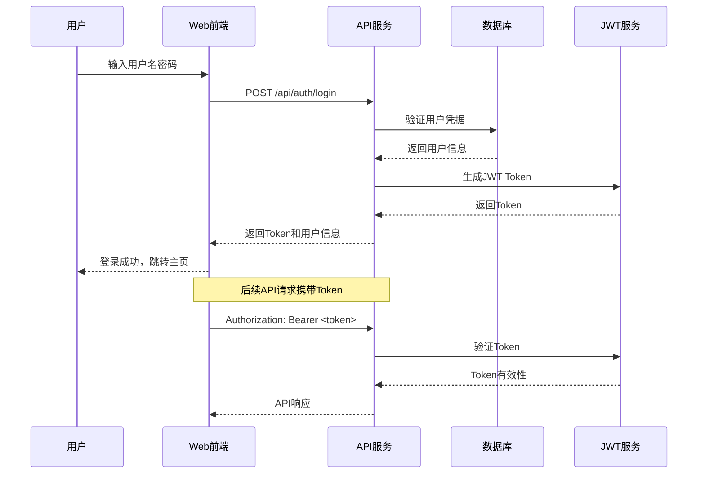
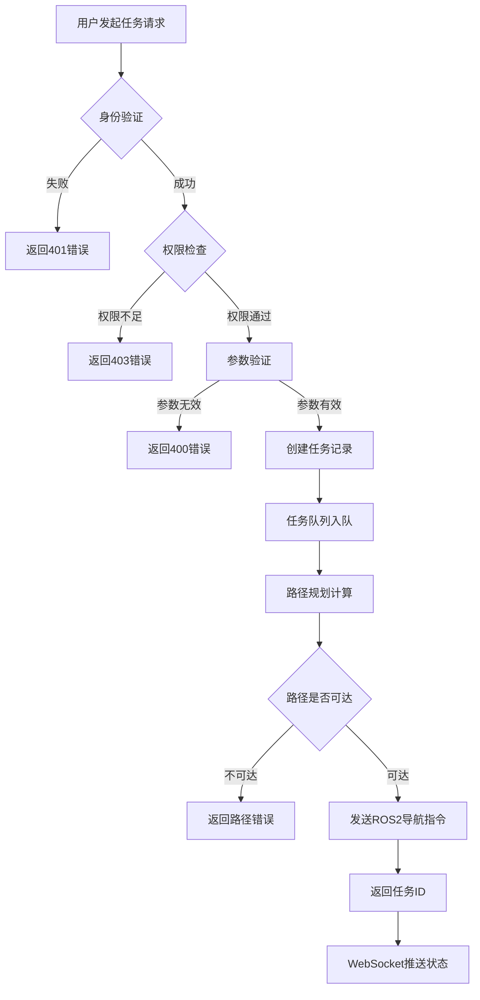

# API流程图

本文档展示了智能配送机器人系统的API调用流程和数据流向。

## 1. 用户认证流程



## 2. 任务创建流程



## 3. 完整API调用流程图

```
┌─────────────────────────────────────────────────────────────────────────────────────┐
│                                 API调用流程图                                         │
├─────────────────────────────────────────────────────────────────────────────────────┤
│                                                                                     │
│  ┌─────────────┐    HTTP Request     ┌─────────────────────────────────────────────┐ │
│  │   客户端     │ ───────────────────>│              API网关层                        │ │
│  │   Client    │                     │           (FastAPI Server)                 │ │
│  │             │                     │                                             │ │
│  │ - Web前端   │                     │  ┌─────────────┐  ┌─────────────────────────┐│ │
│  │ - 移动端    │                     │  │  请求验证    │  │      中间件链            ││ │
│  │ - 语音接口  │<────────────────────│  │ Validation  │  │   Middleware Chain      ││ │
│  │             │    HTTP Response    │  │             │  │                         ││ │
│  └─────────────┘                     │  │ +validate() │  │ - CORS处理              ││ │
│                                      │  │ +sanitize() │  │ - 请求日志              ││ │
│                                      │  │ +format()   │  │ - 限流控制              ││ │
│                                      │  └─────────────┘  │ - 异常捕获              ││ │
│                                      │         │         └─────────────────────────┘│ │
│                                      └─────────┼─────────────────────────────────────┘ │
│                                                │                                       │
│  ┌─────────────────────────────────────────────┼─────────────────────────────────────┐ │
│  │                                  认证授权层 │                                     │ │
│  │                              Authentication & Authorization                       │ │
│  │                                             │                                     │ │
│  │  ┌─────────────┐  ┌─────────────┐  ┌──────┴────────┐  ┌─────────────────────────┐ │ │
│  │  │ JWT验证器   │  │ 权限检查器   │  │  会话管理器    │  │     安全审计器           │ │ │
│  │  │JWTValidator │  │PermChecker  │  │SessionManager │  │  SecurityAuditor        │ │ │
│  │  │             │  │             │  │               │  │                         │ │ │
│  │  │ +verify()   │  │ +check()    │  │ +create()     │  │ +log()                  │ │ │
│  │  │ +decode()   │  │ +authorize()│  │ +refresh()    │  │ +detect()               │ │ │
│  │  │ +expire()   │  │ +deny()     │  │ +destroy()    │  │ +alert()                │ │ │
│  │  └─────────────┘  └─────────────┘  └───────────────┘  └─────────────────────────┘ │ │
│  └─────────────────────────────────────────────┼─────────────────────────────────────┘ │
│                                                │                                       │
│  ┌─────────────────────────────────────────────┼─────────────────────────────────────┐ │
│  │                                  业务逻辑层 │                                     │ │
│  │                              Business Logic Layer                                │ │
│  │                                             │                                     │ │
│  │  ┌─────────────┐  ┌─────────────┐  ┌──────┴────────┐  ┌─────────────────────────┐ │ │
│  │  │ 任务服务    │  │ 用户服务     │  │  配送服务      │  │     路径服务             │ │ │
│  │  │TaskService  │  │UserService  │  │DeliveryService│  │  PathService            │ │ │
│  │  │             │  │             │  │               │  │                         │ │ │
│  │  │ +create()   │  │ +register() │  │ +schedule()   │  │ +plan()                 │ │ │
│  │  │ +update()   │  │ +profile()  │  │ +track()      │  │ +optimize()             │ │ │
│  │  │ +cancel()   │  │ +delete()   │  │ +complete()   │  │ +validate()             │ │ │
│  │  └─────────────┘  └─────────────┘  └───────────────┘  └─────────────────────────┘ │ │
│  └─────────────────────────────────────────────┼─────────────────────────────────────┘ │
│                                                │                                       │
│  ┌─────────────────────────────────────────────┼─────────────────────────────────────┐ │
│  │                                  数据访问层 │                                     │ │
│  │                              Data Access Layer                                   │ │
│  │                                             │                                     │ │
│  │  ┌─────────────┐  ┌─────────────┐  ┌──────┴────────┐  ┌─────────────────────────┐ │ │
│  │  │ 数据库DAO   │  │ 缓存管理器   │  │  文件存储      │  │     外部API接口          │ │ │
│  │  │DatabaseDAO  │  │CacheManager │  │FileStorage    │  │  ExternalAPI            │ │ │
│  │  │             │  │             │  │               │  │                         │ │ │
│  │  │ +query()    │  │ +get()      │  │ +upload()     │  │ +ros2Call()             │ │ │
│  │  │ +insert()   │  │ +set()      │  │ +download()   │  │ +webotsSim()            │ │ │
│  │  │ +update()   │  │ +delete()   │  │ +delete()     │  │ +navStack()             │ │ │
│  │  └─────────────┘  └─────────────┘  └───────────────┘  └─────────────────────────┘ │ │
│  └─────────────────────────────────────────────┼─────────────────────────────────────┘ │
│                                                │                                       │
│  ┌─────────────────────────────────────────────┼─────────────────────────────────────┐ │
│  │                               外部系统接口层│                                     │ │
│  │                           External System Interface                              │ │
│  │                                             │                                     │ │
│  │  ┌─────────────┐  ┌─────────────┐  ┌──────┴────────┐  ┌─────────────────────────┐ │ │
│  │  │ ROS2桥接    │  │ Webots仿真   │  │  Nav2导航栈   │  │     消息队列             │ │ │
│  │  │ROS2Bridge   │  │WebotsSim    │  │Nav2Stack      │  │  MessageQueue           │ │ │
│  │  │             │  │             │  │               │  │                         │ │ │
│  │  │ +publish()  │  │ +start()    │  │ +navigate()   │  │ +send()                 │ │ │
│  │  │ +subscribe()│  │ +reset()    │  │ +cancel()     │  │ +receive()              │ │ │
│  │  │ +call()     │  │ +step()     │  │ +status()     │  │ +ack()                  │ │ │
│  │  └─────────────┘  └─────────────┘  └───────────────┘  └─────────────────────────┘ │ │
│  └─────────────────────────────────────────────────────────────────────────────────┘ │
└─────────────────────────────────────────────────────────────────────────────────────┘
```

## 4. 关键API端点流程

### 4.1 POST /api/tasks/create - 创建配送任务

```
Request Flow:
1. [Client] POST /api/tasks/create
   Body: {
     "pickup_location": "A101",
     "delivery_location": "B205",
     "priority": "high",
     "scheduled_time": "2025-06-22T14:30:00Z"
   }

2. [API Gateway] 请求验证
   - Content-Type: application/json
   - Authorization: Bearer <token>
   - Rate limiting check

3. [Auth Layer] 身份验证
   - JWT token validation
   - User permission check
   - Session status verification

4. [Business Logic] 任务处理
   - Input data validation
   - Location validity check
   - Resource availability check
   - Task priority assignment

5. [Data Layer] 数据持久化
   - Create task record in database
   - Update task queue
   - Log operation

6. [External System] ROS2集成
   - Calculate path using Nav2
   - Validate path feasibility
   - Reserve robot resource

7. [Response] 返回结果
   {
     "task_id": "task_123456",
     "status": "created",
     "estimated_duration": "15min",
     "path_preview": {...}
   }
```

### 4.2 GET /api/tasks/status/{task_id} - 查询任务状态

```
Request Flow:
1. [Client] GET /api/tasks/status/task_123456

2. [API Gateway] 路由和验证

3. [Auth Layer] 权限检查
   - Verify user can access this task
   - Check task ownership/assignment

4. [Business Logic] 状态聚合
   - Query task from database
   - Get real-time robot status from ROS2
   - Calculate progress percentage
   - Format response data

5. [Cache Layer] 性能优化
   - Check cache for recent status
   - Update cache if necessary

6. [Response] 实时状态
   {
     "task_id": "task_123456",
     "status": "in_progress",
     "current_location": {"x": 10.5, "y": 20.3},
     "progress": 65,
     "eta": "2025-06-22T14:35:00Z"
   }
```

### 4.3 WebSocket /ws/tasks - 实时任务更新

```
WebSocket Flow:
1. [Client] 建立WebSocket连接
   ws://api.example.com/ws/tasks?token=<jwt_token>

2. [Server] 连接验证
   - Validate JWT token
   - Check user permissions
   - Add to active connections pool

3. [Real-time Updates] 状态推送
   - Subscribe to ROS2 robot status topics
   - Listen for database task changes
   - Push updates to relevant clients

4. [Message Format] 标准化消息
   {
     "type": "task_update",
     "task_id": "task_123456",
     "data": {
       "status": "completed",
       "completion_time": "2025-06-22T14:40:00Z"
     }
   }

5. [Connection Management] 连接维护
   - Heartbeat pings every 30s
   - Automatic reconnection handling
   - Graceful disconnection cleanup
```

## 5. 错误处理流程

```
Error Handling Flow:
┌─────────────────┐
│   API请求       │
└─────────┬───────┘
          │
          ▼
┌─────────────────┐
│  请求验证        │
└─────────┬───────┘
          │ ┌─────── 验证失败 ─────┐
          ▼ ▼                    │
┌─────────────────┐              │
│  业务逻辑处理    │              │
└─────────┬───────┘              │
          │ ┌─────── 业务异常 ──────┤
          ▼ ▼                    │
┌─────────────────┐              │
│  数据库操作      │              │
└─────────┬───────┘              │
          │ ┌─────── 数据库错误 ────┤
          ▼ ▼                    │
┌─────────────────┐              │
│  外部系统调用    │              │
└─────────┬───────┘              │
          │ ┌─────── 系统超时 ──────┤
          ▼ ▼                    ▼
┌─────────────────┐    ┌─────────────────┐
│   成功响应       │    │   错误响应       │
└─────────────────┘    │                 │
                      │ - 4xx 客户端错误  │
                      │ - 5xx 服务器错误  │
                      │ - 详细错误信息    │
                      │ - 建议解决方案    │
                      └─────────────────┘
```

## 6. 性能优化策略

### 6.1 缓存策略
- **L1缓存**: 应用内存缓存，缓存热点数据
- **L2缓存**: Redis缓存，跨实例共享
- **数据库查询缓存**: 缓存复杂查询结果

### 6.2 异步处理
- 使用 asyncio 处理I/O密集操作
- 后台任务队列处理耗时操作
- WebSocket异步消息推送

### 6.3 数据库优化
- 索引优化：关键字段建立索引
- 连接池：复用数据库连接
- 读写分离：主从数据库架构

### 6.4 API限流
- 用户级别限流：每用户每分钟请求数限制
- IP级别限流：防止恶意攻击
- 接口级别限流：保护关键接口

### 6.5 监控和告警
- API响应时间监控
- 错误率统计和告警
- 系统资源使用监控
- 用户行为分析

## 7. API版本管理

```
版本策略:
- URL路径版本: /api/v1/tasks, /api/v2/tasks
- 请求头版本: Accept: application/vnd.api+json;version=1
- 向后兼容: 保持旧版本接口可用
- 废弃通知: 提前通知接口废弃计划
```
