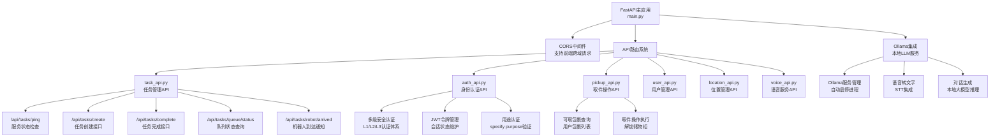
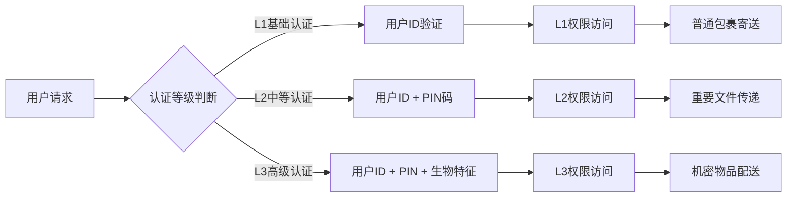
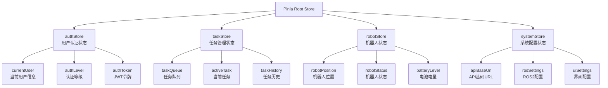
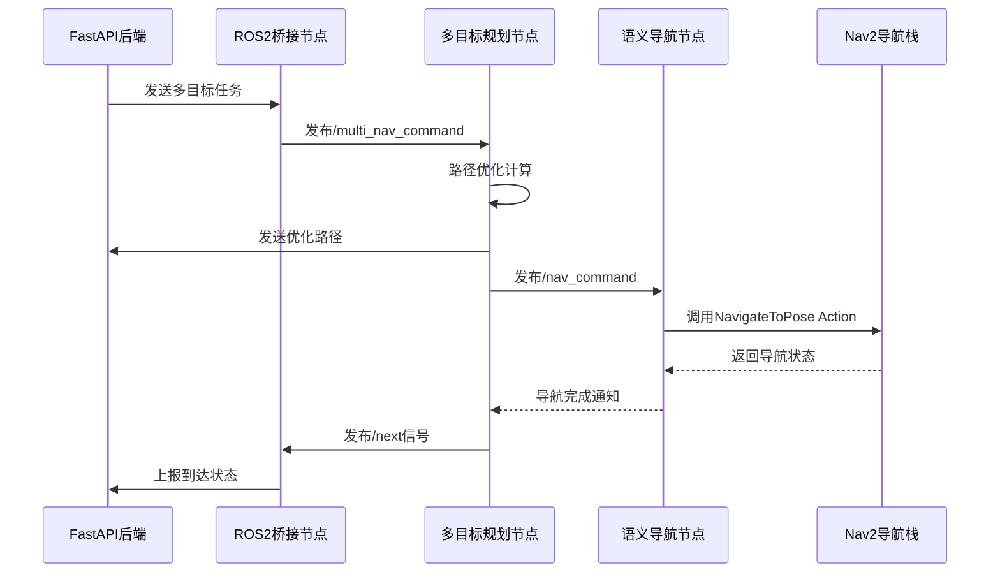
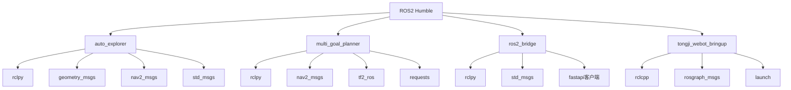

# 开发者指南（Developer Guide）
## 安全配送机器人系统

**版本**: 1.0  
**日期**: 2025年6月22日  
**项目**: 安全配送机器人系统

---

## 1. 开发环境搭建

### 1.1 系统要求

#### 1.1.1 硬件要求
- **处理器**: Intel i5-8400 或 AMD Ryzen 5 2600 及以上
- **内存**: 16GB RAM（推荐32GB用于仿真开发）
- **存储**: 至少50GB可用空间（SSD推荐）
- **显卡**: 支持OpenGL 3.3的独立显卡（用于Webots仿真）

#### 1.1.2 软件环境
- **操作系统**: Ubuntu 22.04 LTS（推荐）或Ubuntu 20.04 LTS
- **Python**: 3.8+ （推荐3.10）
- **Node.js**: 16.x 或 18.x LTS
- **ROS2**: Humble Hawksbill（必须）
- **Webots**: R2023b 或更高版本

### 1.2 依赖安装

#### 1.2.1 ROS2 Humble安装

```bash
# 添加ROS2官方软件源
sudo apt update && sudo apt install curl gnupg lsb-release
sudo curl -sSL https://raw.githubusercontent.com/ros/rosdistro/master/ros.key -o /usr/share/keyrings/ros-archive-keyring.gpg
echo "deb [arch=$(dpkg --print-architecture) signed-by=/usr/share/keyrings/ros-archive-keyring.gpg] http://packages.ros.org/ros2/ubuntu $(. /etc/os-release && echo $UBUNTU_CODENAME) main" | sudo tee /etc/apt/sources.list.d/ros2.list > /dev/null

# 安装ROS2 Humble
sudo apt update
sudo apt install ros-humble-desktop
sudo apt install ros-humble-navigation2 ros-humble-nav2-bringup
sudo apt install ros-humble-turtlebot3*

# 安装开发工具
sudo apt install python3-colcon-common-extensions
sudo apt install python3-rosdep python3-argcomplete
```

#### 1.2.2 Python后端依赖

```bash
# 进入后端目录
cd secure_robot_api

# 创建虚拟环境
python3 -m venv venv
source venv/bin/activate

# 安装依赖
pip install -r requirements.txt

# 语音识别相关依赖（可选）
pip install -r requirements_voice.txt
```

#### 1.2.3 前端依赖

```bash
# 进入前端目录
cd robot-delivery-system

# 安装Node.js依赖
npm install

# 或使用yarn
yarn install
```

#### 1.2.4 Webots安装

```bash
# 下载Webots
wget https://github.com/cyberbotics/webots/releases/download/R2023b/webots_2023b_amd64.deb

# 安装Webots
sudo dpkg -i webots_2023b_amd64.deb
sudo apt-get install -f  # 修复依赖问题

# 验证安装
webots --version
```

### 1.3 项目结构初始化

```bash
# 克隆项目（假设使用Git）
git clone <repository-url> webots-robot-system
cd webots-robot-system

# 初始化ROS2工作空间
cd ros2_ws
source /opt/ros/humble/setup.bash
colcon build
source install/setup.bash

# 设置环境变量
echo "source /opt/ros/humble/setup.bash" >> ~/.bashrc
echo "source ~/webots-robot-system/ros2_ws/install/setup.bash" >> ~/.bashrc
```

### 1.3 安全开发要求

#### 1.3.1 安全认证模块开发

在开发安全认证功能时，需要注意以下安全要求：

**认证服务开发**：
```python
# 安全认证服务实现要点
class AuthService:
    """
    安全认证服务开发规范
    """
    
    def __init__(self):
        # 初始化认证等级配置
        self.auth_levels = {
            'L1': {'required_fields': ['user_id'], 'timeout': 1800},
            'L2': {'required_fields': ['user_id', 'l2_auth'], 'timeout': 1800},  
            'L3': {'required_fields': ['user_id', 'l2_auth', 'l3_auth'], 'timeout': 1800}
        }
    
    def verify_auth(self, user_id: str, requested_level: str, provided: dict):
        """
        认证验证核心逻辑
        - 验证用户权限等级
        - 检查提供的认证信息完整性
        - 实现渐进式认证（L1 -> L2 -> L3）
        """
        pass
```

**数据安全开发原则**：
- 敏感数据必须加密存储（PIN码、生物特征等）
- 认证日志必须完整记录，包含时间戳、用户ID、操作类型
- 权限检查必须在每个API端点执行
- 认证缓存必须设置合适的过期时间

**前端安全开发**：
```typescript
// 前端认证状态管理
interface AuthState {
  isAuthenticated: boolean;
  userLevel: 'L1' | 'L2' | 'L3' | null;
  expiresAt: Date | null;
  purpose: 'send' | 'pickup' | null;
}

// 权限检查中间件
const requireAuth = (requiredLevel: string) => {
  return (to: RouteLocationNormalized, from: RouteLocationNormalized, next: NavigationGuardNext) => {
    const authStore = useAuthStore();
    if (!authStore.hasPermission(requiredLevel)) {
      // 重定向到认证页面
      next('/auth');
    } else {
      next();
    }
  };
};
```

#### 1.3.2 安全测试要求

**单元测试**：
- 认证服务的各个等级验证功能
- 权限控制矩阵的正确性
- 认证缓存的过期处理

**集成测试**：
- 前后端认证流程完整性
- 安全等级权限的端到端验证
- 异常情况下的安全降级

**安全测试**：
- 越权访问测试
- 认证绕过测试  
- 敏感数据泄露测试
- 认证重放攻击测试

---

## 2. 项目架构详解

### 2.1 目录结构说明

```mermaid
graph TD
    A[webots项目根目录] --> B[secure_robot_api - 后端API服务]
    A --> C[robot-delivery-system - 前端Web应用]
    A --> D[ros2_ws - ROS2工作空间]
    A --> E[tongji_webot_project - Webots仿真项目]
    A --> F[project-docs - 项目文档]
    
    B --> B1[api/ - API路由模块]
    B --> B2[services/ - 业务逻辑服务]
    B --> B3[models/ - 数据模型]
    B --> B4[storage/ - 数据存储]
    B --> B5[scripts/ - 工具脚本]
    B --> B6[schema/ - 数据结构定义]
    B --> B7[tests/ - 测试文件]
    B --> B8[main.py - 应用入口]
    
    B1 --> B11[task_api.py - 任务API]
    B1 --> B12[auth_api.py - 认证API]
    B1 --> B13[pickup_api.py - 取件API]
    B1 --> B14[user_api.py - 用户API]
    B1 --> B15[location_api.py - 位置API]
    B1 --> B16[voice_api.py - 语音API]
    
    C --> C1[src/ - 源代码]
    C --> C2[public/ - 静态资源]
    C --> C3[e2e/ - 端到端测试]
    C --> C4[package.json - 依赖配置]
    
    C1 --> C11[views/ - 页面视图]
    C1 --> C12[components/ - Vue组件]
    C1 --> C13[services/ - API服务]
    C1 --> C14[stores/ - 状态管理]
    C1 --> C15[router/ - 路由配置]
    C1 --> C16[types/ - TypeScript类型]
    C1 --> C17[config/ - 配置文件]
    
    C11 --> C111[SendPackage.vue - 寄件页面]
    C11 --> C112[ReceivePackage.vue - 取件页面]
    C11 --> C113[CallRobot.vue - 呼叫机器人]
    C11 --> C114[MainDashboard.vue - 主控台]
    C11 --> C115[MapDashboard.vue - 地图监控]
    C11 --> C116[TestDashboard.vue - 测试面板]
    
    D --> D1[src/ - ROS2包源码]
    D --> D2[install/ - 安装文件]
    D --> D3[build/ - 构建文件]
    D --> D4[log/ - 日志文件]
    
    D1 --> D11[auto_explorer - 语义导航包]
    D1 --> D12[multi_goal_planner - 多目标规划包]
    D1 --> D13[ros2_bridge - ROS2桥接包]
    D1 --> D14[tongji_webot_bringup - 启动配置包]
    D1 --> D15[navigation2 - 导航框架]
    
    E --> E1[worlds/ - 仿真世界文件]
    E --> E2[protos/ - 机器人模型定义]
    E --> E3[bringup/ - 启动配置]
    
    F --> F1[SRS.md - 需求规格说明]
    F --> F2[SDS.md - 设计说明书]
    F --> F3[ARCHITECTURE.md - 架构文档]
    F --> F4[TEST_PLAN.md - 测试计划]
    F --> F5[USER_MANUAL.md - 用户手册]
    F --> F6[DEVELOPER_GUIDE.md - 开发指南]
    F --> F7[diagrams/ - 架构图表]
    F --> F8[appendix/ - 附录文件]
```



**实际项目结构详情**:

```
webots/                         # 项目根目录
├── secure_robot_api/           # 后端FastAPI服务
│   ├── api/                   # API路由模块
│   │   ├── task_api.py       # 任务管理API
│   │   ├── auth_api.py       # 认证API
│   │   ├── pickup_api.py     # 取件API
│   │   ├── user_api.py       # 用户API
│   │   ├── location_api.py   # 位置API
│   │   └── voice_api.py      # 语音API
│   ├── services/             # 业务逻辑层
│   ├── models/               # 数据模型
│   ├── storage/              # SQLite数据库存储
│   ├── scripts/              # 工具脚本
│   ├── schema/               # 数据结构定义
│   ├── tests/                # 测试文件
│   ├── main.py              # FastAPI应用入口
│   ├── models.py            # Pydantic数据模型
│   └── requirements.txt     # Python依赖
├── robot-delivery-system/     # 前端Vue.js应用
│   ├── src/
│   │   ├── views/           # 页面组件
│   │   │   ├── SendPackage.vue    # 寄件页面
│   │   │   ├── ReceivePackage.vue # 取件页面
│   │   │   ├── CallRobot.vue      # 呼叫机器人
│   │   │   ├── MainDashboard.vue  # 主控制台
│   │   │   ├── MapDashboard.vue   # 地图监控
│   │   │   └── TestDashboard.vue  # 测试面板
│   │   ├── components/      # 可复用组件
│   │   ├── services/        # API客户端服务
│   │   ├── stores/          # Pinia状态管理
│   │   ├── router/          # Vue Router配置
│   │   ├── types/           # TypeScript类型定义
│   │   └── config/          # 配置文件
│   ├── public/              # 静态资源
│   ├── e2e/                 # 端到端测试
│   ├── package.json         # 项目依赖和脚本
│   └── vite.config.ts       # Vite构建配置
├── ros2_ws/                  # ROS2工作空间
│   └── src/
│       ├── auto_explorer/    # 语义导航包
│       │   ├── auto_explorer/
│       │   │   └── semantic_nav.py  # 语义导航节点
│       │   └── share/map/map.json   # 语义地图配置
│       ├── multi_goal_planner/       # 多目标路径规划包
│       │   └── multi_goal_planner/
│       │       └── optimized_multi_nav.py # 多目标导航节点
│       ├── ros2_bridge/              # ROS2-API桥接包
│       ├── tongji_webot_bringup/     # 系统启动配置包
│       └── navigation2/              # Nav2导航框架
├── tongji_webot_project/     # Webots仿真项目
│   ├── worlds/              # 仿真世界文件
│   ├── protos/              # 机器人PROTO模型定义
│   └── bringup/             # 启动配置
├── project-docs/            # 项目文档（本文档集）
├── start_system.sh          # 一键启动脚本
├── stop_system.sh           # 系统停止脚本
├── start_ros_bridge.sh      # ROS2桥接启动脚本
└── fast_build_ros.sh        # 快速构建ROS2脚本
```

### 2.2 核心模块分析

#### 2.2.1 后端API服务架构

**FastAPI应用结构图**:


**核心应用配置** (`main.py`):

```python
from fastapi import FastAPI
from fastapi.middleware.cors import CORSMiddleware
from api.task_api import router as task_router
from api.auth_api import router as auth_router
from api.pickup_api import router as pickup_router
from api.user_api import router as user_router
from api.location_api import router as location_router
from api.voice_api import router as voice_router

# FastAPI应用实例化
app = FastAPI(title="Secure Robot API")

# CORS中间件配置 - 支持Vue.js开发环境
app.add_middleware(
    CORSMiddleware,
    allow_origins=["http://localhost:5173", "http://127.0.0.1:5173"],
    allow_credentials=True,
    allow_methods=["*"],
    allow_headers=["*"],
)

# API路由注册
app.include_router(task_router, prefix="/api/tasks")
app.include_router(auth_router, prefix="/api/auth")
app.include_router(pickup_router, prefix="/api/pickup")
app.include_router(user_router, prefix="/api/user")
app.include_router(location_router, prefix="/api/locations")
app.include_router(voice_router, prefix="/api/voice")
```

**任务管理API功能清单** (`task_api.py`):

| 端点路径 | HTTP方法 | 功能描述 | 关键参数 |
|---------|---------|----------|----------|
| `/api/tasks/ping` | GET | 服务健康检查 | 无 |
| `/api/tasks/create` | POST | 创建配送任务 | user_id, receiver, location_id, security_level, task_type |
| `/api/tasks/complete` | POST | 标记任务完成 | task_id, completion_data |
| `/api/tasks/fail` | POST | 标记任务失败 | task_id, error_reason |
| `/api/tasks/cancel/{task_id}` | POST | 取消指定任务 | task_id |
| `/api/tasks/start` | POST | 启动队列中下一任务 | 无 |
| `/api/tasks/queue/status` | GET | 获取任务队列状态 | 无 |
| `/api/tasks/ros2/status` | GET | 检查ROS2系统连接 | 无 |
| `/api/tasks/robot/arrived` | POST | 机器人到达目标通知 | arrival_data |
| `/api/tasks/robot/optimized_order` | POST | 接收路径优化结果 | optimized_route |

**认证系统安全等级**:



**数据模型结构** (`models.py`):

```python
# 任务创建请求模型
class TaskCreateRequest(BaseModel):
    user_id: str                          # 发起人用户ID
    receiver: str                         # 接收人用户ID
    location_id: str                      # 目标位置ID
    security_level: str                   # 安全等级："L1"/"L2"/"L3"
    task_type: Literal["call", "send"]    # 任务类型：呼叫/寄送
    description: Optional[str] = None     # 任务描述信息

# 任务创建响应模型
class TaskCreateResponse(BaseModel):
    success: bool                         # 操作成功标志
    code: str                            # 状态码：TASK_000-TASK_009 
    message: str                         # 详细状态信息
    task_id: Optional[str] = None        # 创建的任务ID
    task: Optional[Dict] = None          # 完整任务信息
    locker_id: Optional[str] = None      # 分配的储物柜ID

# 认证请求模型
class AuthRequest(BaseModel):
    user_id: str                         # 用户ID
    purpose: Optional[str] = None        # 认证用途：send/pickup
    requested_level: str                 # 请求认证等级：L1/L2/L3
    provided: Dict[str, str]             # 提供的认证信息

# 用途认证模型
class PurposeAuthRequest(BaseModel):
    user_id: str                                    # 用户ID
    purpose: Literal["send", "pickup"]              # 认证用途
    requested_level: Literal["L1", "L2", "L3"]     # 请求等级
    provided: Dict[str, str]                       # 认证数据
```

**系统状态码定义**:

| 状态码 | 含义 | 适用场景 |
|--------|------|----------|
| TASK_000 | 操作成功 | 任务创建/完成成功 |
| TASK_001 | 发起人不存在 | 用户ID验证失败 |
| TASK_002 | 接收人不存在 | 收件人ID验证失败 |
| TASK_003 | 目标位置不存在 | 位置ID验证失败 |
| TASK_006 | 无可用储物柜 | 寄送任务柜门分配失败 |
| TASK_007 | 柜门分配失败 | 储物柜系统错误 |
| TASK_008 | 数据验证失败 | 请求参数格式错误 |
| TASK_009 | 保存失败 | 数据持久化错误 |

#### 2.2.2 前端Vue.js架构

**Vue.js应用架构图**:

```mermaid
graph TB
    A[Vue 3 Single Page Application] --> B[Vite构建系统]
    A --> C[Element Plus UI框架]
    A --> D[Pinia状态管理]
    A --> E[Vue Router路由系统]
    A --> F[TypeScript类型支持]
    
    G[核心页面视图] --> G1[HomeView.vue<br/>系统首页]
    G --> G2[SendPackage.vue<br/>包裹寄送界面]
    G --> G3[ReceivePackage.vue<br/>包裹接收界面]
    G --> G4[CallRobot.vue<br/>机器人呼叫界面]
    G --> G5[MainDashboard.vue<br/>主控制面板]
    G --> G6[MapDashboard.vue<br/>地图监控面板]
    G --> G7[TestDashboard.vue<br/>系统测试面板]
    G --> G8[AboutView.vue<br/>关于页面]
    
    H[核心服务模块] --> H1[api服务<br/>HTTP请求封装]
    H --> H2[rosConnection<br/>ROS2 WebSocket连接]
    H --> H3[类型定义<br/>TypeScript接口]
    H --> H4[工具函数<br/>Lodash集成]
    
    I[依赖生态系统] --> I1[Element Plus 2.10.1<br/>UI组件库]
    I --> I2[Axios 1.9.0<br/>HTTP客户端]
    I --> I3[Roslib 1.4.1<br/>ROS JavaScript库]
    I --> I4[Pinia 3.0.1<br/>Vue 3状态管理]
```


**项目配置文件分析** (`package.json`):

```json
{
  "name": "robot-delivery-system",
  "version": "0.0.0",
  "type": "module",
  "scripts": {
    "dev": "vite",                               // 开发服务器启动
    "build": "run-p type-check \"build-only {@}\" --",  // 生产构建
    "preview": "vite preview",                   // 构建预览
    "test:unit": "vitest",                      // 单元测试
    "test:e2e": "playwright test",              // 端到端测试
    "lint": "run-s lint:*",                     // 代码检查
    "format": "prettier --write src/"          // 代码格式化
  },
  "dependencies": {
    "@element-plus/icons-vue": "^2.3.1",       // Element Plus图标组件
    "@types/lodash-es": "^4.17.12",            // Lodash ES模块类型
    "axios": "^1.9.0",                         // HTTP请求库
    "element-plus": "^2.10.1",                 // Vue 3 UI组件库
    "lodash-es": "^4.17.21",                   // JavaScript工具库
    "pinia": "^3.0.1",                         // Vue 3官方状态管理
    "roslib": "^1.4.1",                        // ROS JavaScript客户端
    "vue": "^3.5.13",                          // Vue 3核心框架
    "vue-router": "^4.5.0"                     // Vue 3路由系统
  }
}
```

**页面组件功能详解**:

1. **SendPackage.vue** - 包裹寄送页面
   ```vue
   核心功能：
   - 收件人ID输入验证
   - 目标位置下拉选择器
   - 三级安全等级选择 (L1/L2/L3)
   - 多级身份认证模态框
   - 任务描述文本输入
   - 实时表单验证
   - 与 /api/tasks/create 接口集成
   
   技术特点：
   - Element Plus表单组件
   - 响应式数据绑定
   - 异步API调用
   - 错误处理和用户反馈
   ```

2. **ReceivePackage.vue** - 包裹接收页面
   ```vue
   核心功能：
   - 用户身份认证流程
   - 可取包裹列表显示
   - 包裹详情查看
   - 一键取件操作
   - 取件确认对话框
   - 与 /api/pickup/ 接口集成
   
   技术特点：
   - 动态列表渲染
   - 条件渲染和状态管理
   - 异步数据加载
   - 实时状态更新
   ```

3. **CallRobot.vue** - 机器人呼叫页面
   ```vue
   核心功能：
   - 目标位置选择
   - 呼叫任务创建
   - 机器人实时状态显示
   - 任务进度跟踪
   - 取消呼叫功能
   
   技术特点：
   - WebSocket实时通信
   - 状态图表显示
   - 任务状态可视化
   ```

4. **MainDashboard.vue** - 主控制面板
   ```vue
   核心功能：
   - 系统总览仪表板
   - 任务队列状态监控
   - 机器人状态显示
   - 快捷操作按钮
   - 实时数据刷新
   - 系统统计图表
   
   技术特点：
   - 实时数据绑定
   - 图表组件集成
   - 响应式布局设计
   - WebSocket数据流
   ```

5. **MapDashboard.vue** - 地图监控面板
   ```vue
   核心功能：
   - 2D地图可视化
   - 机器人位置实时跟踪
   - 路径规划可视化
   - 任务执行状态标注
   - 地图缩放和平移
   
   技术特点：
   - Canvas 2D绘图
   - ROS2地图数据集成
   - 实时坐标变换
   - 交互式地图操作
   ```

6. **TestDashboard.vue** - 系统测试面板
   ```vue
   核心功能：
   - API连接测试
   - ROS2通信测试
   - 系统功能验证
   - 性能监控界面
   - 调试工具集成
   
   技术特点：
   - 开发者工具集成
   - 实时日志显示
   - 性能指标监控
   - 错误诊断工具
   ```

**状态管理架构** (Pinia Store):



**路由配置系统** (`router/index.ts`):

```typescript
import { createRouter, createWebHistory } from 'vue-router'

const routes = [
  {
    path: '/',
    name: 'Home',
    component: () => import('@/views/HomeView.vue'),
    meta: { title: '智能配送系统首页' }
  },
  {
    path: '/send',
    name: 'SendPackage',
    component: () => import('@/views/SendPackage.vue'),
    meta: { title: '寄送包裹', requiresAuth: true }
  },
  {
    path: '/receive',
    name: 'ReceivePackage',
    component: () => import('@/views/ReceivePackage.vue'),
    meta: { title: '接收包裹', requiresAuth: true }
  },
  {
    path: '/call',
    name: 'CallRobot',
    component: () => import('@/views/CallRobot.vue'),
    meta: { title: '呼叫机器人', requiresAuth: true }
  },
  {
    path: '/dashboard',
    name: 'MainDashboard',
    component: () => import('@/views/MainDashboard.vue'),
    meta: { title: '主控制面板', requiresAuth: true }
  },
  {
    path: '/map',
    name: 'MapDashboard',
    component: () => import('@/views/MapDashboard.vue'),
    meta: { title: '地图监控', requiresAuth: true }
  },
  {
    path: '/test',
    name: 'TestDashboard',
    component: () => import('@/views/TestDashboard.vue'),
    meta: { title: '系统测试', requiresAuth: true }
  },
  {
    path: '/about',
    name: 'About',
    component: () => import('@/views/AboutView.vue'),
    meta: { title: '关于系统' }
  }
]

const router = createRouter({
  history: createWebHistory(),
  routes
})

export default router
```

#### 2.2.3 ROS2机器人控制系统

**ROS2系统架构图**:

```mermaid
graph TB
    A[ROS2 Humble Distribution] --> B[auto_explorer包<br/>语义导航系统]
    A --> C[multi_goal_planner包<br/>多目标路径规划]
    A --> D[ros2_bridge包<br/>API桥接服务]
    A --> E[tongji_webot_bringup包<br/>启动配置管理]
    A --> F[navigation2框架<br/>Nav2导航栈]
    
    B --> B1[SemanticNavigator节点<br/>语义位置导航]
    B --> B2[语义地图配置<br/>map.json]
    B --> B3[NavigateToPose Action<br/>导航动作客户端]
    
    C --> C1[OptimizedMultiNav节点<br/>多目标优化导航]
    C --> C2[路径优化算法<br/>TSP贪心求解]
    C --> C3[API通信接口<br/>HTTP请求集成]
    C --> C4[TF坐标变换<br/>机器人位置获取]
    
    D --> D1[ROS2-API桥接<br/>双向数据同步]
    D --> D2[状态同步服务<br/>机器人状态上报]
    D --> D3[任务接收器<br/>API任务下发]
    
    E --> E1[系统启动脚本<br/>launch文件管理]
    E --> E2[参数配置<br/>ROS2参数服务器]
    E --> E3[节点生命周期<br/>启动停止管理]
    
    F --> F1[AMCL定位<br/>自适应蒙特卡罗定位]
    F --> F2[Local Planner<br/>局部路径规划器]
    F --> F3[Global Planner<br/>全局路径规划器]
    F --> F4[Costmap 2D<br/>代价地图构建]
```


**语义导航节点实现** (`semantic_nav.py`):

```python
#!/usr/bin/env python3
import rclpy
from rclpy.node import Node
from std_msgs.msg import String
from geometry_msgs.msg import PoseStamped
from nav2_msgs.action import NavigateToPose
from rclpy.action import ActionClient
from ament_index_python.packages import get_package_share_directory
import json
import os

class SemanticNavigator(Node):
    def __init__(self):
        super().__init__('semantic_navigator')
        
        # 加载语义地图配置文件
        map_file = os.path.join(
            get_package_share_directory('auto_explorer'),
            'map',
            'map.json'
        )
        
        # 读取语义地图数据
        with open(map_file, 'r', encoding='utf-8') as f:
            self.semantic_map = json.load(f)
        
        self.get_logger().info(f"已加载语义地图: {list(self.semantic_map.keys())}")
        
        # 订阅导航命令话题
        self.subscription = self.create_subscription(
            String,
            '/nav_command',
            self.nav_command_callback,
            10
        )
        
        # 创建导航动作客户端
        self._action_client = ActionClient(self, NavigateToPose, 'navigate_to_pose')
        
        self.get_logger().info('语义导航节点已启动')
    
    def nav_command_callback(self, msg):
        """处理语义导航命令"""
        room = msg.data.strip()
        
        if room not in self.semantic_map:
            self.get_logger().warn(f"目标房间 '{room}' 不在语义地图中")
            return
        
        # 提取目标位置的姿态信息
        pose_dict = self.semantic_map[room]['pose']
        
        # 构建导航目标消息
        pose_msg = PoseStamped()
        pose_msg.header.frame_id = 'map'
        pose_msg.header.stamp = self.get_clock().now().to_msg()
        pose_msg.pose.position.x = pose_dict['position']['x']
        pose_msg.pose.position.y = pose_dict['position']['y']
        pose_msg.pose.position.z = pose_dict['position']['z']
        pose_msg.pose.orientation.x = pose_dict['orientation']['x']
        pose_msg.pose.orientation.y = pose_dict['orientation']['y']
        pose_msg.pose.orientation.z = pose_dict['orientation']['z']
        pose_msg.pose.orientation.w = pose_dict['orientation']['w']
        
        self.get_logger().info(f"开始导航到: {room}")
        
        # 发送导航目标
        goal_msg = NavigateToPose.Goal()
        goal_msg.pose = pose_msg
        
        self._action_client.wait_for_server()
        send_goal_future = self._action_client.send_goal_async(goal_msg)
        send_goal_future.add_done_callback(self.goal_response_callback)
    
    def goal_response_callback(self, future):
        """导航目标响应回调"""
        goal_handle = future.result()
        if not goal_handle.accepted:
            self.get_logger().error('导航目标被拒绝')
            return
        
        self.get_logger().info('导航目标已接受，正在导航...')
        get_result_future = goal_handle.get_result_async()
        get_result_future.add_done_callback(self.get_result_callback)
    
    def get_result_callback(self, future):
        """导航结果回调"""
        result = future.result().result
        status = future.result().status
        self.get_logger().info(f'导航完成，状态码: {status}')

def main(args=None):
    rclpy.init(args=args)
    node = SemanticNavigator()
    rclpy.spin(node)
    node.destroy_node()
    rclpy.shutdown()

if __name__ == '__main__':
    main()
```

**多目标路径规划节点实现** (`optimized_multi_nav.py`):

```python
#!/usr/bin/env python3
import rclpy
from rclpy.node import Node
from rclpy.action import ActionClient
from std_msgs.msg import String
from nav2_msgs.action import NavigateToPose
from geometry_msgs.msg import PoseStamped
import json
import math
import itertools
import tf2_ros
import requests

class OptimizedMultiNav(Node):
    def __init__(self):
        super().__init__('optimized_multi_nav')
        
        # API端点配置
        self.API_BASE_URL = "http://localhost:8000"
        self.ARRIVED_API_ENDPOINT = f"{self.API_BASE_URL}/api/tasks/robot/arrived"
        self.OPTIMIZED_ORDER_API_ENDPOINT = f"{self.API_BASE_URL}/api/tasks/robot/optimized_order"
        
        # 创建话题订阅器
        self.subscription = self.create_subscription(
            String,
            '/multi_nav_command',
            self.command_callback,
            10
        )
        
        # 创建next信号订阅器
        self.next_subscription = self.create_subscription(
            String,
            '/next',
            self.next_callback,
            10
        )
        
        # 创建next信号发布器
        self.next_publisher = self.create_publisher(String, '/next', 10)
        
        # TF缓冲区和监听器
        self.tf_buffer = tf2_ros.Buffer()
        self.tf_listener = tf2_ros.TransformListener(self.tf_buffer, self)
        
        # 导航动作客户端
        self.nav_client = ActionClient(self, NavigateToPose, 'navigate_to_pose')
        
        # 当前导航状态
        self.current_goals = []
        self.current_goal_index = 0
        self.is_navigating = False
        self.waiting_for_next = False
        self.current_goal_handle = None
        self.task_cancelled = False
        
        self.get_logger().info('多目标优化导航节点已初始化')
    
    def command_callback(self, msg):
        """处理多目标导航命令"""
        try:
            command_data = json.loads(msg.data)
            self.get_logger().info(f'接收到多目标导航命令: {command_data}')
            
            if 'goals' in command_data:
                # 路径优化
                optimized_goals = self.optimize_path(command_data['goals'])
                
                # 发送优化结果到API
                self.send_optimized_order_to_api(optimized_goals)
                
                # 开始导航
                self.start_multi_goal_navigation(optimized_goals)
                
        except json.JSONDecodeError:
            self.get_logger().error('无效的JSON命令格式')
    
    def optimize_path(self, goals):
        """使用贪心算法优化路径"""
        if len(goals) <= 1:
            return goals
        
        # 获取当前机器人位置
        try:
            transform = self.tf_buffer.lookup_transform(
                'map', 'base_link', rclpy.time.Time()
            )
            current_pos = {
                'x': transform.transform.translation.x,
                'y': transform.transform.translation.y
            }
        except Exception as e:
            self.get_logger().warn(f'无法获取机器人位置，使用默认起点: {e}')
            current_pos = {'x': 0.0, 'y': 0.0}
        
        # TSP贪心求解
        unvisited = goals.copy()
        optimized_path = []
        current = current_pos
        
        while unvisited:
            # 找到距离当前位置最近的目标
            nearest_goal = min(unvisited, 
                             key=lambda g: self.calculate_distance(current, g))
            optimized_path.append(nearest_goal)
            unvisited.remove(nearest_goal)
            current = nearest_goal
        
        self.get_logger().info(f'路径优化完成: {optimized_path}')
        return optimized_path
    
    def calculate_distance(self, point1, point2):
        """计算两点间欧几里得距离"""
        dx = point1['x'] - point2['x']
        dy = point1['y'] - point2['y']
        return math.sqrt(dx * dx + dy * dy)
    
    def send_optimized_order_to_api(self, optimized_goals):
        """向API发送优化后的路径顺序"""
        try:
            response = requests.post(
                self.OPTIMIZED_ORDER_API_ENDPOINT,
                json={'optimized_goals': optimized_goals},
                timeout=5
            )
            if response.status_code == 200:
                self.get_logger().info('优化路径已发送到API')
            else:
                self.get_logger().warn(f'API响应错误: {response.status_code}')
        except Exception as e:
            self.get_logger().error(f'发送优化路径失败: {e}')

def main(args=None):
    rclpy.init(args=args)
    node = OptimizedMultiNav()
    rclpy.spin(node)
    node.destroy_node()
    rclpy.shutdown()

if __name__ == '__main__':
    main()
```

**ROS2包管理结构**:

| 包名 | 功能描述 | 核心节点 | 主要话题/服务 |
|------|----------|----------|---------------|
| auto_explorer | 语义导航和地图管理 | semantic_navigator | /nav_command (订阅) |
| multi_goal_planner | 多目标路径优化 | optimized_multi_nav | /multi_nav_command, /next |
| ros2_bridge | ROS2-API桥接通信 | bridge_node | /robot_status (发布) |
| tongji_webot_bringup | 系统启动和配置 | clock_publisher | /clock (发布) |
| navigation2 | Nav2导航框架 | nav2_lifecycle_manager | 标准Nav2话题/服务 |

**ROS2通信架构**:



## 3. 编译与构建

### 3.1 后端FastAPI服务构建

**后端开发环境配置**:
```bash
# 进入后端API目录
cd /home/jerry/Documents/webots/secure_robot_api

# 创建Python虚拟环境（首次运行）
python3 -m venv venv

# 激活虚拟环境
source venv/bin/activate

# 安装项目依赖
pip install -r requirements.txt

# 启动开发服务器
uvicorn main:app --host 0.0.0.0 --port 8000 --reload

# 生产环境部署
uvicorn main:app --host 0.0.0.0 --port 8000 --workers 4
```

**后端依赖包清单** (`requirements.txt`):
```text
fastapi>=0.104.0          # Web框架核心
uvicorn[standard]>=0.20.0 # ASGI服务器
pydantic>=2.0.0          # 数据验证模型
python-multipart>=0.0.5  # 文件上传支持
requests>=2.31.0         # HTTP客户端
```

**API服务健康检查**:
```bash
# 检查服务状态
curl http://localhost:8000/api/tasks/ping

# 检查OpenAPI文档
curl http://localhost:8000/docs

# 检查API架构
curl http://localhost:8000/redoc
```

### 3.2 前端Vue.js应用构建

**前端开发环境配置**:
```bash
# 进入前端应用目录
cd /home/jerry/Documents/webots/robot-delivery-system

# 安装Node.js依赖包
npm install

# 启动开发服务器
npm run dev

# 生产环境构建
npm run build

# 预览生产构建结果
npm run preview

# 运行单元测试
npm run test:unit

# 运行端到端测试
npm run test:e2e
```

**构建配置分析** (`package.json`):
```json
{
  "scripts": {
    "dev": "vite",                              // Vite开发服务器
    "build": "run-p type-check \"build-only {@}\" --", // 并行类型检查和构建
    "preview": "vite preview",                  // 预览生产构建
    "test:unit": "vitest",                     // Vitest单元测试
    "test:e2e": "playwright test",             // Playwright端到端测试
    "build-only": "vite build",                // 仅构建（不检查类型）
    "type-check": "vue-tsc --build",           // TypeScript类型检查
    "lint": "run-s lint:*",                    // 串行执行所有lint任务
    "format": "prettier --write src/"          // 代码格式化
  }
}
```

**Vite构建配置** (`vite.config.ts`):
```typescript
import { defineConfig } from 'vite'
import vue from '@vitejs/plugin-vue'
import { resolve } from 'path'

export default defineConfig({
  plugins: [vue()],
  resolve: {
    alias: {
      '@': resolve(__dirname, 'src')
    }
  },
  server: {
    port: 5173,
    host: '0.0.0.0',
    proxy: {
      '/api': {
        target: 'http://localhost:8000',
        changeOrigin: true
      }
    }
  },
  build: {
    outDir: 'dist',
    assetsDir: 'assets',
    sourcemap: true
  }
})
```

### 3.3 ROS2工作空间构建

**ROS2环境设置和构建**:
```bash
# 设置ROS2环境
source /opt/ros/humble/setup.bash

# 进入ROS2工作空间
cd /home/jerry/Documents/webots/ros2_ws

# 安装依赖包
rosdep install --from-paths src --ignore-src -r -y

# 构建所有包
colcon build

# 构建指定包
colcon build --packages-select auto_explorer
colcon build --packages-select multi_goal_planner
colcon build --packages-select ros2_bridge
colcon build --packages-select tongji_webot_bringup

# 构建并运行测试
colcon build --packages-select auto_explorer
colcon test --packages-select auto_explorer

# 设置工作空间环境
source install/setup.bash

# 验证包安装
ros2 pkg list | grep -E "(auto_explorer|multi_goal_planner)"
```

**ROS2包依赖关系**:



**CMakeList.txt配置示例** (`auto_explorer/CMakeLists.txt`):
```cmake
cmake_minimum_required(VERSION 3.5)
project(auto_explorer)

find_package(ament_cmake REQUIRED)
find_package(rclpy REQUIRED)
find_package(geometry_msgs REQUIRED)
find_package(nav2_msgs REQUIRED)

# 安装Python可执行节点
install(PROGRAMS
  auto_explorer/auto_explorer.py
  auto_explorer/semantic_nav.py
  DESTINATION lib/${PROJECT_NAME}
)

# 安装launch文件
install(DIRECTORY launch
  DESTINATION share/${PROJECT_NAME})

# 安装配置文件
install(DIRECTORY config
  DESTINATION share/${PROJECT_NAME})

# 安装地图文件
install(DIRECTORY map
  DESTINATION share/${PROJECT_NAME})

ament_package()
```

```python
# setup.py
from setuptools import setup

package_name = 'auto_explorer'

setup(
    name=package_name,
    version='0.0.0',
    packages=[package_name],
    data_files=[
        ('share/ament_index/resource_index/packages',
            ['resource/' + package_name]),
        ('share/' + package_name, ['package.xml']),
    ],
    install_requires=['setuptools'],
    zip_safe=True,
    maintainer='Your Name',
    maintainer_email='you@example.com',
    description='Auto Explorer package',
    license='Apache-2.0',
    tests_require=['pytest'],
    entry_points={
        'console_scripts': [
            'auto_explorer = auto_explorer.auto_explorer:main',
            'semantic_nav = auto_explorer.semantic_nav:main',
        ],
    },
)
```

### 4. 系统部署

### 4.1 一键启动部署

**系统启动脚本** (`start_system.sh`):

```bash
#!/bin/bash
# 智能机器人配送系统一键启动脚本

echo "=== 启动机器人配送系统 ==="

# 颜色输出设置
RED='\033[0;31m'
GREEN='\033[0;32m'
YELLOW='\033[1;33m'
NC='\033[0m' # No Color

# 环境检查
echo -e "${YELLOW}检查Python环境...${NC}"
if ! command -v python3 &> /dev/null; then
    echo -e "${RED}错误: 未找到Python3${NC}"
    exit 1
fi

echo -e "${YELLOW}检查Node.js环境...${NC}"
if ! command -v npm &> /dev/null; then
    echo -e "${RED}错误: 未找到npm${NC}"
    exit 1
fi

# 启动后端API服务
echo -e "${YELLOW}启动后端API服务...${NC}"
cd /home/jerry/Documents/webots/secure_robot_api

# 创建虚拟环境（如果不存在）
if [ ! -d "venv" ]; then
    echo "创建Python虚拟环境..."
    python3 -m venv venv
fi

# 激活虚拟环境并安装依赖
source venv/bin/activate
pip install -r requirements.txt

# 启动FastAPI服务器
echo -e "${GREEN}启动FastAPI服务器 (端口8000)...${NC}"
uvicorn main:app --host 0.0.0.0 --port 8000 --reload &
BACKEND_PID=$!

# 等待后端启动
sleep 3

# 测试后端连接
echo -e "${YELLOW}测试后端API连接...${NC}"
if curl -s http://localhost:8000/api/tasks/ping > /dev/null; then
    echo -e "${GREEN}✓ 后端API启动成功${NC}"
else
    echo -e "${RED}✗ 后端API启动失败${NC}"
    kill $BACKEND_PID 2>/dev/null
    exit 1
fi

# 启动前端服务
echo -e "${YELLOW}启动前端服务...${NC}"
cd /home/jerry/Documents/webots/robot-delivery-system

# 安装前端依赖（如果需要）
if [ ! -d "node_modules" ]; then
    echo "安装前端依赖..."
    npm install
fi

# 启动Vue.js开发服务器
echo -e "${GREEN}启动Vue.js开发服务器 (端口5173)...${NC}"
npm run dev &
FRONTEND_PID=$!

# 等待前端启动
sleep 5

# 测试前端连接
echo -e "${YELLOW}测试前端连接...${NC}"
if curl -s http://localhost:5173 > /dev/null; then
    echo -e "${GREEN}✓ 前端服务启动成功${NC}"
else
    echo -e "${RED}✗ 前端服务启动失败${NC}"
    kill $BACKEND_PID $FRONTEND_PID 2>/dev/null
    exit 1
fi

# 显示启动信息
echo ""
echo -e "${GREEN}=== 系统启动完成 ===${NC}"
echo -e "后端API: ${GREEN}http://localhost:8000${NC}"
echo -e "前端界面: ${GREEN}http://localhost:5173${NC}"
echo -e "API文档: ${GREEN}http://localhost:8000/docs${NC}"
echo -e "测试页面: ${GREEN}http://localhost:5173/test${NC}"
echo ""
echo -e "${YELLOW}按 Ctrl+C 停止所有服务${NC}"

# 保存进程ID用于后续停止
echo $BACKEND_PID > /tmp/robot_backend.pid
echo $FRONTEND_PID > /tmp/robot_frontend.pid

# 等待用户中断
trap 'echo -e "\n${YELLOW}正在停止服务...${NC}"; kill $BACKEND_PID $FRONTEND_PID 2>/dev/null; exit' INT
wait
```

**系统停止脚本** (`stop_system.sh`):

```bash
#!/bin/bash
# 智能机器人配送系统停止脚本

echo "=== 停止机器人配送系统 ==="

# 颜色输出设置
RED='\033[0;31m'
GREEN='\033[0;32m'
YELLOW='\033[1;33m'
NC='\033[0m'

# 停止前端服务
if [ -f /tmp/robot_frontend.pid ]; then
    echo -e "${YELLOW}停止前端服务...${NC}"
    kill $(cat /tmp/robot_frontend.pid) 2>/dev/null
    rm /tmp/robot_frontend.pid
    echo -e "${GREEN}✓ 前端服务已停止${NC}"
else
    echo -e "${YELLOW}未找到前端进程ID文件${NC}"
fi

# 停止后端服务
if [ -f /tmp/robot_backend.pid ]; then
    echo -e "${YELLOW}停止后端服务...${NC}"
    kill $(cat /tmp/robot_backend.pid) 2>/dev/null
    rm /tmp/robot_backend.pid
    echo -e "${GREEN}✓ 后端服务已停止${NC}"
else
    echo -e "${YELLOW}未找到后端进程ID文件${NC}"
fi

# 强制清理残留进程
echo -e "${YELLOW}检查并清理残留进程...${NC}"

# 停止uvicorn进程
pkill -f "uvicorn main:app" 2>/dev/null && echo -e "${GREEN}✓ 清理uvicorn进程${NC}"

# 停止npm dev进程
pkill -f "npm run dev" 2>/dev/null && echo -e "${GREEN}✓ 清理npm进程${NC}"

# 停止vite进程
pkill -f "vite" 2>/dev/null && echo -e "${GREEN}✓ 清理vite进程${NC}"

echo -e "${GREEN}=== 系统已完全停止 ===${NC}"
```

**快速启动命令**:

```bash
# 一键启动系统
chmod +x start_system.sh
./start_system.sh

# 一键停止系统
chmod +x stop_system.sh
./stop_system.sh

# 检查系统状态
curl http://localhost:8000/api/tasks/ping    # 后端状态
curl http://localhost:5173                   # 前端状态
```

### 4.2 ROS2桥接服务部署

**ROS2系统启动脚本** (`start_ros_bridge.sh`):

```bash
#!/bin/bash
# ROS2桥接服务启动脚本

echo "=== 启动ROS2桥接服务 ==="

# 设置ROS2环境
source /opt/ros/humble/setup.bash
cd /home/jerry/Documents/webots/ros2_ws
source install/setup.bash

# 启动ROS2核心服务
echo "启动ROS2桥接节点..."
ros2 run ros2_bridge bridge_node &
ROS2_BRIDGE_PID=$!

echo "启动语义导航节点..."
ros2 run auto_explorer semantic_nav &
SEMANTIC_NAV_PID=$!

echo "启动多目标规划节点..."
ros2 run multi_goal_planner optimized_multi_nav &
MULTI_NAV_PID=$!

# 保存进程ID
echo $ROS2_BRIDGE_PID > /tmp/ros2_bridge.pid
echo $SEMANTIC_NAV_PID > /tmp/semantic_nav.pid
echo $MULTI_NAV_PID > /tmp/multi_nav.pid

echo "ROS2服务启动完成"
echo "按 Ctrl+C 停止所有ROS2服务"

# 等待用户中断
trap 'echo "正在停止ROS2服务..."; kill $ROS2_BRIDGE_PID $SEMANTIC_NAV_PID $MULTI_NAV_PID 2>/dev/null; exit' INT
wait
```

**服务状态监控**:

```bash
# 检查ROS2节点状态
ros2 node list

# 检查ROS2话题
ros2 topic list

# 检查ROS2服务
ros2 service list

# 实时监控话题数据
ros2 topic echo /nav_command
ros2 topic echo /multi_nav_command
ros2 topic echo /next

# 检查节点信息
ros2 node info /semantic_navigator
ros2 node info /optimized_multi_nav
```

### 4.3 生产环境部署

**Docker容器化部署**:

**后端Dockerfile**:
```dockerfile
# secure_robot_api/Dockerfile
FROM python:3.10-slim

WORKDIR /app

# 安装系统依赖
RUN apt-get update && apt-get install -y \
    gcc \
    curl \
    && rm -rf /var/lib/apt/lists/*

# 复制依赖文件并安装
COPY requirements.txt .
RUN pip install --no-cache-dir -r requirements.txt

# 复制应用代码
COPY . .

# 创建非root用户
RUN useradd -m -u 1000 apiuser && chown -R apiuser:apiuser /app
USER apiuser

# 健康检查
HEALTHCHECK --interval=30s --timeout=10s --start-period=5s --retries=3 \
  CMD curl -f http://localhost:8000/api/tasks/ping || exit 1

# 暴露端口
EXPOSE 8000

# 启动命令
CMD ["uvicorn", "main:app", "--host", "0.0.0.0", "--port", "8000"]
```

**前端Dockerfile**:
```dockerfile
# robot-delivery-system/Dockerfile
FROM node:18-alpine as builder

WORKDIR /app
COPY package*.json ./
RUN npm ci --only=production

COPY . .
RUN npm run build

FROM nginx:alpine
COPY --from=builder /app/dist /usr/share/nginx/html

# Nginx配置
COPY nginx.conf /etc/nginx/nginx.conf

EXPOSE 80
CMD ["nginx", "-g", "daemon off;"]
```

**Docker Compose配置**:
```yaml
# docker-compose.yml
version: '3.8'

services:
  api:
    build:
      context: ./secure_robot_api
      dockerfile: Dockerfile
    ports:
      - "8000:8000"
    volumes:
      - ./secure_robot_api/storage:/app/storage
    environment:
      - ENV=production
      - API_DEBUG=false
    healthcheck:
      test: ["CMD", "curl", "-f", "http://localhost:8000/api/tasks/ping"]
      interval: 30s
      timeout: 10s
      retries: 3
    restart: unless-stopped

  frontend:
    build:
      context: ./robot-delivery-system
      dockerfile: Dockerfile
    ports:
      - "80:80"
    depends_on:
      api:
        condition: service_healthy
    restart: unless-stopped

  ros2:
    image: ros:humble
    network_mode: host
    volumes:
      - ./ros2_ws:/ros2_ws
    command: >
      bash -c "
        source /opt/ros/humble/setup.bash &&
        cd /ros2_ws &&
        colcon build &&
        source install/setup.bash &&
        ros2 launch tongji_webot_bringup robot_bringup.launch.py
      "
    restart: unless-stopped
    depends_on:
      - api

volumes:
  storage_data:
    driver: local

networks:
  robot_network:
    driver: bridge
```

**生产环境启动命令**:
```bash
# 构建并启动所有服务
docker-compose up --build -d

# 查看服务状态
docker-compose ps

# 查看服务日志
docker-compose logs -f api
docker-compose logs -f frontend

# 停止所有服务
docker-compose down

# 清理资源
docker-compose down -v --remove-orphans
```

### 4.4 系统监控与维护

**监控工具**:

```bash
# 安装htop和iotop
sudo apt install htop iotop

# 实时监控系统资源
htop

# 实时监控磁盘I/O
iotop
```

**日志管理**:
```bash
# 查看后端日志
tail -f /var/log/robot-api.log

# 查看前端构建日志
tail -f /var/log/robot-frontend.log

# 查看ROS2节点日志
ros2 run rqt_console rqt_console

# 系统日志清理
find /var/log -name "*.log" -mtime +7 -delete
```

## 5. 开发工作流

### 5.1 版本控制策略

#### 5.1.1 Git分支模型

```mermaid
gitgraph
    commit id: "初始提交"
    branch develop
    checkout develop
    commit id: "基础架构搭建"
    
    branch feature/backend-api
    checkout feature/backend-api
    commit id: "FastAPI基础框架"
    commit id: "认证系统实现"
    commit id: "任务管理API"
    
    checkout develop
    merge feature/backend-api
    
    branch feature/frontend-vue
    checkout feature/frontend-vue
    commit id: "Vue3项目初始化"
    commit id: "路由和状态管理"
    commit id: "UI组件开发"
    
    checkout develop
    merge feature/frontend-vue
    
    branch feature/ros2-navigation
    checkout feature/ros2-navigation
    commit id: "语义导航节点"
    commit id: "多目标规划算法"
    
    checkout develop
    merge feature/ros2-navigation
    
    checkout main
    merge develop
    commit id: "v1.0.0发布"
```

**分支命名规范**:
- `main`: 生产发布分支，稳定版本
- `develop`: 开发集成分支，功能汇总
- `feature/功能名称`: 功能开发分支
- `hotfix/修复名称`: 紧急修复分支
- `release/版本号`: 发布准备分支

#### 5.1.2 提交信息规范

```bash
# 提交格式
<类型>(<作用域>): <简短描述>

<详细描述>

<关联问题>

# 类型说明
feat: 新功能
fix: 修复bug
docs: 文档更新
style: 代码格式调整（不影响功能）
refactor: 重构代码
test: 测试相关
chore: 构建工具或辅助工具变更
perf: 性能优化

# 示例提交
feat(api): 添加多级认证支持

- 实现L1/L2/L3三级安全认证
- 支持PIN码和生物特征验证
- 添加认证缓存机制

Closes #123
```

**实际项目提交示例**:
```bash
# 后端功能开发
git commit -m "feat(task-api): 实现任务创建和队列管理

- 添加TaskCreateRequest/Response数据模型
- 实现create_task服务函数
- 支持call/send两种任务类型
- 集成储物柜分配逻辑

Closes #45"

# 前端组件开发
git commit -m "feat(ui): 完成SendPackage页面开发

- 实现收件人选择和位置选择器
- 添加三级安全等级选择
- 集成身份认证模态框
- 添加表单验证和错误处理

Closes #67"

# ROS2节点开发
git commit -m "feat(ros2): 实现语义导航和多目标规划

- 完成SemanticNavigator节点开发
- 实现OptimizedMultiNav路径优化
- 添加TF坐标变换支持
- 集成Nav2导航框架

Closes #89"
```

### 5.2 代码质量控制

#### 5.2.1 Python代码规范（后端）

**代码格式化配置** (`.flake8`):
```ini
[flake8]
max-line-length = 88
extend-ignore = E203, W503, F401
exclude = 
    .git,
    __pycache__,
    venv,
    build,
    dist,
    *.egg-info

per-file-ignores =
    __init__.py:F401
```

**Black代码格式化** (`pyproject.toml`):
```toml
[tool.black]
line-length = 88
target-version = ['py310']
include = '\.pyi?$'
exclude = '''
/(
    \.git
  | \.venv
  | build
  | dist
)/
'''
```

**Pre-commit配置** (`.pre-commit-config.yaml`):
```yaml
repos:
  - repo: https://github.com/psf/black
    rev: 22.3.0
    hooks:
      - id: black
        language_version: python3.10
  
  - repo: https://github.com/pycqa/flake8
    rev: 4.0.1
    hooks:
      - id: flake8
        
  - repo: https://github.com/pycqa/isort
    rev: 5.10.1
    hooks:
      - id: isort
        args: ["--profile", "black"]
```

#### 5.2.2 JavaScript/TypeScript代码规范（前端）

**ESLint配置** (`.eslintrc.js`):
```javascript
module.exports = {
  root: true,
  env: {
    node: true,
    browser: true,
    es2022: true
  },
  extends: [
    'eslint:recommended',
    '@vue/eslint-config-typescript',
    '@vue/eslint-config-prettier'
  ],
  parserOptions: {
    ecmaVersion: 'latest',
    sourceType: 'module'
  },
  rules: {
    'no-console': process.env.NODE_ENV === 'production' ? 'warn' : 'off',
    'no-debugger': process.env.NODE_ENV === 'production' ? 'warn' : 'off',
    'vue/multi-word-component-names': 'off',
    '@typescript-eslint/no-unused-vars': 'warn',
    'prefer-const': 'error',
    'no-var': 'error'
  }
}
```

**Prettier配置** (`.prettierrc.json`):
```json
{
  "semi": false,
  "singleQuote": true,
  "tabWidth": 2,
  "trailingComma": "es5",
  "printWidth": 80,
  "bracketSpacing": true,
  "arrowParens": "avoid"
}
```

#### 5.2.3 代码审查检查清单

**后端API审查要点**:
- [ ] API端点遵循RESTful设计原则
- [ ] 使用Pydantic模型进行数据验证
- [ ] 异常处理覆盖所有可能错误场景
- [ ] 日志记录包含必要的调试信息
- [ ] 安全认证和授权逻辑正确
- [ ] 数据库操作使用事务保证一致性
- [ ] API文档和注释完整准确

**前端组件审查要点**:
- [ ] 组件遵循Vue 3 Composition API最佳实践
- [ ] TypeScript类型定义完整
- [ ] 响应式设计适配不同屏幕尺寸
- [ ] 用户交互反馈及时明确
- [ ] 错误处理和加载状态显示
- [ ] 可访问性（a11y）标准符合
- [ ] 性能优化和懒加载实现

**ROS2节点审查要点**:
- [ ] 节点初始化和清理逻辑正确
- [ ] 话题和服务命名符合ROS2约定
- [ ] 参数配置灵活可调
- [ ] 错误恢复和故障处理机制
- [ ] 日志级别和输出内容合理
- [ ] 资源使用优化（CPU/内存）
- [ ] 与其他节点通信协议一致

### 5.3 测试策略

#### 5.3.1 后端API单元测试

**测试配置** (`tests/conftest.py`):
```python
import pytest
from fastapi.testclient import TestClient
from main import app

@pytest.fixture
def client():
    return TestClient(app)

@pytest.fixture
def sample_user():
    return {
        "user_id": "TEST001",
        "security_level": "L1"
    }

@pytest.fixture
def sample_task():
    return {
        "user_id": "EMP1001",
        "receiver": "EMP1002", 
        "location_id": "办公室A",
        "security_level": "L1",
        "task_type": "send",
        "description": "测试包裹"
    }
```

**API测试示例** (`tests/test_task_api.py`):
```python
import pytest
from fastapi.testclient import TestClient

def test_ping_endpoint(client):
    """测试服务健康检查端点"""
    response = client.get("/api/tasks/ping")
    assert response.status_code == 200
    assert response.json()["message"] == "Secure Robot API 正常运行"

def test_create_task_success(client, sample_task):
    """测试任务创建成功场景"""
    response = client.post("/api/tasks/create", json=sample_task)
    assert response.status_code == 200
    
    data = response.json()
    assert data["success"] is True
    assert data["code"] == "TASK_000"
    assert "task_id" in data
    assert data["task"]["task_type"] == "send"

def test_create_task_invalid_user(client, sample_task):
    """测试无效用户ID场景"""
    sample_task["user_id"] = "INVALID_USER"
    response = client.post("/api/tasks/create", json=sample_task)
    
    assert response.status_code == 200
    data = response.json()
    assert data["success"] is False
    assert data["code"] == "TASK_001"

def test_authentication_l1(client):
    """测试L1级别认证"""
    auth_data = {
        "user_id": "EMP1001",
        "requested_level": "L1",
        "provided": {}
    }
    response = client.post("/api/auth/verify", json=auth_data)
    
    assert response.status_code == 200
    data = response.json()
    assert data["success"] is True
    assert data["verified_level"] == "L1"

def test_queue_status(client):
    """测试队列状态查询"""
    response = client.get("/api/tasks/queue/status")
    assert response.status_code == 200
    
    data = response.json()
    assert "queue" in data
    assert "status" in data
    assert isinstance(data["queue"], list)

# 运行测试命令
# pytest tests/ -v --cov=. --cov-report=html
```

#### 5.3.2 前端组件测试

**组件单元测试** (`tests/components/SendPackage.test.ts`):
```typescript
import { mount } from '@vue/test-utils'
import { describe, it, expect, vi } from 'vitest'
import { ElForm, ElButton } from 'element-plus'
import SendPackage from '@/views/SendPackage.vue'

// Mock API服务
vi.mock('@/services/api', () => ({
  taskService: {
    createTask: vi.fn()
  },
  locationService: {
    getLocations: vi.fn(() => Promise.resolve([
      { id: '办公室A', name: '办公室A' },
      { id: '办公室B', name: '办公室B' }
    ]))
  }
}))

describe('SendPackage.vue', () => {
  it('正确渲染寄件表单', () => {
    const wrapper = mount(SendPackage, {
      global: {
        components: {
          ElForm,
          ElButton
        }
      }
    })
    
    expect(wrapper.find('h1').text()).toBe('寄送包裹')
    expect(wrapper.find('[data-testid="receiver-input"]').exists()).toBe(true)
    expect(wrapper.find('[data-testid="location-select"]').exists()).toBe(true)
    expect(wrapper.find('[data-testid="security-level-radio"]').exists()).toBe(true)
  })

  it('表单验证工作正常', async () => {
    const wrapper = mount(SendPackage)
    const submitButton = wrapper.find('[data-testid="submit-button"]')
    
    await submitButton.trigger('click')
    
    // 验证错误信息显示
    expect(wrapper.find('.el-form-item__error').exists()).toBe(true)
  })

  it('成功提交任务', async () => {
    const mockCreateTask = vi.fn(() => Promise.resolve({
      success: true,
      code: 'TASK_000',
      task_id: 'TASK_123',
      locker_id: 'LOCKER_01'
    }))
    
    vi.mocked(taskService.createTask).mockImplementation(mockCreateTask)
    
    const wrapper = mount(SendPackage)
    
    // 填写表单
    await wrapper.find('[data-testid="receiver-input"]').setValue('EMP1002')
    await wrapper.find('[data-testid="location-select"]').setValue('办公室A')
    await wrapper.find('[data-testid="description-input"]').setValue('测试包裹')
    
    // 提交表单
    await wrapper.find('[data-testid="submit-button"]').trigger('click')
    
    expect(mockCreateTask).toHaveBeenCalledWith({
      user_id: expect.any(String),
      receiver: 'EMP1002',
      location_id: '办公室A',
      security_level: 'L1',
      task_type: 'send',
      description: '测试包裹'
    })
  })
})

// 运行前端测试
// npm run test:unit
```

#### 5.3.3 ROS2节点测试

**语义导航节点测试** (`tests/test_semantic_nav.py`):
```python
import unittest
import rclpy
from std_msgs.msg import String
from auto_explorer.semantic_nav import SemanticNavigator

class TestSemanticNavigator(unittest.TestCase):
    @classmethod
    def setUpClass(cls):
        rclpy.init()
        cls.node = SemanticNavigator()

    @classmethod
    def tearDownClass(cls):
        cls.node.destroy_node()
        rclpy.shutdown()

    def test_semantic_map_loading(self):
        """测试语义地图加载"""
        self.assertIsInstance(self.node.semantic_map, dict)
        self.assertIn('办公室A', self.node.semantic_map)
        self.assertIn('办公室B', self.node.semantic_map)

    def test_navigation_command_valid_location(self):
        """测试有效位置导航命令"""
        msg = String()
        msg.data = '办公室A'
        
        # 这里需要模拟导航客户端
        # 实际测试中会检查是否正确调用了导航服务
        self.node.nav_command_callback(msg)
        
        # 验证导航目标是否正确设置
        # 这需要在实际的ROS2测试环境中运行

    def test_navigation_command_invalid_location(self):
        """测试无效位置导航命令"""
        msg = String()
        msg.data = '不存在的房间'
        
        # 应该记录警告日志但不崩溃
        self.node.nav_command_callback(msg)

if __name__ == '__main__':
    unittest.main()

# 运行ROS2测试
# cd ros2_ws
# colcon test --packages-select auto_explorer
# colcon test-result --verbose
```

#### 5.3.4 集成测试

**端到端测试** (`e2e/robot-delivery.spec.ts`):
```typescript
import { test, expect } from '@playwright/test'

test.describe('机器人配送系统端到端测试', () => {
  test.beforeEach(async ({ page }) => {
    await page.goto('http://localhost:5173')
  })

  test('完整寄件流程测试', async ({ page }) => {
    // 导航到寄件页面
    await page.click('text=寄送包裹')
    await expect(page.locator('h1')).toContainText('寄送包裹')

    // 填写寄件信息
    await page.fill('[data-testid="receiver-input"]', 'EMP1002')
    await page.selectOption('[data-testid="location-select"]', '办公室A')
    await page.click('[data-testid="security-level-l1"]')
    await page.fill('[data-testid="description-input"]', 'E2E测试包裹')

    // 进行身份认证
    await page.click('text=进行身份认证')
    await page.fill('[data-testid="user-id-input"]', 'EMP1001')
    await page.click('text=验证身份')

    // 提交寄件任务
    await page.click('text=确认寄送')

    // 验证成功消息
    await expect(page.locator('.el-message--success')).toBeVisible()
    await expect(page.locator('text=任务创建成功')).toBeVisible()
  })

  test('取件流程测试', async ({ page }) => {
    // 导航到取件页面
    await page.click('text=接收包裹')
    await expect(page.locator('h1')).toContainText('接收包裹')

    // 身份认证
    await page.fill('[data-testid="user-id-input"]', 'EMP1002')
    await page.click('text=查询包裹')

    // 验证包裹列表显示
    await expect(page.locator('[data-testid="package-list"]')).toBeVisible()

    // 取件操作
    await page.click('[data-testid="pickup-button"]:first-child')
    await page.click('text=确认取件')

    // 验证取件成功
    await expect(page.locator('text=取件成功')).toBeVisible()
  })

  test('系统状态监控测试', async ({ page }) => {
    // 导航到主控制面板
    await page.click('text=主控制面板')
    
    // 验证状态指标显示
    await expect(page.locator('[data-testid="queue-status"]')).toBeVisible()
    await expect(page.locator('[data-testid="robot-status"]')).toBeVisible()
    await expect(page.locator('[data-testid="system-stats"]')).toBeVisible()

    // 验证实时数据更新
    const initialQueueCount = await page.textContent('[data-testid="queue-count"]')
    
    // 等待数据刷新
    await page.waitForTimeout(2000)
    
    // 数据应该保持更新（这里的具体验证依赖于实际的数据变化）
  })
})

// 运行端到端测试
// npm run test:e2e
```

### 5.4 持续集成/持续部署

#### 5.4.1 GitHub Actions配置

```yaml
# .github/workflows/ci.yml
name: CI/CD Pipeline

on:
  push:
    branches: [ main, develop ]
  pull_request:
    branches: [ main ]

jobs:
  test-backend:
    runs-on: ubuntu-latest
    steps:
    - uses: actions/checkout@v3
    
    - name: Set up Python
      uses: actions/setup-python@v4
      with:
        python-version: '3.10'
    
    - name: Install dependencies
      run: |
        cd secure_robot_api
        pip install -r requirements.txt
        pip install pytest pytest-cov
    
    - name: Run tests
      run: |
        cd secure_robot_api
        pytest tests/ --cov=. --cov-report=xml
    
    - name: Upload coverage
      uses: codecov/codecov-action@v3

  test-frontend:
    runs-on: ubuntu-latest
    steps:
    - uses: actions/checkout@v3
    
    - name: Set up Node.js
      uses: actions/setup-node@v3
      with:
        node-version: '18'
    
    - name: Install dependencies
      run: |
        cd robot-delivery-system
        npm ci
    
    - name: Run tests
      run: |
        cd robot-delivery-system
        npm run test
    
    - name: Build
      run: |
        cd robot-delivery-system
        npm run build

  deploy:
    needs: [test-backend, test-frontend]
    runs-on: ubuntu-latest
    if: github.ref == 'refs/heads/main'
    
    steps:
    - uses: actions/checkout@v3
    
    - name: Deploy to production
      run: |
        # 生产部署脚本
        echo "部署到生产环境"
```

## 6. 故障排除

### 6.1 常见问题及解决方案

#### 6.1.1 后端API服务问题

**问题**: FastAPI服务无法启动
```bash
# 症状：uvicorn main:app 命令失败
# 排查步骤：

# 1. 检查Python环境
python3 --version
which python3

# 2. 检查虚拟环境
cd /home/jerry/Documents/webots/secure_robot_api
source venv/bin/activate
pip list | grep fastapi

# 3. 检查端口占用
netstat -tlnp | grep 8000
lsof -i :8000

# 4. 检查依赖包
pip install -r requirements.txt --upgrade

# 5. 详细错误日志
uvicorn main:app --host 0.0.0.0 --port 8000 --log-level debug

# 解决方案：
# - 如果端口被占用：kill -9 $(lsof -t -i:8000)
# - 如果依赖缺失：pip install -r requirements.txt
# - 如果Python版本不兼容：使用Python 3.8+
```

**问题**: Ollama服务集成失败
```bash
# 症状：API启动时Ollama相关错误
# 排查步骤：

# 1. 检查Ollama安装
ollama --version
which ollama

# 2. 检查Ollama服务状态
curl http://localhost:11434/api/tags

# 3. 手动启动Ollama
ollama serve &

# 4. 测试Ollama API
curl -X POST http://localhost:11434/api/generate \
  -H "Content-Type: application/json" \
  -d '{"model": "llama2", "prompt": "Hello"}'

# 解决方案：
# - 安装Ollama：curl -fsSL https://ollama.ai/install.sh | sh
# - 下载模型：ollama pull llama2
# - 配置环境变量：export OLLAMA_HOST=0.0.0.0:11434
```

**问题**: API认证失败
```bash
# 症状：用户认证请求返回错误
# 排查步骤：

# 1. 检查用户数据文件
cat /home/jerry/Documents/webots/secure_robot_api/storage/users.json

# 2. 验证API端点
curl -X POST http://localhost:8000/api/auth/verify \
  -H "Content-Type: application/json" \
  -d '{"user_id": "EMP1001", "requested_level": "L1", "provided": {}}'

# 3. 检查日志输出
tail -f /var/log/robot-api.log

# 4. 测试数据库连接
python3 -c "
import json
with open('storage/users.json', 'r') as f:
    users = json.load(f)
    print(f'加载用户数: {len(users)}')
"

# 解决方案：
# - 检查users.json格式和权限
# - 验证安全等级配置
# - 重置用户数据：cp storage/users.json.backup storage/users.json
```

#### 6.1.2 前端Vue.js应用问题

**问题**: 前端服务无法启动
```bash
# 症状：npm run dev 命令失败
# 排查步骤：

# 1. 检查Node.js版本
node --version
npm --version

# 2. 清除缓存和重新安装
cd /home/jerry/Documents/webots/robot-delivery-system
rm -rf node_modules package-lock.json
npm cache clean --force
npm install

# 3. 检查端口占用
netstat -tlnp | grep 5173

# 4. 检查Vite配置
cat vite.config.ts

# 5. 详细错误日志
npm run dev -- --debug

# 解决方案：
# - Node.js版本要求：16.x 或 18.x LTS
# - 清理依赖：rm -rf node_modules && npm install
# - 端口冲突：修改vite.config.ts中的port配置
```

**问题**: API请求CORS错误
```bash
# 症状：浏览器控制台显示跨域错误
# 排查步骤：

# 1. 检查后端CORS配置
grep -n "allow_origins" /home/jerry/Documents/webots/secure_robot_api/main.py

# 2. 验证API服务状态
curl -I http://localhost:8000/api/tasks/ping

# 3. 检查前端API配置
grep -n "baseURL\|proxy" /home/jerry/Documents/webots/robot-delivery-system/vite.config.ts

# 4. 浏览器网络面板检查
# 打开开发者工具 -> Network面板 -> 查看请求详情

# 解决方案：
# - 后端添加前端域名到allow_origins
# - 前端使用代理配置：proxy: { '/api': 'http://localhost:8000' }
# - 开发环境：确保前端运行在localhost:5173
```

**问题**: Element Plus组件样式异常
```bash
# 症状：UI组件显示不正常
# 排查步骤：

# 1. 检查Element Plus版本
npm list element-plus

# 2. 验证样式导入
grep -n "element-plus/dist" /home/jerry/Documents/webots/robot-delivery-system/src/main.ts

# 3. 检查自动导入配置
cat auto-imports.d.ts

# 4. 浏览器样式检查
# 开发者工具 -> Elements面板 -> 检查CSS样式

# 解决方案：
# - 重新安装Element Plus：npm install element-plus@latest
# - 确保正确导入样式：import 'element-plus/dist/index.css'
# - 清除浏览器缓存：Ctrl+Shift+R
```

#### 6.1.3 ROS2系统问题

**问题**: ROS2节点无法通信
```bash
# 症状：节点启动但无法接收/发送消息
# 排查步骤：

# 1. 检查ROS2环境
source /opt/ros/humble/setup.bash
ros2 doctor

# 2. 检查节点状态
ros2 node list
ros2 node info /semantic_navigator

# 3. 检查话题通信
ros2 topic list
ros2 topic info /nav_command
ros2 topic echo /nav_command

# 4. 检查网络配置
echo $ROS_DOMAIN_ID
echo $RMW_IMPLEMENTATION

# 解决方案：
export ROS_DOMAIN_ID=0
export RMW_IMPLEMENTATION=rmw_fastrtps_cpp
source /opt/ros/humble/setup.bash
source ~/webots/ros2_ws/install/setup.bash
```

**问题**: 语义导航失败
```bash
# 症状：语义导航节点接收命令但不执行
# 排查步骤：

# 1. 检查语义地图文件
cat /home/jerry/Documents/webots/ros2_ws/src/auto_explorer/map/map.json

# 2. 检查导航话题
ros2 topic echo /nav_command
ros2 topic pub /nav_command std_msgs/msg/String "{data: '办公室A'}"

# 3. 检查Nav2状态
ros2 lifecycle list /planner_server
ros2 lifecycle get /planner_server

# 4. 检查TF变换
ros2 run tf2_ros tf2_echo map base_link

# 解决方案：
# - 检查机器人TF变换树完整性
# - 验证API端点可访问性
# - 调试路径优化算法：增加日志输出
```

**问题**: 多目标路径规划异常
```bash
# 症状：OptimizedMultiNav节点计算路径错误
# 排查步骤：

# 1. 检查节点日志
ros2 node info /optimized_multi_nav
ros2 log level /optimized_multi_nav DEBUG

# 2. 测试路径优化
ros2 topic pub /multi_nav_command std_msgs/msg/String \
  '{"data": "{\"goals\": [{\"x\": 1.0, \"y\": 2.0}, {\"x\": 3.0, \"y\": 4.0}]}"}'

# 3. 检查TF获取
ros2 run tf2_ros tf2_echo map base_link

# 4. 检查API通信
curl -X POST http://localhost:8000/api/tasks/robot/optimized_order \
  -H "Content-Type: application/json" \
  -d '{"optimized_goals": []}'

# 解决方案：
# - 检查机器人TF变换树完整性
# - 验证API端点可访问性
# - 调试路径优化算法：增加日志输出
```

#### 6.1.4 Webots仿真问题

**问题**: Webots无法启动仿真
```bash
# 症状：webots命令失败或界面异常
# 排查步骤：

# 1. 检查Webots安装
webots --version
which webots

# 2. 检查显卡驱动
glxinfo | grep OpenGL
nvidia-smi  # 如果使用NVIDIA显卡

# 3. 检查世界文件
cd /home/jerry/Documents/webots/tongji_webot_project
ls -la worlds/robot_office.wbt

# 4. 尝试不同启动模式
webots --mode=fast --no-rendering worlds/robot_office.wbt
webots --batch worlds/robot_office.wbt

# 解决方案：
# - 更新显卡驱动
# - 使用虚拟显示：export DISPLAY=:0.0
# - 降低图形质量：webots --mode=fast
```

### 6.2 性能优化指南

#### 6.2.1 后端API性能优化

**数据库查询优化**:
```python
# 优化前：频繁文件读写
def get_tasks():
    with open('storage/tasks.json', 'r') as f:
        tasks = json.load(f)
    return tasks

# 优化后：内存缓存
import functools
import time

@functools.lru_cache(maxsize=128)
def get_tasks_cached(timestamp):
    with open('storage/tasks.json', 'r') as f:
        tasks = json.load(f)
    return tasks

def get_tasks():
    # 使用文件修改时间作为缓存键
    file_mtime = os.path.getmtime('storage/tasks.json')
    return get_tasks_cached(file_mtime)
```

**异步处理优化**:
```python
import asyncio
from concurrent.futures import ThreadPoolExecutor

# 异步文件操作
async def save_task_async(task_data):
    loop = asyncio.get_event_loop()
    with ThreadPoolExecutor() as executor:
        await loop.run_in_executor(
            executor, 
            save_task_to_file, 
            task_data
        )

# 批量处理优化
async def process_multiple_tasks(tasks):
    semaphore = asyncio.Semaphore(5)  # 限制并发数
    
    async def process_single_task(task):
        async with semaphore:
            return await save_task_async(task)
    
    results = await asyncio.gather(*[
        process_single_task(task) for task in tasks
    ])
    return results
```

#### 6.2.2 前端应用性能优化

**组件懒加载**:
```typescript
// router/index.ts - 路由级懒加载
const routes = [
  {
    path: '/send',
    name: 'SendPackage',
    component: () => import('@/views/SendPackage.vue')
  },
  {
    path: '/dashboard',
    name: 'MainDashboard',
    component: () => import('@/views/MainDashboard.vue')
  }
]

// 组件级懒加载
// SendPackage.vue
<script setup>
import { defineAsyncComponent } from 'vue'

const AuthModal = defineAsyncComponent(() => 
  import('@/components/AuthModal.vue')
)
</script>
```

**状态管理优化**:
```typescript
// stores/taskStore.ts - 分页和缓存
import { defineStore } from 'pinia'

export const useTaskStore = defineStore('task', () => {
  const tasks = ref<Task[]>([])
  const currentPage = ref(1)
  const pageSize = ref(20)
  const cache = new Map<string, Task[]>()

  // 分页获取任务
  const getTasksPaginated = async (page: number) => {
    const cacheKey = `tasks-${page}`
    
    if (cache.has(cacheKey)) {
      return cache.get(cacheKey)
    }
    
    const response = await taskService.getTasks({
      page,
      size: pageSize.value
    })
    
    cache.set(cacheKey, response.data)
    return response.data
  }

  // 清理过期缓存
  const clearExpiredCache = () => {
    cache.clear()
  }

  return {
    tasks,
    getTasksPaginated,
    clearExpiredCache
  }
})
```

#### 6.2.3 ROS2系统性能优化

**节点资源管理**:
```python
# 优化前：无限制的消息处理
class SemanticNavigator(Node):
    def __init__(self):
        super().__init__('semantic_navigator')
        self.subscription = self.create_subscription(
            String,
            '/nav_command',
            self.nav_command_callback,
            10  # 队列大小较小
        )

# 优化后：资源控制和错误恢复
import threading
from collections import deque

class SemanticNavigator(Node):
    def __init__(self):
        super().__init__('semantic_navigator')
        
        # 使用更大的队列和QoS配置
        qos_profile = rclpy.qos.QoSProfile(
            reliability=rclpy.qos.ReliabilityPolicy.RELIABLE,
            durability=rclpy.qos.DurabilityPolicy.TRANSIENT_LOCAL,
            history=rclpy.qos.HistoryPolicy.KEEP_LAST,
            depth=50
        )
        
        self.subscription = self.create_subscription(
            String,
            '/nav_command',
            self.nav_command_callback,
            qos_profile
        )
        
        # 命令队列和处理线程
        self.command_queue = deque(maxlen=100)
        self.processing_thread = threading.Thread(
            target=self.process_commands,
            daemon=True
        )
        self.processing_thread.start()
        
        # 性能监控
        self.processed_commands = 0
        self.last_performance_log = time.time()
    
    def nav_command_callback(self, msg):
        """非阻塞命令接收"""
        self.command_queue.append(msg.data)
        
    def process_commands(self):
        """后台处理命令队列"""
        while rclpy.ok():
            if self.command_queue:
                command = self.command_queue.popleft()
                try:
                    self.execute_navigation(command)
                    self.processed_commands += 1
                except Exception as e:
                    self.get_logger().error(f'导航执行失败: {e}')
                
                # 性能日志
                current_time = time.time()
                if current_time - self.last_performance_log > 60:
                    self.get_logger().info(
                        f'性能统计: 处理命令 {self.processed_commands}/分钟'
                    )
                    self.processed_commands = 0
                    self.last_performance_log = current_time
            
            time.sleep(0.1)  # 避免CPU占用过高
```

**话题通信优化**:
```python
# 使用自定义消息类型减少序列化开销
from geometry_msgs.msg import PoseStamped
from nav2_msgs.msg import TaskCommand

# 批量发送减少通信频率
class BatchNavigationPublisher(Node):
    def __init__(self):
        super().__init__('batch_nav_publisher')
        self.publisher = self.create_publisher(
            TaskCommand,
            '/batch_nav_commands',
            10
        )
        
        # 批量缓存
        self.command_batch = []
        self.batch_size = 10
        self.batch_timeout = 1.0  # 秒
        
        # 定时器批量发送
        self.timer = self.create_timer(
            self.batch_timeout,
            self.publish_batch
        )
    
    def add_command(self, command):
        self.command_batch.append(command)
        
        if len(self.command_batch) >= self.batch_size:
            self.publish_batch()
    
    def publish_batch(self):
        if self.command_batch:
            batch_msg = TaskCommand()
            batch_msg.commands = self.command_batch
            batch_msg.timestamp = self.get_clock().now().to_msg()
            
            self.publisher.publish(batch_msg)
            self.command_batch.clear()
```

### 6.3 监控和调试工具

#### 6.3.1 系统监控仪表板

**实时监控脚本** (`monitor_dashboard.py`):
```python
#!/usr/bin/env python3
import time
import requests
import psutil
import subprocess
from rich.console import Console
from rich.table import Table
from rich.live import Live

console = Console()

def get_api_status():
    """获取API服务状态"""
    try:
        response = requests.get('http://localhost:8000/api/tasks/ping', timeout=3)
        return "正常" if response.status_code == 200 else "异常"
    except:
        return "离线"

def get_frontend_status():
    """获取前端服务状态"""
    try:
        response = requests.get('http://localhost:5173', timeout=3)
        return "正常" if response.status_code == 200 else "异常"
    except:
        return "离线"

def get_ros2_nodes():
    """获取ROS2节点状态"""
    try:
        result = subprocess.run(
            ['ros2', 'node', 'list'],
            capture_output=True,
            text=True,
            timeout=5
        )
        nodes = result.stdout.strip().split('\n') if result.returncode == 0 else []
        return len([n for n in nodes if n.strip()])
    except:
        return 0

def create_status_table():
    """创建状态监控表格"""
    table = Table(title="智能机器人配送系统状态监控")
    
    table.add_column("组件", style="cyan", no_wrap=True)
    table.add_column("状态", style="magenta")
    table.add_column("详细信息", style="green")
    
    # 系统资源
    cpu_percent = psutil.cpu_percent(interval=1)
    memory = psutil.virtual_memory()
    disk = psutil.disk_usage('/')
    
    table.add_row(
        "系统资源",
        "运行中",
        f"CPU: {cpu_percent}% | 内存: {memory.percent}% | 磁盘: {disk.percent}%"
    )
    
    # API服务
    api_status = get_api_status()
    table.add_row("后端API", api_status, "端口: 8000")
    
    # 前端服务
    frontend_status = get_frontend_status()
    table.add_row("前端服务", frontend_status, "端口: 5173")
    
    # ROS2节点
    ros2_node_count = get_ros2_nodes()
    ros2_status = "正常" if ros2_node_count > 0 else "异常"
    table.add_row("ROS2节点", ros2_status, f"活跃节点: {ros2_node_count}")
    
    return table

def main():
    """主监控循环"""
    with Live(create_status_table(), refresh_per_second=1) as live:
        while True:
            live.update(create_status_table())
            time.sleep(5)

if __name__ == "__main__":
    try:
        main()
    except KeyboardInterrupt:
        console.print("\n[yellow]监控已停止[/yellow]")
```

#### 6.3.2 日志分析工具

**日志聚合脚本** (`log_analyzer.py`):
```python
#!/usr/bin/env python3
import re
import json
from datetime import datetime, timedelta
from collections import defaultdict

class LogAnalyzer:
    def __init__(self):
        self.log_patterns = {
            'error': re.compile(r'\[ERROR\]|ERROR:|Failed|Exception'),
            'warning': re.compile(r'\[WARN\]|WARNING:|警告'),
            'api_request': re.compile(r'(GET|POST|PUT|DELETE)\s+/api/(\w+)'),
            'task_created': re.compile(r'任务创建成功.*task_id:\s*(\w+)'),
            'navigation': re.compile(r'导航到:\s*(.+)|Navigation to:\s*(.+)')
        }
    
    def analyze_api_logs(self, log_file):
        """分析API日志"""
        stats = {
            'total_requests': 0,
            'error_count': 0,
            'endpoint_stats': defaultdict(int),
            'recent_errors': []
        }
        
        with open(log_file, 'r') as f:
            for line in f:
                # API请求统计
                api_match = self.log_patterns['api_request'].search(line)
                if api_match:
                    stats['total_requests'] += 1
                    endpoint = api_match.group(2)
                    stats['endpoint_stats'][endpoint] += 1
                
                # 错误统计
                if self.log_patterns['error'].search(line):
                    stats['error_count'] += 1
                    stats['recent_errors'].append(line.strip())
        
        return stats
    
    def analyze_ros2_logs(self, log_file):
        """分析ROS2日志"""
        stats = {
            'navigation_commands': 0,
            'successful_navigations': 0,
            'failed_navigations': 0,
            'nodes_started': 0,
            'nodes_stopped': 0
        }
        
        with open(log_file, 'r') as f:
            for line in f:
                if self.log_patterns['navigation'].search(line):
                    stats['navigation_commands'] += 1
                
                if '导航完成' in line or 'Navigation completed' in line:
                    stats['successful_navigations'] += 1
                
                if '导航失败' in line or 'Navigation failed' in line:
                    stats['failed_navigations'] += 1
        
        return stats
    
    def generate_report(self, api_stats, ros2_stats):
        """生成分析报告"""
        report = {
            'timestamp': datetime.now().isoformat(),
            'api_summary': {
                'total_requests': api_stats['total_requests'],
                'error_rate': api_stats['error_count'] / max(api_stats['total_requests'], 1),
                'top_endpoints': dict(sorted(
                    api_stats['endpoint_stats'].items(),
                    key=lambda x: x[1],
                    reverse=True
                )[:5])
            },
            'ros2_summary': {
                'navigation_success_rate': ros2_stats['successful_navigations'] / max(ros2_stats['navigation_commands'], 1),
                'total_navigation_commands': ros2_stats['navigation_commands']
            },
            'recent_errors': api_stats['recent_errors'][-10:]  # 最近10个错误
        }
        
        return report

# 使用示例
if __name__ == "__main__":
    analyzer = LogAnalyzer()
    
    # 分析日志文件
    api_stats = analyzer.analyze_api_logs('/var/log/robot-api.log')
    ros2_stats = analyzer.analyze_ros2_logs('/var/log/ros2-nodes.log')
    
    # 生成报告
    report = analyzer.generate_report(api_stats, ros2_stats)
    
    # 输出报告
    print(json.dumps(report, indent=2, ensure_ascii=False))
```

## 7. 扩展开发

### 7.1 添加新的API端点

```python
# api/new_feature.py
from fastapi import APIRouter, Depends, HTTPException
from typing import List
from models import CustomModel
from services.auth_service import verify_token

router = APIRouter()

@router.post("/new-endpoint")
async def create_new_resource(
    data: CustomModel,
    current_user: dict = Depends(verify_token)
):
    """创建新资源的API端点"""
    try:
        # 业务逻辑实现
        result = process_new_resource(data)
        return {"status": "success", "data": result}
    except Exception as e:
        raise HTTPException(status_code=500, detail=str(e))

# 在main.py中注册路由
app.include_router(router, prefix="/api/new-feature")
```

### 7.2 添加新的ROS2节点

```python
# ros2_ws/src/new_package/new_package/new_node.py
import rclpy
from rclpy.node import Node
from std_msgs.msg import String

class NewNode(Node):
    def __init__(self):
        super().__init__('new_node')
        
        # 发布器
        self.publisher = self.create_publisher(
            String,
            'new_topic',
            10
        )
        
        # 订阅器
        self.subscription = self.create_subscription(
            String,
            'input_topic',
            self.callback,
            10
        )
        
        # 定时器
        self.timer = self.create_timer(1.0, self.timer_callback)
        
        self.get_logger().info('新节点已启动')
    
    def callback(self, msg):
        """处理接收到的消息"""
        self.get_logger().info(f'收到消息: {msg.data}')
        
        # 处理逻辑
        response = self.process_message(msg.data)
        
        # 发布响应
        response_msg = String()
        response_msg.data = response
        self.publisher.publish(response_msg)
    
    def timer_callback(self):
        """定时器回调函数"""
        msg = String()
        msg.data = f'定时消息: {self.get_clock().now().to_msg()}'
        self.publisher.publish(msg)
    
    def process_message(self, data):
        """处理消息的业务逻辑"""
        return f"处理结果: {data}"

def main():
    rclpy.init()
    node = NewNode()
    rclpy.spin(node)
    node.destroy_node()
    rclpy.shutdown()

if __name__ == '__main__':
    main()
```

```xml
<!-- package.xml -->
<?xml version="1.0"?>
<package format="3">
  <name>new_package</name>
  <version>1.0.0</version>
  <description>新功能包</description>
  <maintainer email="developer@example.com">Developer</maintainer>
  <license>Apache-2.0</license>

  <depend>rclpy</depend>
  <depend>std_msgs</depend>

  <test_depend>ament_copyright</test_depend>
  <test_depend>ament_flake8</test_depend>
  <test_depend>ament_pep257</test_depend>
  <test_depend>python3-pytest</test_depend>

  <export>
    <build_type>ament_python</build_type>
  </export>
</package>
```

```python
# setup.py
from setuptools import setup

package_name = 'new_package'

setup(
    name=package_name,
    version='1.0.0',
    packages=[package_name],
    data_files=[
        ('share/ament_index/resource_index/packages',
            ['resource/' + package_name]),
        ('share/' + package_name, ['package.xml']),
    ],
    install_requires=['setuptools'],
    zip_safe=True,
    maintainer='Developer',
    maintainer_email='developer@example.com',
    description='新功能包',
    license='Apache-2.0',
    tests_require=['pytest'],
    entry_points={
        'console_scripts': [
            'new_node = new_package.new_node:main',
        ],
    },
)
```

### 7.3 添加前端组件

```vue
<!-- src/components/NewComponent.vue -->
<template>
  <div class="new-component">
    <el-card class="component-card">
      <template #header>
        <div class="card-header">
          <span>新功能组件</span>
          <el-button @click="handleAction" type="primary">
            执行操作
          </el-button>
        </div>
      </template>
      
      <div class="component-content">
        <el-table :data="tableData" stripe>
          <el-table-column prop="id" label="ID" width="80" />
          <el-table-column prop="name" label="名称" />
          <el-table-column prop="status" label="状态">
            <template #default="{ row }">
              <el-tag :type="getStatusType(row.status)">
                {{ row.status }}
              </el-tag>
            </template>
          </el-table-column>
          <el-table-column label="操作" width="120">
            <template #default="{ row }">
              <el-button @click="editItem(row)" size="small">
                编辑
              </el-button>
            </template>
          </el-table-column>
        </el-table>
      </div>
    </el-card>
  </div>
</template>

<script setup>
import { ref, onMounted } from 'vue'
import { ElMessage } from 'element-plus'
import { newFeatureApi } from '@/services/api'

const tableData = ref([])

const handleAction = async () => {
  try {
    const response = await newFeatureApi.performAction()
    ElMessage.success('操作成功')
    await loadData()
  } catch (error) {
    ElMessage.error('操作失败: ' + error.message)
  }
}

const editItem = (item) => {
  // 编辑逻辑
  console.log('编辑项目:', item)
}

const getStatusType = (status) => {
  const statusMap = {
    'active': 'success',
    'inactive': 'warning',
    'error': 'danger'
  }
  return statusMap[status] || 'info'
}

const loadData = async () => {
  try {
    const response = await newFeatureApi.getData()
    tableData.value = response.data
  } catch (error) {
    ElMessage.error('数据加载失败')
  }
}

onMounted(() => {
  loadData()
})
</script>

<style scoped>
.new-component {
  padding: 20px;
}

.component-card {
  min-height: 400px;
}

.card-header {
  display: flex;
  justify-content: space-between;
  align-items: center;
}

.component-content {
  margin-top: 20px;
}
</style>
```
