# 系统架构文档（Architecture Document）
## 安全配送机器人系统

**版本**: 1.0  
**日期**: 2025年6月22日  
**项目**: 安全配送机器人系统

---

## 1. 架构概述

### 1.1 架构设计原则

#### 1.1.1 设计理念
- **模块化设计**: 系统按功能划分为独立模块，便于开发、测试和维护
- **服务化架构**: 各组件通过标准接口通信，支持分布式部署
- **可扩展性**: 支持水平和垂直扩展，适应业务增长需求
- **容错性**: 具备故障检测、隔离和恢复机制
- **安全性**: 多层次安全防护机制，确保数据和系统安全，实现L1/L2/L3三级认证体系

#### 1.1.2 技术原则
- **标准化**: 遵循ROS2、HTTP、WebSocket等标准协议
- **轻量化**: 选择轻量级技术栈，降低系统复杂度
- **实时性**: 满足机器人控制的实时性要求
- **可观测性**: 提供完善的日志、监控和调试能力

### 1.2 系统上下文

#### 1.2.1 系统边界

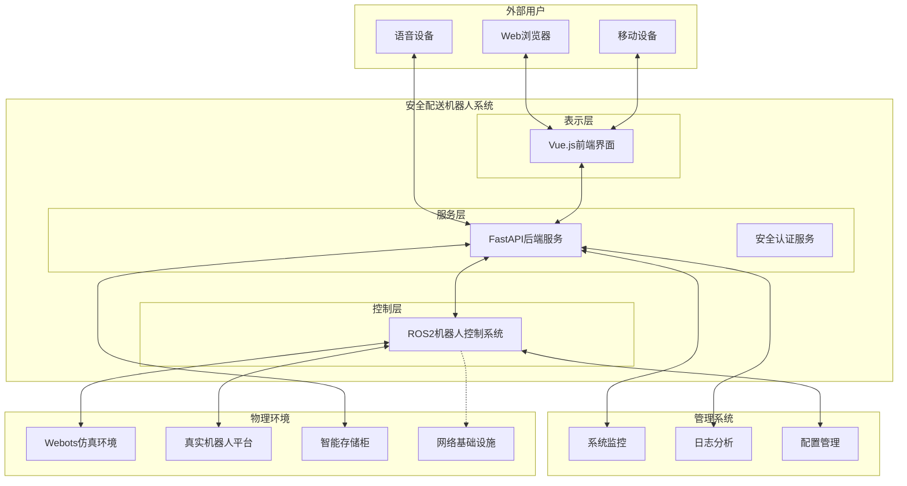

#### 1.2.2 利益相关者
- **最终用户**: 寄件人、收件人、系统操作员
- **技术团队**: 开发人员、测试人员、运维人员
- **业务团队**: 产品经理、业务分析师
- **第三方**: 硬件供应商、集成商

---

## 2. 架构视角

### 2.1 逻辑视角

#### 2.1.1 系统分层架构

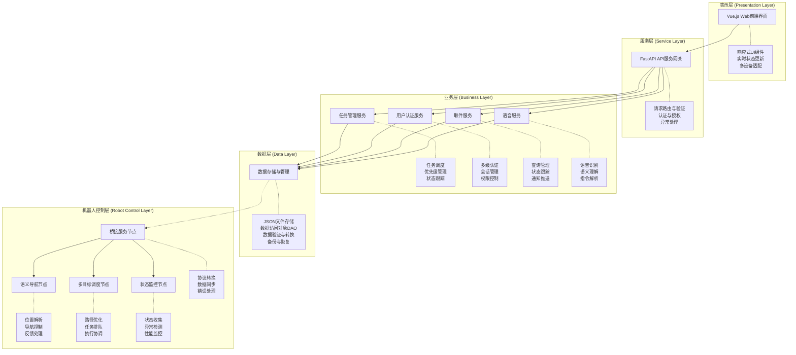

#### 2.1.2 组件交互图

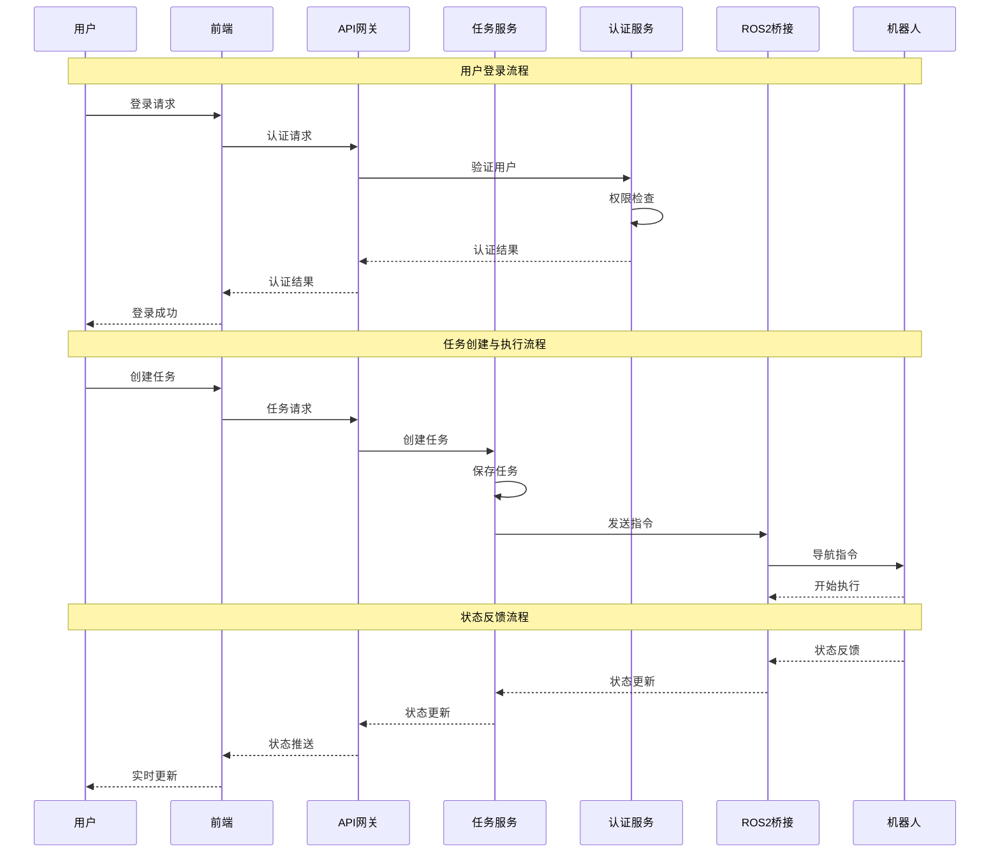

### 2.2 开发视角

#### 2.2.1 代码组织结构

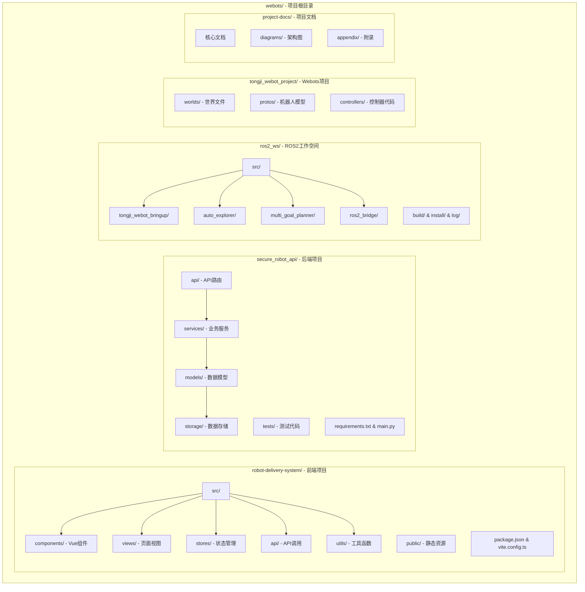

#### 2.2.2 模块依赖关系

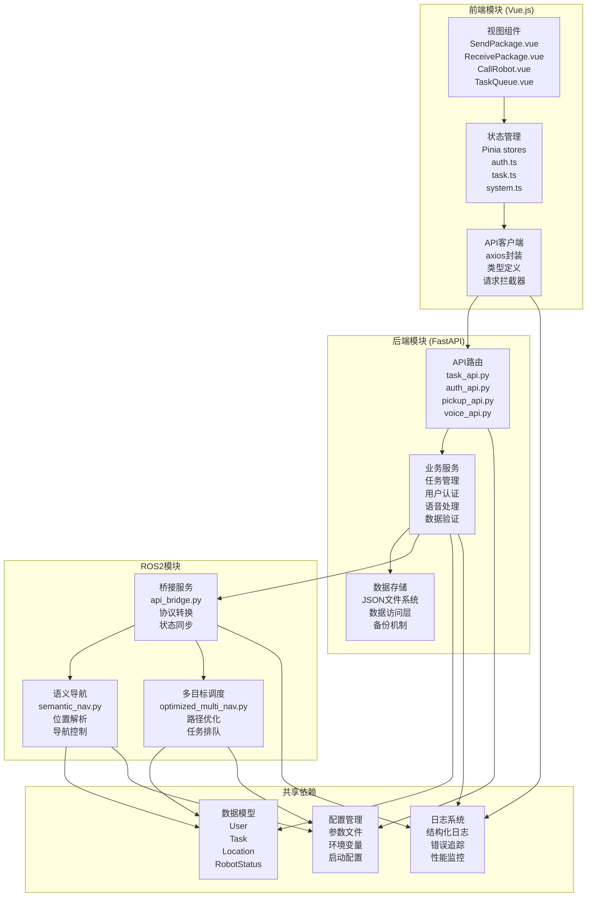

### 2.3 部署视角

#### 2.3.1 部署架构图

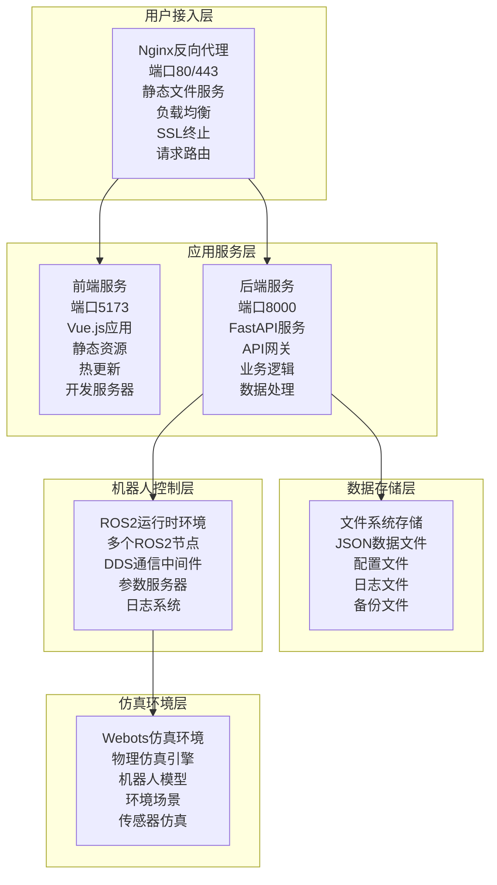

#### 2.3.2 网络通信拓扑

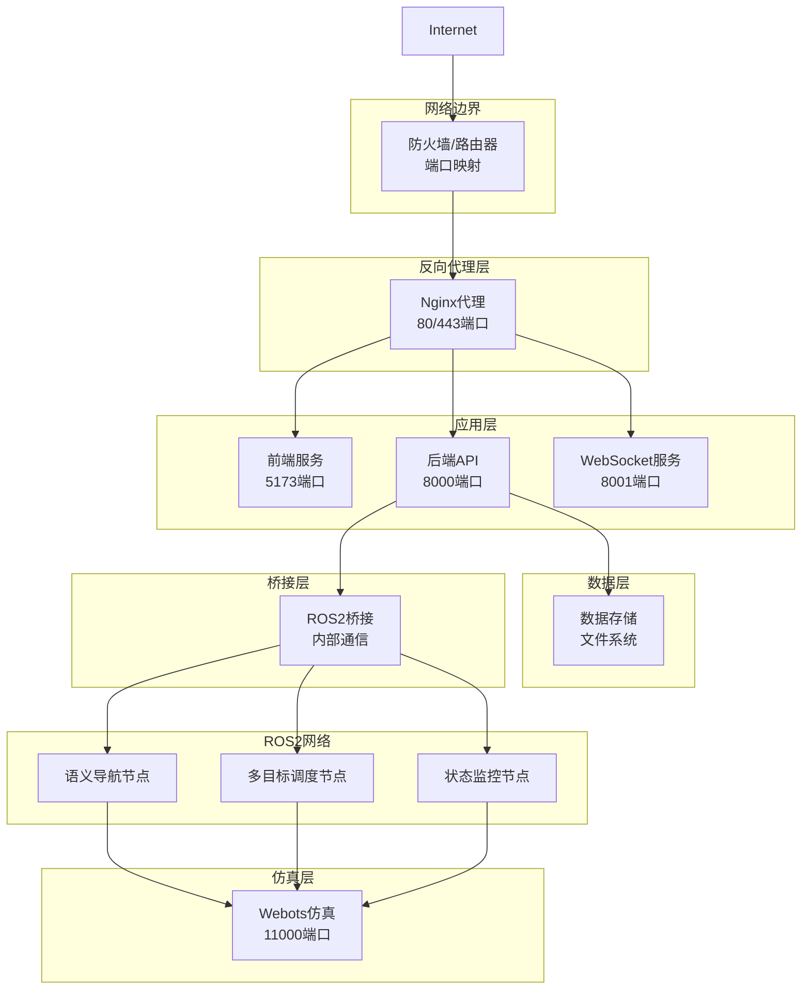

---

## 3. 系统组件设计

### 3.1 核心组件架构

#### 3.1.1 前端应用组件
```typescript
// 前端核心组件架构
interface FrontendArchitecture {
  // 应用入口
  app: {
    main: "应用主入口，Vue应用初始化";
    router: "路由配置，页面导航管理";
    store: "全局状态管理，Pinia实现";
    plugins: "插件系统，Element Plus等";
  };
  
  // 页面组件
  pages: {
    home: "主页面，系统概览和快速操作";
    send: "寄件页面，包裹信息填写和发送";
    receive: "收件页面，包裹查询和接收";
    call: "呼叫页面，机器人呼叫和位置选择";
    queue: "队列页面，任务管理和状态监控";
    test: "测试页面，API调试和系统测试";
  };
  
  // 功能组件
  components: {
    auth: "认证组件，多级认证流程";
    task: "任务组件，任务卡片和操作";
    location: "位置组件，位置选择和显示";
    status: "状态组件，系统状态和机器人状态";
    voice: "语音组件，语音识别和交互";
  };
  
  // 服务层
  services: {
    api: "API服务，HTTP请求封装";
    websocket: "WebSocket服务，实时通信";
    storage: "存储服务，本地存储管理";
    notification: "通知服务，消息提醒";
  };
}
```

#### 3.1.2 后端服务组件
```python
# 后端服务架构设计
class BackendArchitecture:
    """后端服务架构"""
    
    def __init__(self):
        self.api_gateway = self.setup_api_gateway()
        self.auth_service = self.setup_auth_service()
        self.task_service = self.setup_task_service()
        self.pickup_service = self.setup_pickup_service()
        self.voice_service = self.setup_voice_service()
        self.storage_service = self.setup_storage_service()
        self.ros2_bridge = self.setup_ros2_bridge()
    
    def setup_api_gateway(self) -> FastAPI:
        """设置API网关"""
        app = FastAPI(
            title="Robot Delivery System API",
            description="智能机器人配送系统API",
            version="1.0.0"
        )
        
        # 中间件配置
        app.add_middleware(
            CORSMiddleware,
            allow_origins=["http://localhost:5173"],
            allow_credentials=True,
            allow_methods=["*"],
            allow_headers=["*"],
        )
        
        # 路由注册
        app.include_router(task_router, prefix="/api/tasks", tags=["tasks"])
        app.include_router(auth_router, prefix="/api/auth", tags=["auth"])
        app.include_router(pickup_router, prefix="/api/pickup", tags=["pickup"])
        app.include_router(voice_router, prefix="/api/voice", tags=["voice"])
        
        return app
    
    def setup_auth_service(self) -> AuthService:
        """设置认证服务"""
        return AuthService(
            jwt_secret="your-secret-key",
            token_expiry=1800,  # 30分钟
            max_retry_attempts=3
        )
    
    def setup_task_service(self) -> TaskService:
        """设置任务服务"""
        return TaskService(
            max_queue_size=100,
            task_timeout=3600,  # 1小时
            priority_levels=5
        )
```

#### 3.1.3 ROS2节点组件
```python
# ROS2节点架构设计
class ROS2Architecture:
    """ROS2节点架构"""
    
    def __init__(self):
        self.nodes = {
            'semantic_navigator': self.create_semantic_navigator(),
            'multi_goal_planner': self.create_multi_goal_planner(),
            'ros2_bridge': self.create_ros2_bridge(),
            'status_monitor': self.create_status_monitor()
        }
    
    def create_semantic_navigator(self) -> Node:
        """创建语义导航节点"""
        return SemanticNavigator(
            semantic_map_file="map/semantic_map.json",
            default_nav_timeout=300,
            retry_attempts=3
        )
    
    def create_multi_goal_planner(self) -> Node:
        """创建多目标规划节点"""
        return MultiGoalPlanner(
            optimization_algorithm="greedy",
            max_goals_per_task=10,
            path_planning_timeout=30
        )
    
    def create_ros2_bridge(self) -> Node:
        """创建ROS2桥接节点"""
        return ROS2Bridge(
            api_endpoint="http://localhost:8000",
            status_update_interval=1.0,
            max_retry_attempts=5
        )
```

### 3.2 组件交互协议

#### 3.2.1 HTTP API协议
```yaml
# HTTP API规范
api_specification:
  base_url: "http://localhost:8000/api"
  content_type: "application/json"
  charset: "utf-8"
  
  authentication:
    type: "Bearer Token"
    header: "Authorization"
    token_format: "Bearer {jwt_token}"
    
  common_headers:
    - "Content-Type: application/json"
    - "Accept: application/json"
    - "Authorization: Bearer {token}"
    
  error_format:
    error_code: "字符串，标识错误类型"
    message: "字符串，错误描述"
    details: "对象，详细错误信息"
    timestamp: "字符串，ISO8601格式时间戳"
    
  success_format:
    success: "布尔值，操作是否成功"
    data: "对象，返回的数据"
    message: "字符串，操作成功描述"
    timestamp: "字符串，ISO8601格式时间戳"
```

#### 3.2.2 ROS2通信协议
```yaml
# ROS2通信规范
ros2_communication:
  domain_id: 0
  qos_profiles:
    reliable:
      reliability: RELIABLE
      durability: VOLATILE
      history: KEEP_LAST
      depth: 10
      
    best_effort:
      reliability: BEST_EFFORT
      durability: VOLATILE
      history: KEEP_LAST
      depth: 1
      
  topic_naming:
    prefix: "robot_delivery"
    format: "/{prefix}/{module}/{action}"
    examples:
      - "/robot_delivery/nav/command"
      - "/robot_delivery/task/status"
      - "/robot_delivery/robot/pose"
      
  message_format:
    header:
      timestamp: "时间戳"
      source_node: "发送节点名称"
      message_id: "消息唯一标识"
      
    payload:
      data: "实际数据内容"
      metadata: "元数据信息"
```

### 3.3 数据流设计

#### 3.3.1 用户操作数据流

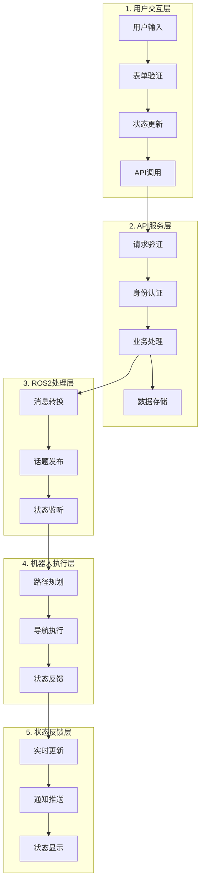

#### 3.3.2 系统状态数据流

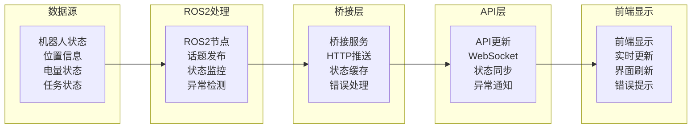

---

## 4. 关键设计决策记录（ADR）

### 4.1 ADR-001: 前端技术栈选择

**状态**: 已接受  
**日期**: 2025-06-01

#### 4.1.1 背景
需要选择合适的前端技术栈来构建用户界面，要求支持实时更新、组件化开发和良好的用户体验。

#### 4.1.2 决策
选择Vue.js 3 + TypeScript + Element Plus + Vite作为前端技术栈。

#### 4.1.3 理由
- **Vue.js 3**: 组合式API提供更好的代码组织，性能优异
- **TypeScript**: 类型安全，提高代码质量和可维护性
- **Element Plus**: 丰富的UI组件库，设计一致性好
- **Vite**: 快速的构建工具，开发体验好

#### 4.1.4 后果
- 学习成本相对较低
- 开发效率高
- 代码质量有保障
- 需要保持技术栈版本更新

### 4.2 ADR-002: 后端架构选择

**状态**: 已接受  
**日期**: 2025-06-01

#### 4.2.1 背景
需要选择后端技术架构，要求支持高并发、易于扩展、开发效率高。

#### 4.2.2 决策
选择FastAPI + Python + JSON文件存储的轻量级架构。

#### 4.2.3 理由
- **FastAPI**: 现代化的Python Web框架，自动文档生成
- **Python**: 与ROS2生态系统兼容性好，开发效率高
- **JSON存储**: 轻量级，适合原型开发和小规模部署
- **异步支持**: 支持高并发处理

#### 4.2.4 后果
- 开发和部署简单
- 适合快速原型开发
- 后期可能需要迁移到更强大的数据库
- 需要考虑数据一致性和备份

### 4.3 ADR-003: ROS2版本选择

**状态**: 已接受  
**日期**: 2025-06-01

#### 4.3.1 背景
需要选择合适的ROS2版本作为机器人控制平台。

#### 4.3.2 决策
选择ROS2 Humble Hawksbill作为目标版本。

#### 4.3.3 理由
- **长期支持**: Humble是LTS版本，支持到2027年
- **稳定性**: 经过充分测试，稳定性好
- **生态系统**: 丰富的功能包和社区支持
- **Nav2支持**: 完整的导航框架支持

#### 4.3.4 后果
- 稳定的开发环境
- 长期技术支持
- 丰富的第三方包
- 需要保持与ROS2生态系统同步

### 4.4 ADR-004: 数据存储方案

**状态**: 已接受  
**日期**: 2025-06-01

#### 4.4.1 背景
需要选择合适的数据存储方案，平衡简单性和功能性。

#### 4.4.2 决策
使用JSON文件存储作为主要数据存储方案。

#### 4.4.3 理由
- **简单性**: 无需额外数据库安装和配置
- **可读性**: 数据格式直观，便于调试
- **版本控制**: 支持Git版本控制
- **轻量级**: 适合小规模应用

#### 4.4.4 后果
- 部署简单
- 开发调试方便
- 性能可能有限制
- 需要手动处理并发访问

### 4.5 ADR-005: 通信协议选择

**状态**: 已接受  
**日期**: 2025-06-01

#### 4.5.1 背景
需要设计前后端通信和ROS2通信的协议方案。

#### 4.5.2 决策
- 前后端通信: HTTP REST API + WebSocket
- ROS2通信: 标准DDS协议

#### 4.5.3 理由
- **HTTP REST**: 标准化、易于调试、缓存友好
- **WebSocket**: 实时双向通信，适合状态更新
- **DDS**: ROS2标准协议，分布式系统支持好

#### 4.5.4 后果
- 标准化程度高
- 易于集成和扩展
- 需要处理连接管理
- 网络复杂度增加

---

## 5. 系统质量属性

### 5.1 性能特征

#### 5.1.1 响应时间指标

| 服务类型 | 指标项 | 目标响应时间 | 说明 |
|---------|--------|-------------|------|
| **API响应时间** | 认证API | < 200ms (95%ile) | 用户登录、token验证 |
| | 任务API | < 500ms (95%ile) | 任务创建、查询、更新 |
| | 状态查询 | < 100ms (95%ile) | 机器人状态、任务状态 |
| | 文件上传 | < 2s (95%ile) | 语音文件、图片上传 |
| **导航性能** | 路径规划 | < 2s (单点) | 单点导航路径计算 |
| | 多点优化 | < 5s (5个点) | 多目标路径优化 |
| | 导航执行 | 依赖机器人性能 | 实际移动时间 |
| | 状态反馈 | < 100ms | 位置、状态信息反馈 |
| **用户界面** | 页面加载 | < 3s (首次) | 首次访问页面加载 |
| | 页面切换 | < 500ms | 路由切换响应 |
| | 状态更新 | < 1s | 实时状态刷新 |
| | 交互响应 | < 200ms | 按钮点击、表单提交 |

#### 5.1.2 吞吐量指标

| 服务类型 | 指标项 | 目标吞吐量 | 说明 |
|---------|--------|-----------|------|
| **API吞吐量** | 总体QPS | 100 req/s | 系统整体请求处理能力 |
| | 认证QPS | 10 req/s | 登录、token刷新请求 |
| | 任务QPS | 50 req/s | 任务相关操作请求 |  
| | 状态QPS | 200 req/s | 状态查询请求(高频) |
| **ROS2消息** | 导航指令 | 1 msg/s | 导航命令发送频率 |
| | 状态更新 | 10 msg/s | 机器人状态更新频率 |
| | 位置信息 | 5 msg/s | 位置信息发布频率 |
| | 传感器数据 | 30 msg/s | 传感器数据流频率 |
| **并发用户** | 同时在线 | 50 users | 系统最大并发连接数 |
| | 活跃用户 | 20 users | 同时执行操作的用户数 |
| | 任务创建 | 10 users | 同时创建任务的用户数 |
| | 状态监控 | 50 users | 实时监控状态的用户数 |

### 5.2 可靠性设计

#### 5.2.1 容错策略
```python
# 容错策略实现
class FaultToleranceStrategy:
    """容错策略"""
    
    def __init__(self):
        self.retry_policy = RetryPolicy(
            max_attempts=3,
            backoff_factor=2.0,
            jitter=True
        )
        
        self.circuit_breaker = CircuitBreaker(
            failure_threshold=5,
            recovery_timeout=30,
            expected_exception=ConnectionError
        )
        
        self.health_checker = HealthChecker(
            check_interval=30.0,
            timeout=5.0
        )
    
    async def execute_with_retry(self, operation, *args, **kwargs):
        """带重试的操作执行"""
        for attempt in range(self.retry_policy.max_attempts):
            try:
                return await operation(*args, **kwargs)
            except Exception as e:
                if attempt == self.retry_policy.max_attempts - 1:
                    raise e
                
                delay = self.retry_policy.calculate_delay(attempt)
                await asyncio.sleep(delay)
    
    def handle_circuit_breaker(self, operation):
        """断路器处理"""
        @self.circuit_breaker
        async def wrapped_operation(*args, **kwargs):
            return await operation(*args, **kwargs)
        
        return wrapped_operation
```

#### 5.2.2 数据一致性保证
```python
# 数据一致性保证
class ConsistencyManager:
    """数据一致性管理"""
    
    def __init__(self):
        self.locks = {}
        self.transaction_log = []
        
    async def atomic_operation(self, operations: List[Callable]):
        """原子操作"""
        transaction_id = self.generate_transaction_id()
        
        try:
            # 执行所有操作
            results = []
            for operation in operations:
                result = await operation()
                results.append(result)
                
            # 记录事务日志
            self.transaction_log.append({
                'id': transaction_id,
                'operations': operations,
                'results': results,
                'status': 'committed',
                'timestamp': datetime.now()
            })
            
            return results
            
        except Exception as e:
            # 回滚操作
            await self.rollback_transaction(transaction_id)
            raise e
    
    async def eventual_consistency_sync(self):
        """最终一致性同步"""
        # 检查数据不一致的情况
        inconsistencies = await self.detect_inconsistencies()
        
        for inconsistency in inconsistencies:
            await self.resolve_inconsistency(inconsistency)
```

### 5.3 安全性设计

#### 5.3.1 身份认证安全
```python
# 安全认证实现
class SecurityManager:
    """安全管理器"""
    
    def __init__(self):
        self.password_policy = PasswordPolicy(
            min_length=6,
            require_digits=True,
            require_special_chars=False,
            max_attempts=5
        )
        
        self.session_manager = SessionManager(
            timeout=1800,  # 30分钟
            refresh_threshold=600,  # 10分钟
            max_sessions_per_user=3
        )
    
    async def authenticate_user(self, user_id: str, auth_data: dict) -> AuthResult:
        """用户认证"""
        # 防止暴力攻击
        if await self.is_account_locked(user_id):
            raise AuthenticationError("账户已锁定")
        
        # 验证认证数据
        user = await self.get_user(user_id)
        if not user:
            await self.record_failed_attempt(user_id)
            raise AuthenticationError("用户不存在")
        
        # 执行认证
        auth_result = await self.verify_credentials(user, auth_data)
        
        if not auth_result.success:
            await self.record_failed_attempt(user_id)
            raise AuthenticationError("认证失败")
        
        # 创建会话
        session = await self.session_manager.create_session(user)
        
        return AuthResult(
            success=True,
            user_info=user,
            session_token=session.token,
            expires_at=session.expires_at
        )
    
    async def validate_session(self, token: str) -> bool:
        """会话验证"""
        session = await self.session_manager.get_session(token)
        
        if not session or session.is_expired():
            return False
        
        # 自动续期
        if session.should_refresh():
            await self.session_manager.refresh_session(session)
        
        return True
```

#### 5.3.2 API安全防护
```python
# API安全防护
class APISecurityMiddleware:
    """API安全中间件"""
    
    def __init__(self):
        self.rate_limiter = RateLimiter(
            requests_per_minute=60,
            burst_size=10
        )
        
        self.input_validator = InputValidator()
        self.csrf_protection = CSRFProtection()
    
    async def __call__(self, request: Request, call_next):
        """安全中间件处理"""
        # 速率限制
        if not await self.rate_limiter.allow_request(request):
            raise HTTPException(429, "请求过于频繁")
        
        # 输入验证
        if request.method in ['POST', 'PUT', 'PATCH']:
            await self.input_validator.validate_request(request)
        
        # CSRF保护
        if request.method in ['POST', 'PUT', 'DELETE']:
            await self.csrf_protection.validate_token(request)
        
        # 执行请求
        response = await call_next(request)
        
        # 设置安全头
        response.headers['X-Content-Type-Options'] = 'nosniff'
        response.headers['X-Frame-Options'] = 'DENY'
        response.headers['X-XSS-Protection'] = '1; mode=block'
        
        return response
```

### 5.4 可扩展性设计

#### 5.4.1 模块化架构
```python
# 模块化架构设计
class ModularArchitecture:
    """模块化架构"""
    
    def __init__(self):
        self.module_registry = {}
        self.dependency_graph = {}
        self.event_bus = EventBus()
    
    def register_module(self, module: Module):
        """注册模块"""
        self.module_registry[module.name] = module
        self.dependency_graph[module.name] = module.dependencies
        
        # 订阅事件
        for event_type in module.subscribed_events:
            self.event_bus.subscribe(event_type, module.handle_event)
    
    async def load_modules(self):
        """加载模块"""
        # 根据依赖关系排序
        load_order = self.calculate_load_order()
        
        for module_name in load_order:
            module = self.module_registry[module_name]
            await module.initialize()
            
            # 发布模块加载事件
            await self.event_bus.publish(
                ModuleLoadedEvent(module_name=module_name)
            )
    
    def calculate_load_order(self) -> List[str]:
        """计算模块加载顺序"""
        # 拓扑排序算法
        visited = set()
        temp_visited = set()
        result = []
        
        def visit(module_name):
            if module_name in temp_visited:
                raise CircularDependencyError(f"循环依赖: {module_name}")
            
            if module_name not in visited:
                temp_visited.add(module_name)
                
                for dependency in self.dependency_graph.get(module_name, []):
                    visit(dependency)
                
                temp_visited.remove(module_name)
                visited.add(module_name)
                result.append(module_name)
        
        for module_name in self.module_registry:
            if module_name not in visited:
                visit(module_name)
        
        return result
```

#### 5.4.2 插件系统设计
```python
# 插件系统
class PluginSystem:
    """插件系统"""
    
    def __init__(self):
        self.plugins = {}
        self.hooks = {}
        self.plugin_loader = PluginLoader()
    
    def register_hook(self, hook_name: str, hook_func: Callable):
        """注册钩子"""
        if hook_name not in self.hooks:
            self.hooks[hook_name] = []
        
        self.hooks[hook_name].append(hook_func)
    
    async def execute_hook(self, hook_name: str, *args, **kwargs):
        """执行钩子"""
        if hook_name not in self.hooks:
            return
        
        for hook_func in self.hooks[hook_name]:
            try:
                await hook_func(*args, **kwargs)
            except Exception as e:
                logger.error(f"钩子执行失败 {hook_name}: {e}")
    
    async def load_plugin(self, plugin_path: str):
        """加载插件"""
        plugin = await self.plugin_loader.load(plugin_path)
        
        # 验证插件
        if not self.validate_plugin(plugin):
            raise PluginValidationError(f"插件验证失败: {plugin_path}")
        
        # 注册插件
        self.plugins[plugin.name] = plugin
        
        # 初始化插件
        await plugin.initialize()
        
        # 注册插件钩子
        for hook_name, hook_func in plugin.hooks.items():
            self.register_hook(hook_name, hook_func)
```

---

## 1.3 安全架构设计

#### 1.3.1 多级安全认证体系

本系统实现了L1/L2/L3三级安全认证体系，确保不同安全等级的任务和操作得到相应的安全保护：

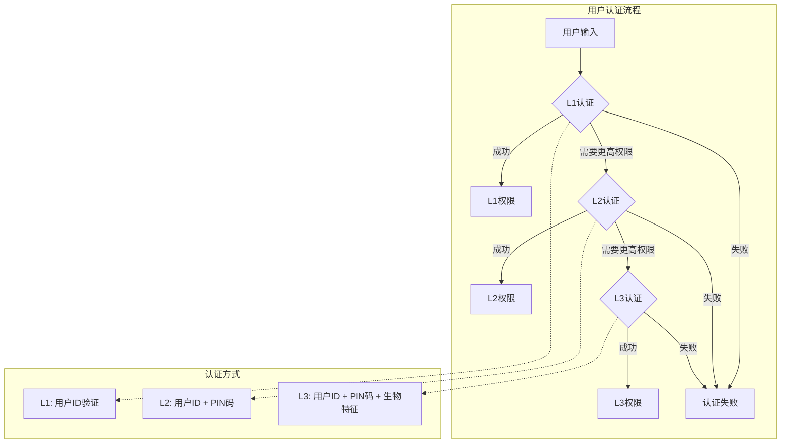

#### 1.3.2 安全等级权限矩阵

| 操作类型 | L1权限 | L2权限 | L3权限 | 说明 |
|---------|-------|-------|-------|------|
| 查看任务队列 | ✅ | ✅ | ✅ | 基础查看权限 |
| 创建L1任务 | ✅ | ✅ | ✅ | 低安全等级任务 |
| 创建L2任务 | ❌ | ✅ | ✅ | 中等安全等级任务 |
| 创建L3任务 | ❌ | ❌ | ✅ | 高安全等级任务 |
| 接收L1包裹 | ✅ | ✅ | ✅ | 普通包裹接收 |
| 接收L2包裹 | ❌ | ✅ | ✅ | 敏感包裹接收 |
| 接收L3包裹 | ❌ | ❌ | ✅ | 机密包裹接收 |

#### 1.3.3 安全服务架构

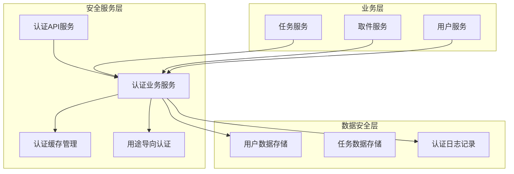

#### 1.3.4 安全机制实现

**认证服务核心功能**：
- 用户身份验证：基于用户ID的基础认证
- PIN码验证：支持数字密码的二级认证
- 生物特征认证：预留指纹/面部识别接口
- 认证缓存：支持临时认证状态存储，提升用户体验
- 用途导向认证：基于任务用途（寄送/接收）的专用认证流程

**数据安全保护**：
- 敏感信息加密存储
- 认证日志完整记录
- 权限等级严格控制
- 异常访问检测和阻断
